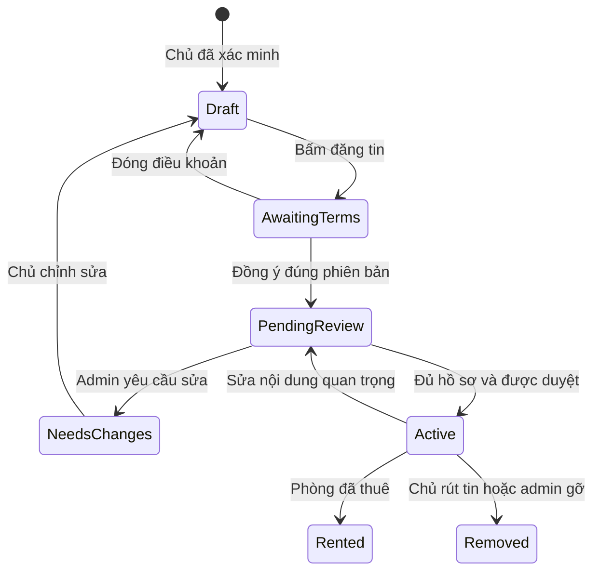

# Kế hoạch điều chỉnh website Bất Động Sản — QNS BROKER

**Phiên bản:** 2.0 — ngày 25/09/2026, múi giờ Việt Nam  
**Mục tiêu:** bỏ thanh toán trực tuyến; khách gửi yêu cầu xem phòng cho Quân; chủ đăng tin bằng tài khoản đã xác thực; thu phí môi giới bằng 40% tiền thuê trung bình một tháng của giao dịch thành công  
**Repository:** <https://github.com/QuanNguyenS403/batdongsan>  
**Mã nguồn đã đọc:** nhánh `main`, commit [`0ac02b890fb0c6ec2426898b755258177c943160`](https://github.com/QuanNguyenS403/batdongsan/tree/0ac02b890fb0c6ec2426898b755258177c943160), thời điểm commit 25/09/2026 14:54:54 +07:00  
**Phạm vi bàn giao lần này:** phân tích mã nguồn và kế hoạch thực hiện, kèm dự thảo điều khoản để triển khai. Chưa sửa ứng dụng, chạy migration hoặc đưa điều khoản lên website thật.

**Cách đọc nhanh:** mục 2 là phát hiện trong mã; mục 3–8 là yêu cầu kỹ thuật; mục 9–10 là pháp lý và dự thảo hợp đồng; mục 12–15 là lộ trình, kiểm thử và phát hành; mục 16 là những quyết định cần chốt. Phạm vi pháp lý được giả định là hoạt động cho thuê tại Việt Nam, giá tính bằng VND.

## 1. Kết luận và nguyên tắc áp dụng

Website đã có phần lớn khung nghiệp vụ môi giới: tin đăng, khách quan tâm, lịch xem, hồ sơ giao dịch, hợp đồng dịch vụ, hoa hồng và quản trị. Nên sửa trên cấu trúc hiện có, không viết lại toàn bộ.

Tuy nhiên, mã tại commit được kiểm tra **chưa đáp ứng đầy đủ mô hình mới**. Có lỗi nghiêm trọng trong xác thực OTP và Google, đường dẫn VietQR/webhook ngân hàng vẫn được khai báo, phí môi giới còn tính theo một giá thuê tháng, và chưa có luồng chủ nhà chấp nhận điều khoản gắn với từng tin đăng.

### 1.1. Yêu cầu bắt buộc từ chủ website

| Mã | Quy tắc phải thực hiện |
|---|---|
| BR-01 | Không có chức năng thanh toán trực tuyến trên website: không checkout, VietQR thanh toán, cổng thanh toán, nạp tiền, ví, thu hộ hay tự động ghi nhận tiền qua webhook |
| BR-02 | Khách thuê xem tin và gửi yêu cầu xem phòng bằng biểu mẫu; không bắt tạo tài khoản hoặc trả tiền |
| BR-03 | Quân là đầu mối tiếp nhận; Quân chủ động liên hệ khách qua Zalo và làm việc trực tiếp |
| BR-04 | Chủ nhà phải đăng ký/đăng nhập bằng Google hoặc số điện thoại; không thêm Facebook, tài khoản tên đăng nhập hay luồng email/mật khẩu độc lập |
| BR-05 | Đăng ký theo số điện thoại phải xác minh SMS OTP; đăng ký Google phải xác minh Google và hoàn tất OTP gửi tới email của tài khoản Google trước khi tạo tài khoản hoạt động |
| BR-06 | Một số điện thoại chuẩn hóa và một email chuẩn hóa chỉ thuộc một tài khoản; liên kết phương thức đăng nhập không tạo tài khoản thứ hai |
| BR-07 | Có khôi phục tài khoản/mật khẩu bằng OTP đúng kênh đã xác minh; không tạo lại tài khoản khi người dùng quên mật khẩu |
| BR-08 | Sau khi chủ hoàn tất nội dung và bấm đăng tin, phải hiển thị điều khoản để chủ chủ động đồng ý; chưa đồng ý thì tin chưa được công khai |
| BR-09 | Phí do chủ nhà trả: **40% tiền thuê trung bình một tháng theo toàn bộ thời hạn hợp đồng đã xác định**, thu một lần cho giao dịch dài hạn thành công |
| BR-10 | Giao dịch thuê độc lập một tháng: phí bằng 40% tiền thuê của tháng đó; tần suất trả tiền hằng tháng của hợp đồng dài hạn không làm phát sinh phí hằng tháng |
| BR-11 | Tiền cọc thuộc quan hệ chủ nhà–khách thuê; không đưa vào cơ sở tính phí, không nhận hoặc giữ cọc trên website |
| BR-12 | Lưu bằng chứng đồng ý, phiên bản điều khoản, căn cứ nguồn khách và bảng tính phí; admin thao tác phải có nhật ký |

**Lưu ý về OTP Google:** Google OAuth thường đã xác minh danh tính Google, nhưng yêu cầu hiện tại của chủ website còn đòi OTP khi đăng ký. Kế hoạch giữ bước OTP email này, không âm thầm thay bằng riêng `email_verified=true`. Đây vẫn là đăng ký qua Google, không mở phương thức đăng nhập email mới.

### 1.2. Các mặc định thiết kế trong kế hoạch

Những nội dung sau là đề xuất triển khai để tài liệu có thể giao cho lập trình viên. Chúng không phải lời khẳng định chủ website đã quyết định mọi chi tiết thương mại:

- Khách thuê không phải nhập OTP khi gửi yêu cầu ban đầu; dùng chống spam và Quân xác minh khi liên hệ. Yêu cầu OTP bắt buộc của người dùng áp dụng cho đăng ký/khôi phục tài khoản chủ nhà.
- Chủ nhà được tạo tài khoản bằng một trong hai kênh. Không bắt đăng ký cả Google lẫn số điện thoại. Kênh thứ hai, nếu liên kết, cũng phải được xác minh.
- Giữ bước admin duyệt tin hiện có, đồng thời kiểm tra quyền cho thuê. Xác minh email/SMS không chứng minh người đăng là chủ sở hữu phòng.
- Miễn phí gửi yêu cầu xem phòng và đăng tin trong phạm vi mô hình này; không bán gói đăng tin mới.
- Giữ định nghĩa thành công có trong định hướng repository: hợp đồng thuê đã có hiệu lực, đã bàn giao và đã hoàn tất khoản tiền thuê đầu tiên đến hạn nếu có. Miễn tiền thuê kỳ đầu phải có cách ghi nhận riêng, không giả lập một khoản đã thanh toán.
- Theo dõi công nợ và ghi nhận đã thu ngoài website là nghiệp vụ nội bộ; không có nút trả tiền hoặc tích hợp nhận tiền trên website.
- Hạn trả phí, cách xử lý gia hạn, hủy sau thành công, thuế và thời hạn bảo vệ nguồn khách được đánh dấu cụ thể tại mục 10 và 16 để chốt trước khi dùng dự thảo với chủ nhà thật.

## 2. Kết quả đọc repository

### 2.1. Kiến trúc và phần có thể tận dụng

| Thành phần | Hiện trạng đọc được | Hướng xử lý |
|---|---|---|
| Monorepo | pnpm 9.15.9, Turborepo, TypeScript | Giữ cấu trúc |
| Giao diện | Next.js 14.2.15, React 18, Tailwind | Sửa luồng hiện có; đánh giá cập nhật bảo mật dependency trong đợt triển khai |
| API | NestJS 10; DTO, guard, Prisma | Giữ; bổ sung guard tài khoản đã xác minh và kiểm tra quyền trên từng đối tượng |
| Dữ liệu | PostgreSQL, Prisma; đã có `Lead`, `RentalRequest`, `RentalUnit`, `OwnerServiceAgreement`, `RentalDeal`, `Commission` | Mở rộng bằng migration có kiểm chứng |
| Xác thực | Mật khẩu số điện thoại, Google, OTP, JWT và `tokenVersion` | Sửa lỗi P0 trước; thêm email/Google identity và OTP theo mục đích |
| Vận hành | Admin tin đăng/lead; outbox; sổ tiền và giao dịch ngân hàng | Giữ quản trị; thay thông báo chỉ ghi log bằng thông báo thật; tách bỏ phần nhận tiền trực tuyến |
| Hồ sơ chấp thuận | Có `Document`, `DocumentAcceptance`, `ConsentRecord` trong schema | Tận dụng nhưng bổ sung quan hệ, snapshot và luồng ghi nhận thực tế |
| Tài liệu cũ | Có kế hoạch pivot 24/09 và báo cáo “verified” | Đối chiếu lại theo mã nguồn; không dùng trạng thái trong tài liệu làm bằng chứng đã đạt yêu cầu mới |

### 2.2. Phát hiện có căn cứ trong mã nguồn

Đường dẫn dưới đây tương đối với root repository, tại commit đã ghi đầu tài liệu. **P0** là việc phải khắc phục trước khi mở luồng liên quan cho người dùng thật. Đây là kiểm tra tĩnh có trọng tâm, không phải kết quả pentest hoặc xác nhận trạng thái production.

| Mã | Mức | Phát hiện | Bằng chứng | Thay đổi bắt buộc |
|---|---|---|---|---|
| GAP-01 | P0 | Đăng ký và reset mật khẩu gọi hàm OTP bất đồng bộ nhưng thiếu `await`; điều kiện đang kiểm tra Promise thay vì kết quả boolean | `apps/api/src/modules/auth/auth.service.ts`, `register()` dòng 58 và `resetPassword()` dòng 284; `otp.service.ts`, `async verifyOtp()` | Chờ kết quả và từ chối mọi kết quả không phải `true`; kiểm thử OTP sai/quá hạn ở API thật |
| GAP-02 | P0 | Google nhận `dto.phone`, tìm tài khoản theo số tự nhập rồi cấp token; chưa chứng minh quyền sở hữu số đó hoặc liên kết Google với tài khoản | `auth.service.ts`, `googleLogin()` dòng 122; `dto/google-login.dto.ts` | Xóa nhánh tin số điện thoại client; định danh bằng Google `sub`; liên kết chỉ sau xác minh và xác thực lại |
| GAP-03 | P0 | Google dùng `tokeninfo` nhưng ứng dụng chưa ràng buộc `aud` với client ID, chưa dùng `sub` làm khóa tài khoản và chưa buộc `email_verified` | `auth.service.ts`, `googleLogin()` | Dùng thư viện xác minh Google phía server; kiểm tra chữ ký, issuer, audience, expiry và nonce theo luồng đã chọn [KT-01] |
| GAP-04 | P0 | `User` chưa có email/Google identity; số điện thoại bắt buộc, unique theo chuỗi gốc | `packages/database/prisma/schema.prisma`, model `User` | Thêm định danh Google/email; chuẩn hóa số; unique tại DB; xử lý dữ liệu cũ trước migration |
| GAP-05 | P0 | OTP chưa tách mục đích; Redis lỗi chuyển sang bộ nhớ; đọc–kiểm tra–xóa Redis chưa nguyên tử; có adapter Telegram gửi mã đến chat cố định | `apps/api/src/modules/auth/otp.service.ts` | Challenge theo mục đích, tiêu thụ nguyên tử, không hạ bảo vệ ở production; chỉ SMS thật/email thật xác minh người đăng ký |
| GAP-06 | P0 | Còn endpoint VietQR công khai và webhook ngân hàng | `payments/payments.controller.ts` dòng 28, 36; `payments.service.ts`; `app.module.ts` | Gỡ route, service tích hợp và wiring; tắt tác vụ bên ngoài đang gọi webhook; chỉ giữ sổ công nợ nội bộ |
| GAP-07 | P0 | Hoa hồng lấy `deal.actualMonthlyRent` hoặc `customBaseVnd`; chưa có lịch giá nhiều giai đoạn để tính bình quân toàn hợp đồng | `commissions/commissions.service.ts`, `generateCommission()` dòng 88; model `RentalDeal` | Thêm lịch giá và engine tính bình quân; không cho số nhập tùy ý thay bằng chứng giá |
| GAP-08 | P0 | Trang điều khoản đang nói “40% tiền thuê tháng đầu tiên (sau ưu đãi)” | `apps/web/src/app/dieu-khoan/page.tsx` dòng 48; kế hoạch pivot cũ | Thay bằng công thức ở mục 7; giữ bản cũ cho giao dịch đã chấp thuận, không hồi tố |
| GAP-09 | P0 | Trang đăng tin chưa có bước chấp thuận hợp đồng gắn tin; chưa thấy luồng ghi `DocumentAcceptance`/`ConsentRecord` trong API hiện có | `apps/web/src/app/dang-tin/page.tsx`; tìm các tên model tương ứng trong `apps/api/src` | Thêm bước điều khoản, snapshot và giao dịch DB; không chỉ thêm checkbox phía giao diện |
| GAP-10 | P0 | Admin có thể tạo hợp đồng mặc định `active`; kiểm tra hồ sơ chỉ diễn ra nếu hồ sơ tồn tại; chưa bắt đầy đủ ngày hiệu lực/phạm vi phòng | `admin/admin.service.ts`, `createOwnerAgreement()`, `approveListing()` | Trạng thái chưa hiệu lực cho đến đủ bằng chứng; bắt hồ sơ, bên ký, phạm vi và hiệu lực đúng thời điểm |
| GAP-11 | P0 | Giá cơ sở phụ lục phòng đang có nhánh suy ra từ diện tích nhân 100.000, hoặc mặc định 3 triệu | `admin/admin.service.ts` dòng 993 | Không suy diễn giá để lập nghĩa vụ tiền; dùng giá được chủ xác nhận và lịch giá hợp đồng |
| GAP-12 | P0 | Thông báo `LEAD_CREATED` hiện chỉ ghi log và trả `SENT`; chưa phải thông báo thực đến admin | `outbox/outbox.service.ts` dòng 241 | Thông báo thật vào hàng đợi admin/email; lỗi gửi phải retry; giảm PII trong log |
| GAP-13 | P0 | Luồng duyệt tin vẫn lấy hạn mức membership, còn thông báo yêu cầu nâng cấp gói | `admin/admin.service.ts`, `approveListing()`; `listings.service.ts`, `create()` | Tách hạn mức chống spam khỏi gói trả tiền; xử lý quyền lợi gói cũ riêng |
| GAP-14 | P1 | Ngày/giờ xem trong form hiện được nối vào chuỗi `message`, thiếu trường có cấu trúc | `components/ContactBrokerModal.tsx`; `leads/dto/create-lead.dto.ts` | Lưu ngày, khung giờ và múi giờ riêng, giữ ghi chú tự do |
| GAP-15 | P0 | CI chưa chạy đầy đủ API/E2E cho luồng mới; test hoa hồng có hàm tính lặp lại trong test, test OTP service chưa chứng minh đường đăng ký/reset an toàn | `.github/workflows/ci.yml`; `test-dev05-at08.js`; `test-dev09-at15-18.js` | Bổ sung test gọi service thật và HTTP thật; test bảo mật và đồng thời ở mục 14 |
| GAP-16 | P1 | Refresh token được lưu trong localStorage; “MFA” quản trị hiện so header với một secret tĩnh | `apps/web/src/lib/auth-client.ts`; `common/guards/capabilities.guard.ts` | Refresh token trong cookie bảo vệ; dùng MFA có kiểm chứng cho admin, không coi shared secret tĩnh là OTP |

**Điểm đã có và cần giữ:** `MembershipService.requestUpgrade()` đã chặn bán gói mới; `ContactBrokerModal` cho phép khách gửi không đăng nhập và consent ban đầu là `false`; lead được lưu trong transaction với outbox; `Commission.dealId` đã unique; đổi mật khẩu có tăng `tokenVersion`. Không làm lại các phần này nếu có thể sửa đúng tại chỗ.

**Giới hạn kiểm tra:** chưa truy cập CSDL thật, dashboard hosting, cấu hình SMS/email, Google OAuth console hay tiến trình Apps Script. Chưa cài dependency/chạy build hoặc kiểm thử tích hợp của repository trong lần lập kế hoạch này. Các dòng “pass/verified” trong tài liệu cũ chưa được tái xác nhận.

## 3. Phạm vi bỏ thanh toán trực tuyến

### 3.1. Gỡ hoàn toàn khỏi ứng dụng hoạt động

- Route `GET /payments/commissions/:id/vietqr` và `POST /payments/webhook/bank`.
- `getVietQrForCommission()`, `handleBankEmailWebhook()` và mã kết nối/đối soát tự động liên quan.
- QR trả phí, nút “Thanh toán”, mua gói, yêu cầu nâng cấp, callback trả tiền và thông báo thúc đẩy checkout.
- Tác vụ `packages/database/scripts/vietcombank-email-webhook.gs`: loại khỏi hướng dẫn vận hành mới; tắt trigger thực tế khi triển khai nếu đang được cài đặt. Việc xóa file Git không tự tắt trigger ở Google.
- Biến cấu hình/chìa khóa chỉ phục vụ thanh toán tự động; thu hồi quyền truy cập hộp thư nếu quyền đó chỉ dùng đọc thông báo ngân hàng. Giữ riêng cấu hình gửi email OTP/thông báo cần thiết.
- Sửa `HUONG-DAN-THANH-TOAN-VIETCOMBANK-0D.md` thành tài liệu lịch sử đã ngừng áp dụng hoặc đưa vào thư mục lưu trữ; bỏ chỉ dẫn đang hướng người vận hành bật lại.
- Xóa kế hoạch tương lai tự bật cổng thanh toán từ phạm vi phát hành này, gồm mục DEV-16 trong kế hoạch cũ.

**Nghiệm thu:** route cũ trả 404 hoặc 410 nhất quán; không tạo giao dịch, phát sinh outbox hay thay đổi công nợ. Dùng route inventory và kiểm thử mạng để xác nhận, không chỉ kiểm tra nút giao diện đã ẩn.

### 3.2. Phần được giữ cho admin

Website vẫn cần biết giao dịch nào thành công, phí phải thu bao nhiêu và Quân đã xác nhận thu ngoài hệ thống hay chưa. Giữ:

| Giữ | Giới hạn |
|---|---|
| Bảng tính hoa hồng | Chỉ tính từ điều khoản và lịch giá đã xác nhận |
| Công nợ `due`, `partially_collected`, `collected`, `disputed`, `void` | Không kích hoạt chuyển tiền |
| Ghi nhận khoản thu/hoàn ngoài hệ thống | Admin nhập ngày, số tiền, chứng từ tham chiếu; có quyền và audit |
| Dữ liệu membership/payment lịch sử | Bảo toàn để đối chiếu; không bán lại, không tự xóa sổ cũ |
| Xuất báo cáo/biên nhận nội bộ | Không gắn nút trả tiền hay mã QR vào bản dành cho người dùng |

Đổi tên miền nghiệp vụ còn giữ thành `offline-collections` hoặc `receivables` để tránh việc lập trình viên nối lại cổng thanh toán. Có thể giữ bảng DB cũ để migration ít rủi ro, nhưng loại API tích hợp nhận tiền khỏi ứng dụng production.

Thanh toán phí dịch vụ ngoài website vẫn phải theo phương thức phù hợp tư cách pháp lý của bên cung cấp dịch vụ; điều này không đòi tích hợp cổng thanh toán vào website. Xem mục 9.

## 4. Luồng khách thuê và công việc của Quân

### 4.1. Biểu mẫu gửi yêu cầu

CTA chính: **“Đăng ký xem phòng”**. Khách không cần tài khoản, không có màn hình trả tiền.

| Trường | Bắt buộc | Quy tắc |
|---|---|---|
| Họ tên | Có | Chuẩn hóa khoảng trắng; 2–150 ký tự |
| Số điện thoại liên hệ | Có | Số Việt Nam hợp lệ, chuẩn hóa về E.164; không gán trạng thái đã xác minh chỉ vì nhập đúng định dạng |
| Số Zalo khác số liên hệ | Không | Có thể nhập khi khác; có hướng dẫn cung cấp cách liên lạc nếu Zalo không tìm được theo số |
| Tin/phòng quan tâm | Có, hệ thống điền | Server kiểm tra tin đang nhận khách; không cho client thay chủ/phòng không thuộc tin |
| Ngày mong muốn xem | Có, hoặc chọn “Cần tư vấn lịch” | Không ép người chưa biết lịch chọn một ngày giả |
| Khung giờ | Có khi chọn ngày | Sáng/chiều/tối hoặc giờ cụ thể; ghi `Asia/Ho_Chi_Minh` |
| Ngày dự kiến vào ở, số người, ngân sách, nhu cầu khác | Không | Chỉ yêu cầu thêm khi hữu ích; không biến thành hồ sơ dài |
| Ghi chú | Không | Tối đa 1.000 ký tự; không cho HTML hoạt động |
| Đồng ý xử lý thông tin để liên hệ xem phòng | Có | Checkbox mặc định bỏ chọn; link thông báo quyền riêng tư |

Không yêu cầu căn cước, ảnh giấy tờ, tài khoản ngân hàng hoặc email chỉ để xin xem phòng.

### 4.2. Xử lý server

1. Kiểm tra DTO, tốc độ gửi, honeypot/CAPTCHA theo mức rủi ro.
2. Đọc lại tin, trạng thái tài khoản chủ, hiệu lực hồ sơ dịch vụ và khả dụng phòng. Tin hết hạn/đã thuê không nhận lead mới.
3. Chuẩn hóa số, kiểm tra idempotency và yêu cầu trùng. Dedupe theo ngày Việt Nam; không dùng ngày UTC như ngày làm việc của người dùng.
4. Trong một transaction: lưu yêu cầu, lead, consent đúng phiên bản và outbox. Gán `assignedToUserId` từ cấu hình admin Quân phía server, không tin ID do client gửi.
5. Trả mã tiếp nhận không chứa PII. Không trả hồ sơ yêu cầu cũ của người khác chỉ vì trùng số điện thoại.
6. Worker gửi thông báo thực cho admin. Hệ thống đã lưu được yêu cầu thì vẫn trả thành công dù email tạm lỗi; sự kiện còn để gửi lại.
7. Không gửi tự động số khách cho chủ nhà hoặc đưa số khách lên Google Sheets chia sẻ rộng.

Nội dung sau khi gửi: **“Đã tiếp nhận yêu cầu xem phòng. Quân sẽ liên hệ qua Zalo hoặc số điện thoại bạn cung cấp để xác nhận. Thời gian bạn chọn là đề xuất, chưa phải lịch hẹn đã xác nhận.”**

### 4.3. Màn hình admin phải dùng được trong công việc hằng ngày

- Hàng đợi yêu cầu mới, họ tên, số điện thoại, số Zalo, tin/phòng, lịch mong muốn, ghi chú và thời điểm gửi.
- Lọc theo trạng thái, ngày, phòng và tìm theo mã yêu cầu/số điện thoại; phân trang.
- Nút “Sao chép số”, “Mở Zalo”, “Gọi điện”, “Đã liên hệ”, “Hẹn xem”, “Đóng yêu cầu”. Zalo không tìm được theo số thì có cách sao chép số hoặc cập nhật kênh liên hệ.
- Quân chủ động soạn và gửi tin trên Zalo. Website không tự gửi tin Zalo và không cần tích hợp Zalo OA cho phiên bản này.
- Theo dõi lần liên hệ gần nhất, lịch hẹn tiếp theo, kết quả xem và lý do hủy. Không tự coi bấm “Mở Zalo” là đã liên hệ.
- `Lead` kết thúc thành công chỉ liên kết đến `RentalDeal`; việc đổi trạng thái lead đơn thuần không đủ phát sinh hoa hồng.
- Thông báo trong dashboard là nguồn vận hành chính; email admin chỉ nên chứa mã yêu cầu và liên kết bảo vệ, hạn chế sao chép toàn bộ PII vào email/log.

## 5. Đăng ký, đăng nhập, OTP và khôi phục tài khoản

### 5.1. Hai phương thức duy nhất

| Tình huống | Các bước | Điều kiện tài khoản hoạt động |
|---|---|---|
| Đăng ký số điện thoại | Nhập số, họ tên, mật khẩu → gửi SMS OTP → xác nhận OTP | Số chưa thuộc tài khoản khác; OTP đúng số, đúng mục đích, còn hạn và chỉ dùng một lần |
| Đăng ký Google | Google OAuth → backend kiểm tra token → gửi OTP đến email trong token đã kiểm chứng → nhập OTP | `sub` và email không trùng tài khoản khác; OTP email hợp lệ |
| Đăng nhập số điện thoại | Số điện thoại + mật khẩu | Tài khoản hoạt động, số đã xác minh, chưa bị khóa |
| Đăng nhập Google | Google OAuth | Tra tài khoản theo `(provider=google, subject=sub)`; không tra bằng số điện thoại tự khai |
| Bổ sung phương thức thứ hai | Đăng nhập tài khoản hiện hữu → xác thực lại → xác minh kênh mới | Gắn vào cùng `userId`; không tự gộp hai tài khoản chỉ vì trùng email/số do client gửi |

Chỉ có hồ sơ đăng ký tạm trước khi OTP hoàn tất; chưa tạo `User` hoạt động, chưa cấp phiên có quyền đăng tin. Nếu cần session tạm cho OAuth, session đó chỉ truy cập bước hoàn tất đăng ký.

### 5.2. Sửa luồng Google

- Dùng thư viện chính thức `google-auth-library` phía API; cấu hình audience từ biến môi trường server.
- Kiểm tra chữ ký, `aud`, `iss`, `exp`, `email_verified` và ràng buộc CSRF/nonce hoặc state theo luồng Google cụ thể. Không chỉ decode JWT. Google `tokeninfo` không phải lựa chọn production mặc định [KT-01].
- Lưu `sub` làm định danh Google ổn định. Email dùng cho liên hệ, OTP và chống trùng; email thay đổi không tạo người dùng mới.
- Gửi OTP đến địa chỉ Google trả về và server đã xác minh, không lấy email tùy ý từ trình duyệt.
- Bỏ bước `google-phone` không xác minh. Nếu chủ muốn liên kết điện thoại thì phải nhận SMS OTP tới chính số đó.
- Google account không đồng nghĩa mọi số điện thoại người dùng nhập đã được Google xác minh.
- Tài khoản đã tồn tại qua số điện thoại: yêu cầu đăng nhập/xác thực lại tài khoản đó trước khi liên kết Google. Trường hợp trùng hai tài khoản lịch sử đưa vào quy trình hợp nhất có chứng minh, không tự chọn một tài khoản để cấp token.

### 5.3. Ràng buộc duy nhất và chống tài khoản rác

1. Lưu số chuẩn E.164, ví dụ `0912345678` và `+84912345678` phải quy về một định danh.
2. Email lấy từ Google identity, chuẩn hóa domain và khoảng trắng. Với Gmail cá nhân, xử lý biến thể dấu chấm theo quy tắc Gmail; không áp dụng quy tắc đó cho Google Workspace/domain khác [KT-02]. Địa chỉ gửi OTP phải giữ bản thực đã xác minh.
3. `UNIQUE(phone)` khi khác null, `UNIQUE(emailCanonical)` khi khác null, `UNIQUE(provider, subject)` tại DB. Không dùng riêng câu lệnh “find trước rồi insert” để chống trùng.
4. Hai yêu cầu đăng ký đồng thời cùng định danh chỉ được tạo một `userId`. Bắt lỗi unique và trả hướng dẫn đăng nhập/khôi phục an toàn.
5. Một số/email đã liên kết không được dùng để đăng ký lại qua phương thức khác. Quy trình đổi/khôi phục giữ lịch sử liên kết và chống né khóa.
6. Tài khoản khóa không được né bằng đăng ký lại cùng định danh. Đóng tài khoản không tự giải phóng định danh để tạo bản sao; khôi phục ưu tiên cùng tài khoản. Việc lưu khóa chống trùng sau xóa dữ liệu phải có mục đích, căn cứ và thời hạn phù hợp, không mặc định lưu PII vĩnh viễn.
7. OTP giảm đăng ký giả nhưng không bảo đảm một người chỉ có một tài khoản: một người có thể sở hữu nhiều SIM/Google account. Bổ sung hạn mức đăng ký, kiểm duyệt tin, phát hiện tin trùng và quy trình xử lý lạm dụng.
8. Trường hợp số điện thoại tái cấp/mất SIM: không cho chiếm quyền tài khoản có lịch sử chỉ bằng dữ liệu hồ sơ dễ đoán. Có kênh khôi phục bổ sung và kiểm tra thủ công theo mức rủi ro.

Để quy tắc “một lần” không mất hiệu lực khi người dùng đổi số/email, cần một sổ định danh đã sử dụng (`IdentityRegistry` hoặc cấu trúc tương đương), không chỉ unique trên thông tin hiện tại. Định danh cũ không được tự gán cho `userId` khác. Ngoại lệ số tái cấp, xóa dữ liệu hoặc hợp nhất tài khoản phải qua quy trình có căn cứ và audit; HMAC của số/email vẫn phải được quản lý như dữ liệu có thể liên kết, không coi là đã ẩn danh hoàn toàn.

### 5.4. Quy tắc OTP tối thiểu

| Thuộc tính | Thiết kế bắt buộc |
|---|---|
| Mã | 6 chữ số ngẫu nhiên bằng CSPRNG; không `Math.random()` |
| Hạn | 5 phút; UI hiển thị đếm ngược, server quyết định hết hạn |
| Gửi lại | Tối thiểu 60 giây; gửi lại làm vô hiệu mã cũ |
| Thử sai | Tối đa 5 lần/challenge; bộ đếm được cập nhật nguyên tử |
| Hạn mức | Khởi điểm 5 lần gửi/giờ/định danh, thêm IP/thiết bị/ngân sách nhà cung cấp; điều chỉnh có giám sát để tránh chặn nhầm mạng dùng chung |
| Ràng buộc | `challengeId`, định danh chuẩn hóa, mục đích, phiên đăng ký/khôi phục và thời hạn |
| Mục đích | `REGISTER_PHONE`, `REGISTER_GOOGLE_EMAIL`, `RESET_PASSWORD`, `LINK_PHONE`, `LINK_GOOGLE`, và `ACCEPT_AGREEMENT` nếu có xác nhận tăng cường |
| Lưu trữ | Redis hoặc bảng challenge có TTL; lưu HMAC của mã với secret server, không lưu/log OTP rõ ở production |
| Chống dùng lại | Verify + tăng attempts + consume trong thao tác nguyên tử; không tách `GET` rồi `DEL` có thể đua đồng thời |
| Sự cố | Redis/challenge store lỗi ở production thì từ chối an toàn; không tự chuyển sang RAM từng instance |
| Nhà cung cấp | SMS gửi thực tới số chủ; email gửi thực tới email đã ràng buộc. Không dùng Telegram chat của admin để chứng minh chủ sở hữu số |
| Chế độ thử | Mock chỉ ở test/dev cô lập. Không có `devOtp` trong phản hồi/log production |

Thiết kế việc hoàn tất tài khoản phải idempotent: nếu OTP đã tiêu thụ nhưng DB/response lỗi, có completion token ngắn hạn gắn phiên hoặc quy trình gửi lại; không phát token đăng nhập trước khi transaction tài khoản commit.

### 5.5. Quên mật khẩu và quên tài khoản Google

- **Số điện thoại:** “Quên mật khẩu” → nhập số đã đăng ký → OTP `RESET_PASSWORD` → mật khẩu mới + xác nhận → cập nhật hash và tăng `tokenVersion` → thu hồi mọi phiên cũ → yêu cầu đăng nhập lại.
- Nếu tài khoản đã liên kết Google/email được xác minh, có thể chọn OTP email làm kênh khôi phục **mật khẩu đăng nhập bằng số điện thoại của cùng tài khoản**. Không tạo đăng nhập email/mật khẩu.
- **Google-only:** website không quản lý và không thể đổi mật khẩu Google. Hiển thị đường dẫn khôi phục Google chính thức [KT-03]. Nếu muốn có mật khẩu website, chủ đăng nhập lại Google rồi liên kết một số điện thoại đã xác minh; sau đó thiết lập mật khẩu cho cách đăng nhập số điện thoại.
- Không dùng OTP xác minh xem phòng/đăng ký để đặt lại mật khẩu. Challenge reset phải gắn đúng người dùng và mục đích.
- Trả thông báo khởi tạo trung tính để hạn chế dò tài khoản. Thông báo trùng định danh chi tiết chỉ ở bước đã có bằng chứng sở hữu phù hợp.
- Không cấp token nếu tài khoản bị khóa. Mật khẩu mới phải hash chuyên dụng có salt; nếu giữ bcrypt hiện có thì giới hạn byte đầu vào đúng đặc tính thư viện, không cắt mật khẩu âm thầm. Mức tối thiểu đề xuất 12 ký tự, cho phép password manager và paste.
- Thống nhất luồng ở cả `AuthModal.tsx` và `/dang-nhap`; không để một nơi có khôi phục, nơi còn lại dùng mã xác thực cũ.

### 5.6. Phiên và quyền đăng tin

- Guard server kiểm tra tài khoản hoạt động và có ít nhất một phương thức xác thực hợp lệ trước tạo/sửa/gửi duyệt tin.
- Token đăng ký tạm không được truy cập API người dùng/admin.
- Refresh token đặt trong cookie `HttpOnly`, `Secure`, `SameSite` phù hợp; có chống CSRF khi dùng cookie và CORS theo allowlist. Xóa đường đọc token cũ trong localStorage sau chuyển đổi.
- Thu hồi phiên khi đổi mật khẩu, khóa tài khoản hoặc xác định tài khoản cũ có rủi ro liên kết Google sai.
- Admin dùng cùng một trong hai cách đăng nhập, thêm MFA thật cho thao tác nhạy cảm; yếu tố thứ hai không phải phương thức đăng ký công khai thứ ba.

## 6. Đăng tin và ghi nhận đồng ý điều khoản

### 6.1. Luồng giao diện

1. Chủ đăng nhập tài khoản đã xác minh.
2. Điền tin, thông tin phòng, giá thuê, điều kiện, ảnh và tư cách cho thuê.
3. Bấm **“Đăng tin”**: server lưu bản nháp, UI mở trang/modal điều khoản.
4. Hiển thị nổi bật mức 40%, cơ sở bình quân tháng, ví dụ 2 năm, thời điểm phát sinh phí, loại trừ cọc và link bản đầy đủ.
5. Checkbox mặc định bỏ chọn; chủ bấm **“Tôi đồng ý và gửi tin chờ duyệt”**.
6. Backend lưu chấp thuận và chuyển tin sang chờ duyệt trong cùng transaction. Chưa đồng ý/đóng modal thì giữ nháp.
7. Admin xác minh thông tin, quyền cho thuê và duyệt; chỉ sau đó tin công khai và nhận yêu cầu xem phòng.



Trong DB có thể thêm `draft`, `awaiting_terms`, `needs_changes` vào `ListingStatus` thay vì tạo một vòng đời song song khó đồng bộ. Không dùng `active` trong thời gian chờ chấp thuận.

### 6.2. Chấp thuận phải có bằng chứng phía server

Lưu tối thiểu:

- `userId`, tư cách/người đại diện, `ownerProfileId`, `agreementId`, `listingId`, `listingRevisionId` và phòng thuộc phạm vi dịch vụ.
- `termsVersion`, `commissionPolicyVersion`, bản nội dung hoàn chỉnh đã hiển thị và `contentHash`.
- Thời điểm server, phương thức xác thực, session tham chiếu; IP/user-agent tối thiểu phục vụ chứng cứ theo chính sách lưu trữ.
- Nội dung checkbox/nút đồng ý, mã chấp thuận duy nhất, bằng chứng xác minh tài khoản tại thời điểm chấp thuận.
- Bản dành cho chủ xem/tải/in lại. Chỉ lưu hash mà không lưu được nội dung gốc là không đủ để tái dựng điều khoản.

`DocumentAcceptance` hiện unique theo document/user chưa đủ cho chấp thuận từng tin. Mở rộng khóa nghiệp vụ theo người, tài liệu, agreement và listing revision hoặc tạo bảng nối tương ứng. Người dùng không được tự gửi `acceptedAt`, `rateBps`, `contentHash` làm giá trị đáng tin; server xác định từ bản điều khoản đã phát hành.

Thao tác chấp thuận phải khóa bản nháp/kiểm tra revision. Nội dung bị sửa giữa lúc đọc và bấm đồng ý → trả yêu cầu đọc lại. Double-click/retry → trả cùng kết quả, không sinh hai agreement.

### 6.3. Cổng kiểm duyệt bắt buộc

Không duyệt chỉ vì có một `OwnerServiceAgreement.status=active`. Phải đồng thời đúng:

1. Chủ còn quyền đăng tin và có xác minh kênh hợp lệ.
2. Hồ sơ chủ/người được ủy quyền tồn tại, có kiểm tra quyền cho thuê; thông tin pháp nhân cung cấp dịch vụ đã điền đầy đủ.
3. Hợp đồng đúng chủ, đúng phòng, còn hiệu lực; không thuộc trạng thái chấm dứt/tranh chấp chặn nhận khách.
4. Có bằng chứng chủ chấp thuận đúng phiên bản điều khoản và revision tin.
5. Giá, ảnh và thông tin tin đăng phù hợp hồ sơ phòng; không có giá tự suy diễn.
6. Hạn mức xuất phát từ chống spam/năng lực phục vụ, không ép mua gói.

Admin không được tạo sự kiện “chủ đã đồng ý” thay chủ. Có thể nhập hồ sơ ký ngoài website nếu có tài liệu thật và ghi rõ phương thức chấp thuận khác; không giả thành click online.

## 7. Công thức hoa hồng chuẩn và các tình huống

### 7.1. Hợp đồng xác định đủ số tháng và lịch giá

Gọi `p_i` là giá thuê cơ bản thực tế mỗi tháng của giai đoạn i và `m_i` là số tháng của giai đoạn đó:

```text
Tổng tiền thuê cơ bản toàn kỳ = Σ(p_i × m_i)
Tổng số tháng                 = Σ(m_i)
Tiền thuê trung bình tháng    = Σ(p_i × m_i) / Σ(m_i)
Phí môi giới                  = 40% × Σ(p_i × m_i) / Σ(m_i)
```

Tính bình quân **có trọng số số tháng**, không lấy trung bình cộng các mức giá; không tính 40% tổng giá trị hợp đồng.

### 7.2. Ví dụ do chủ website cung cấp

Giả định đúng theo công thức bạn ghi: 3 tháng đầu 5 triệu, **21 tháng còn lại đều 7 triệu**; tổng 24 tháng. Câu “9 tháng tiếp theo” mới mô tả hết năm đầu, nên phải xác nhận năm thứ hai vẫn 7 triệu trước khi áp dụng vào hợp đồng thật.

| Giai đoạn | Số tháng | Giá/tháng | Thành tiền |
|---|---:|---:|---:|
| Tháng 1–3 | 3 | 5.000.000 đ | 15.000.000 đ |
| Tháng 4–24 | 21 | 7.000.000 đ | 147.000.000 đ |
| Tổng | 24 | | 162.000.000 đ |

```text
Tiền thuê trung bình = 162.000.000 / 24 = 6.750.000 đ/tháng
Hoa hồng            = 6.750.000 × 40%   = 2.700.000 đ
```

**6.750.000 đ là giá thuê trung bình; 2.700.000 đ mới là phí bạn nhận theo tỷ lệ 40%.**

### 7.3. Phạm vi tiền được tính

| Khoản | Tính vào cơ sở? | Cách xử lý |
|---|---|---|
| Tiền thuê cơ bản từng giai đoạn | Có | Theo hợp đồng/phụ lục giá đã xác nhận |
| Ưu đãi giảm/miễn tiền thuê có thật | Có, dưới dạng giảm cơ sở | Tháng miễn phí vẫn nằm trong số tháng của hợp đồng |
| Tiền thuê trả trước nhiều tháng | Không cộng thêm lần nữa | Là cách trả tiền cho các tháng đã nằm trong lịch giá |
| Cọc bảo đảm, hoàn cọc, khấu trừ cọc | Không | Không xuất hiện trong hàm tính hoa hồng |
| Điện, nước, internet, gửi xe, phí dịch vụ, bồi thường | Không | Tách riêng; nếu giá niêm yết gộp thì phải phân tách bằng thỏa thuận, không tự ước lượng |
| Khoản gia hạn chưa xác định giá | Chưa tính | Không giả định giá tương lai là giá hiện tại |

### 7.4. Quy tắc xử lý biên

| Trường hợp | Quy tắc triển khai |
|---|---|
| Thuê 1 tháng giá 5 triệu | Phí 2 triệu, một lần cho giao dịch đó |
| Thuê 24 tháng nhưng trả tiền mỗi tháng | Tính một lần theo bình quân 24 tháng; không thu 24 lần |
| 1 tháng miễn phí + 11 tháng 6 triệu | Bình quân 5,5 triệu, phí 2,2 triệu; không tự cho phí bằng 0 chỉ vì tháng đầu miễn phí |
| Nhiều giai đoạn giá | Các giai đoạn phải bao phủ toàn kỳ, không chồng lấn hoặc thiếu tháng |
| Giá tăng năm thứ hai chưa chốt, CPI/thị trường | Chưa đủ cơ sở tự động chốt phí. Lưu dự tính, bắt thỏa thuận phụ lục cách quyết toán rồi mới phát sinh công nợ chính thức |
| Hợp đồng không kỳ hạn | Chọn rõ kỳ dịch vụ một tháng hoặc thỏa thuận xác định khác; không tự quy thành 12/24 tháng |
| Vào giữa tháng nhưng hợp đồng đủ 12 kỳ tháng | Dùng 12 kỳ thuê theo hợp đồng, không coi ngày vào giữa tháng là giảm một nửa thời hạn |
| Thực sự thuê 15 ngày/1,5 tháng | Ngoài công thức tháng nguyên mặc định; phải có phụ lục nêu cách quy đổi trước khi chốt phí. Phiên bản đầu chặn tự tính để không dùng tùy tiện 30 ngày/tháng |
| Chủ và khách gia hạn | Không tự tạo phí mới. Chỉ tạo giao dịch dịch vụ mới khi có phạm vi và chấp thuận phù hợp; xem quyết định D-03 |
| Giao dịch tháng độc lập kế tiếp | Nếu tiếp tục được thực hiện như một dịch vụ mới qua website, chốt lại kỳ và phí 40% tháng đó; không chạy trừ/thu tự động |
| Hủy trước mốc thành công | Chưa phát sinh phí thành công |
| Chấm dứt thuê sau mốc thành công | Xử lý theo điều khoản hủy/hoàn đã chấp thuận; không tự sửa bảng tính gốc hoặc xóa công nợ |
| Cùng lead gửi nhiều lần/đổi phòng | Kiểm tra nguồn khách, hợp đồng và phòng thực thuê; không thu trùng cùng một giao dịch |

### 7.5. Thiết kế tính tiền để không sai số

- Tiền VND dùng `BigInt`/Decimal chính xác, truyền qua JSON bằng chuỗi. `rateBps=4000` tương ứng 40%.
- Không làm tròn giá trung bình trước khi nhân tỷ lệ. Làm tròn kết quả cuối đến 1 đồng theo half-up cho số không âm; lưu quy tắc này trong policy.
- Với kỳ tháng nguyên: `numerator = totalBaseRentVnd * 4000`; `denominator = totalMonths * 10000`; kết quả half-up bằng `(2*numerator + denominator) / (2*denominator)` với phép chia nguyên.
- Từ chối số tháng <= 0, giá âm, dữ liệu thiếu, giai đoạn trùng và tổng thời hạn không khớp. Không coi đầu vào sai là phí 0.
- Lưu tổng tiền, tổng tháng, từng giai đoạn, tỷ lệ, cách làm tròn, version lịch giá/hợp đồng và policy vào snapshot bất biến của commission.
- Unique phí gốc theo giao dịch được giữ; retry đồng thời chỉ tạo một khoản. Mỗi điều chỉnh có lý do và bản ghi riêng, không chỉ ghi đè số tiền rồi tăng version.
- `customBaseVnd` phải bỏ khỏi luồng chuẩn. Ngoại lệ được ghi bằng phụ lục/điều chỉnh đã có căn cứ; không cho admin nhập một con số tùy ý thay lịch giá.

## 8. Kiến trúc dữ liệu và API đề xuất

### 8.1. Mở rộng mô hình có sẵn

| Thực thể | Thay đổi | Ràng buộc quan trọng |
|---|---|---|
| `User` | `phone` nullable để hỗ trợ Google-only; thêm `emailCanonical`, `emailOriginal`, `phoneVerifiedAt`, `emailVerifiedAt`, `status` | Phone/email unique nếu có; bỏ mọi giả định `user.phone` luôn tồn tại |
| `AuthIdentity` mới | `userId`, `provider`, `subject`, thời điểm liên kết/xác minh | Unique `(provider, subject)`; lookup Google bằng sub |
| `IdentityRegistry` mới hoặc tương đương | Lưu khóa định danh đã sử dụng và userId gốc, trạng thái liên kết/đóng, căn cứ lưu | Unique theo loại và khóa chuẩn hóa/HMAC; không tự giải phóng khi đổi kênh; thời hạn theo chính sách dữ liệu |
| `PendingRegistration`/challenge store | Bản đăng ký tạm, hạn, phiên, purpose và trạng thái hoàn tất | Không có quyền đăng tin; TTL; completion idempotent |
| `OtpChallenge` hoặc Redis tương đương | HMAC mã, định danh, purpose, attempts, sent/expiry/used | Consume nguyên tử, ràng buộc phiên và đối tượng |
| `Listing` | Thêm draft/awaiting_terms/needs_changes; tham chiếu revision/acceptance/agreement | Chỉ public khi đã được duyệt và hợp đồng còn hiệu lực |
| `ListingRevision` mới | Bản nội dung đăng tin đã chấp thuận | Bất biến; sửa quan trọng tạo revision mới |
| `OwnerServiceAgreement` | Bổ sung policy, acceptance, snapshot bên ký và phạm vi; không mặc định active từ API admin | Đúng chủ, đúng phòng, hồ sơ có thật, hiệu lực hợp lệ |
| `Document`/`DocumentAcceptance` | Nội dung đầy đủ + hash; liên kết agreement/listing revision | Không có chấp thuận chỉ bằng boolean trên tin |
| `Lead`/`RentalRequest` | Lịch đề xuất có cấu trúc, Zalo contact nếu khác, consent và admin phụ trách | Khách không bắt buộc có `userId`; PII chỉ trả theo quyền |
| `RentalDeal` | Thời hạn/kỳ thuê, version lịch giá, căn cứ thành công và xác nhận của các bên | Ràng buộc agreement/owner/unit cùng một giao dịch |
| `RentScheduleSegment` mới | `dealId`, version, chỉ số kỳ bắt đầu/kết thúc, giá VND/tháng, loại ưu đãi | Phủ kín toàn kỳ; không overlap; độc lập tiền cọc |
| `Commission` | Thêm tổng thuê, tổng tháng, snapshot lịch giá/policy, tiền phí chính xác | Một phí gốc/giao dịch; không hồi tố policy |
| `CommissionAdjustment` mới | Giá trị cũ/mới, lý do, người duyệt, căn cứ, thời điểm | Append-only; đối chiếu khoản đã thu trước khi thay nghĩa vụ |
| `Payment`/`FinanceLedger` cũ | Giữ dữ liệu, chỉ dùng adapter ghi nhận thu ngoài hệ thống hoặc đổi tên logic | Không có nguồn thu mới từ webhook; số đã thu không vượt số thực nhận |
| `ConsentRecord`/`AuditEvent`/`OutboxEvent` | Ghi nhận cùng transaction nghiệp vụ | Log redaction, retry, chống gửi trùng và quyền đọc rõ |

Không bổ sung một nền tảng hợp đồng/CRM độc lập nếu những model hiện có đáp ứng được bằng sửa đổi nhỏ. `Document` là nội dung pháp lý, còn `DocumentAcceptance` là sự kiện của người dùng; không trộn hai khái niệm.

### 8.2. API mục tiêu

Đây là hợp đồng API đề xuất; có thể giữ endpoint hiện hữu tương đương nếu có đầy đủ kiểm tra. Không giữ hai luồng cũ/mới với mức xác thực khác nhau.

| API | Quyền | Kết quả |
|---|---|---|
| `POST /auth/phone/registration/start` | Public có rate limit | Bắt đầu đăng ký tạm và challenge SMS |
| `POST /auth/phone/registration/complete` | Phiên đăng ký tạm | Xác minh OTP, tạo tài khoản duy nhất, cấp phiên |
| `POST /auth/google` | Public có CSRF/nonce phù hợp | Đăng nhập sub đã liên kết hoặc tạo phiên hoàn tất đăng ký |
| `POST /auth/google/registration/complete` | Phiên Google đã kiểm chứng | Kiểm tra OTP email rồi mới hoàn tất tài khoản |
| `POST /auth/otp/resend` | Challenge phù hợp | Gửi lại có giới hạn, vô hiệu mã cũ |
| `POST /auth/forgot-password/start` | Public có rate limit | Khởi tạo reset, phản hồi trung tính |
| `POST /auth/forgot-password/complete` | Challenge reset | Đổi mật khẩu website, thu hồi phiên |
| `POST /auth/identities/link/start` và `/complete` | Người dùng + reauthentication | Liên kết kênh, kiểm tra unique |
| `POST /leads` | Public, không yêu cầu tài khoản | Lưu yêu cầu và consent, gán admin |
| `GET /leads/admin`, `PATCH /leads/:id/status` | Admin đúng quyền | Tiếp nhận và cập nhật có audit |
| `POST /listings`, `PATCH /listings/:id` | Chủ đã xác minh, đúng ownership | Lưu nháp/revision |
| `GET /listings/:id/agreement-preview` | Chủ của tin | Bản điều khoản/policy chính xác để đọc |
| `POST /listings/:id/accept-and-submit` | Chủ của tin, session hợp lệ | Chấp thuận và gửi duyệt nguyên tử |
| `POST /admin/listings/:id/approve` | Admin | Kiểm tra tất cả điều kiện trước công khai |
| `PUT /admin/deals/:id/rent-schedule` | Admin | Lịch giá và bằng chứng phiên bản mới |
| `POST /admin/deals/:id/confirm-success` | Admin có quyền, đủ hồ sơ | Xác nhận thành công; phát sinh phí một lần |
| `GET /me/agreements`, `/me/commissions` | Chủ của hồ sơ | Xem/tải điều khoản và bảng tính; không có thanh toán |
| `POST /admin/receivables/:id/offline-collections` | Admin tài chính + xác thực tăng cường | Ghi khoản đã thực thu bên ngoài, có audit |
| Các route VietQR/webhook/payment checkout cũ | Không còn phục vụ | 404/410, không tác động DB |

Tất cả endpoint lấy ID phải kiểm tra quyền theo đối tượng, không chỉ kiểm tra có JWT. DTO được whitelist; lỗi không trả password hash, token, secret, ảnh giấy tờ hoặc thông tin khách khác.

## 9. Căn cứ pháp lý và giới hạn áp dụng

### 9.1. Loại hợp đồng cần đưa lên website

Dự thảo ở mục 10 là **hợp đồng dịch vụ môi giới cho thuê giữa đơn vị cung cấp dịch vụ và chủ/người có quyền cho thuê**. Hợp đồng thuê phòng giữa chủ và khách là văn bản riêng. Tên thương hiệu QNS BROKER không tự thay thế tên chủ thể pháp lý ký hợp đồng.

Theo Điều 61 Luật Kinh doanh bất động sản, kinh doanh dịch vụ môi giới có điều kiện về tổ chức và chứng chỉ; cá nhân hành nghề phải thuộc doanh nghiệp phù hợp. Điều 46 quy định nội dung hợp đồng dịch vụ. Điều 48 yêu cầu doanh nghiệp thuộc phạm vi quy định nhận tiền hợp đồng qua tài khoản tại tổ chức tín dụng phù hợp. Vì vậy phải xác định đúng bên cung cấp dịch vụ và tài khoản nhận phí ngoài website. **40% là mức thỏa thuận của mô hình này, không phải mức Nhà nước ấn định** [PL-01].

Quân có thể là đầu mối tư vấn/vận hành, nhưng cần xác nhận tư cách hành nghề, đại diện và đơn vị đứng tên hợp đồng thực tế. Điều kiện triển khai cụ thể phải đối chiếu thêm văn bản hướng dẫn áp dụng [PL-02].

### 9.2. Đồng ý điện tử

Luật Giao dịch điện tử thừa nhận thông điệp dữ liệu và có quy định về chứng cứ, giao kết điện tử. Điều đó không làm một checkbox thiếu nội dung, thiếu người có thẩm quyền hoặc thiếu bằng chứng tự trở thành hợp đồng bảo đảm thi hành. Thiết kế phải lưu nội dung, tính toàn vẹn, người chấp thuận và khả năng truy xuất [PL-03].

Không quảng cáo checkbox/OTP là chữ ký số được chứng thực. Khi pháp luật, đối tác hoặc hồ sơ cụ thể yêu cầu hình thức cao hơn, dùng hình thức ký phù hợp và giữ chứng cứ; không đánh dấu đã ký khi thực tế chưa hoàn tất.

### 9.3. Không thanh toán online vẫn cần xác định nghĩa vụ của nền tảng

Tại thời điểm lập kế hoạch, Luật Thương mại điện tử 122/2025/QH15 và Nghị định 248/2026/NĐ-CP đã có hiệu lực từ 01/07/2026 [PL-04, PL-05]. Với chức năng cho chủ nhà đăng tin và tiếp nhận yêu cầu, cần xác định mô hình đăng ký, nghĩa vụ công khai và xác minh người cung cấp dịch vụ. Bỏ thanh toán không tự loại các nghĩa vụ này. Nguồn Chính phủ hướng dẫn thủ tục đối với nền tảng trung gian và việc thay đổi mô hình/điều khoản [PL-06].

**Việc áp dụng cụ thể là đánh giá cần hoàn tất trước phát hành:** form xin xem phòng chưa phải chấp nhận thuê; đồng thời website dự kiến cho giao kết dịch vụ môi giới. Phải đánh giá cả hai chức năng, không kết luận phân loại chỉ vì không có nút thanh toán. OTP email/SMS là kiểm soát tài khoản, không tự thay thế định danh pháp lý người đăng nếu chế độ áp dụng yêu cầu thêm.

### 9.4. Dữ liệu cá nhân

Luật Bảo vệ dữ liệu cá nhân 91/2025/QH15 và Nghị định 356/2025/NĐ-CP có hiệu lực từ 01/01/2026 [PL-07, PL-08]. Cần công bố bên xử lý, mục đích, dữ liệu, kênh liên hệ, bên nhận và thời hạn; tách liên hệ xem phòng khỏi marketing.

Danh sách dữ liệu phải xét cả SMS/email, hosting và việc Quân sử dụng Zalo để liên hệ. Đánh giá nghĩa vụ hồ sơ, xử lý bởi bên thứ ba/chuyển dữ liệu theo triển khai thực tế; không tuyên bố được miễn chỉ vì website nhỏ.

**Trạng thái pháp lý của tài liệu:** đây là dự thảo vận hành được soạn từ yêu cầu của chủ website và nguồn chính thức đã tra cứu, không phải xác nhận pháp lý cho doanh nghiệp cụ thể. Trước khi dùng với chủ nhà thật, người có chuyên môn pháp lý tại Việt Nam cần rà soát chủ thể, điều kiện kinh doanh, thuế, các điều khoản bổ sung và chế độ nền tảng áp dụng. Có thể lập trình và kiểm thử đầy đủ bằng bản dự thảo trong lúc hoàn tất việc này.

## 10. Dự thảo điều khoản/hợp đồng để tích hợp website

> **BẢN DỰ THẢO V2.0 — CHƯA DÙNG VỚI KHÁCH HÀNG THẬT KHI CÒN TRƯỜNG TRỐNG**  
> Nội dung bên dưới là đề xuất cụ thể. Các thời hạn, xử lý gia hạn, thuế và hoàn phí phải được chốt theo mục 16; không coi những đề xuất này là nội dung người dùng đã xác nhận trong yêu cầu ban đầu.

### HỢP ĐỒNG DỊCH VỤ MÔI GIỚI CHO THUÊ

**Mã hợp đồng:** `[agreementCode]`  
**Phiên bản điều khoản:** `[termsVersion]`  
**Phiên bản chính sách phí:** `AVERAGE_MONTHLY_RENT_40_V2`  
**Tin/phòng áp dụng:** `[listingCode, unitCode, địa chỉ, danh mục phòng hoặc phụ lục]`

#### Điều 1. Các bên và tư cách ký kết

**Bên A — Đơn vị cung cấp dịch vụ:** `[Tên pháp lý đầy đủ]`, mã số doanh nghiệp/hợp tác xã `[mã số]`, địa chỉ `[địa chỉ]`, người đại diện `[họ tên, chức danh, căn cứ đại diện]`, email `[email]`, số điện thoại `[số]`, website `[tên miền]`.

Đầu mối hỗ trợ: Quân `[họ tên đầy đủ và tư cách được giao]`. Tài khoản nhận phí dịch vụ ngoài website được Bên A thông báo qua kênh chính thức, thuộc chủ thể có quyền nhận theo quy định áp dụng.

**Bên B — Chủ/người có quyền cho thuê:** `[họ tên/tên tổ chức]`, `[thông tin định danh/đăng ký phù hợp]`, địa chỉ `[địa chỉ]`, tài khoản website `[userId]`, kênh liên hệ đã xác minh `[kênh]`, căn cứ quyền cho thuê hoặc đại diện `[hồ sơ tham chiếu]`.

Bên B cam kết có quyền đăng tin và cho thuê phòng trong phạm vi hợp đồng. Trường hợp đại diện/ủy quyền, phải cung cấp căn cứ hợp lệ và thông báo khi quyền đó thay đổi.

#### Điều 2. Nội dung và giới hạn dịch vụ

Bên A tiếp nhận thông tin phòng, hỗ trợ đăng và kiểm duyệt tin, tiếp nhận người có nhu cầu, liên hệ tư vấn, phối hợp lịch xem và hỗ trợ các bên trao đổi để ký thuê. Quân là đầu mối xử lý yêu cầu qua Zalo/điện thoại và làm việc trực tiếp.

Hợp đồng này không cam kết chắc chắn có khách, mức thu nhập cho thuê hoặc thời hạn tìm được khách. Bên B được xem nội dung tin và đề nghị sửa thông tin không chính xác.

Khách thuê và Bên B trực tiếp quyết định, ký và thực hiện hợp đồng thuê. Bên A không có quyền ký thay nếu không có ủy quyền hợp lệ riêng, không thu hộ tiền thuê và không nhận/giữ/hoàn tiền cọc thay các bên.

#### Điều 3. Đăng tin, chấp thuận và thời hạn dịch vụ

Bên B tạo tài khoản theo phương thức được website hỗ trợ và hoàn tất xác minh trước khi gửi tin. Sau khi hoàn thiện tin, Bên B được đọc hợp đồng, kiểm tra thông tin và chủ động xác nhận đồng ý.

Tin chỉ công khai khi Bên A đã kiểm tra và xác nhận tiếp nhận. Bản chấp thuận của Bên B không được thay bằng thao tác tự xác nhận của admin.

Thời hạn dịch vụ cho tin/phòng: từ `[validFrom]` đến `[validUntil]`, hiển thị rõ trước khi chấp thuận. Bên B có thể yêu cầu ngừng nhận khách mới; việc ngừng này không tự xóa nghĩa vụ đã phát sinh từ giao dịch thành công hoặc hồ sơ giới thiệu còn thuộc phạm vi đã thỏa thuận.

#### Điều 4. Xác định khách do dịch vụ giới thiệu

Khách được ghi nhận khi có yêu cầu qua website hoặc được Quân tiếp nhận trong phạm vi dịch vụ, kèm mã hồ sơ, tin/phòng, thời điểm và bằng chứng liên hệ/giới thiệu phù hợp. Một hồ sơ form tự khai chưa được đối chiếu không phải bằng chứng duy nhất để kết luận chắc chắn có nghĩa vụ trả phí.

Bên A thông báo hồ sơ giới thiệu cần thiết cho Bên B qua kênh đã thỏa thuận; chỉ chia sẻ dữ liệu khách trong phạm vi cần thiết và có căn cứ.

Nếu Bên B đã làm việc với khách từ trước, có nguồn môi giới khác hoặc không đồng ý nguồn khách, hai bên đối chiếu bằng chứng. Đề xuất thời gian phản hồi ban đầu là 03 ngày làm việc; việc phản hồi muộn không tự tước quyền đưa ra bằng chứng hợp lệ.

Đề xuất bảo vệ nguồn khách 90 ngày tính từ ngày giới thiệu được ghi nhận và thông báo, phù hợp trường dữ liệu hiện có. Chỉ áp dụng cho khách và phòng/phạm vi được nhận diện; đổi phòng phải đối chiếu và ghi nhận lại. Không áp phí cho mọi giao dịch tương lai của Bên B với khách mà không có căn cứ thuộc phạm vi dịch vụ.

#### Điều 5. Mốc giao dịch thuê thành công

Giao dịch đủ điều kiện ghi nhận thành công khi có đồng thời:

1. Chủ và khách đã giao kết hợp đồng thuê có hiệu lực trong phạm vi dịch vụ.
2. Phòng đã được bàn giao và khách nhận sử dụng, có thông tin xác nhận phù hợp.
3. Khoản tiền thuê đầu tiên đến hạn tại mốc này, nếu có, đã được chủ xác nhận nhận từ khách.

Nếu hợp đồng miễn tiền thuê giai đoạn đầu hoặc chưa đến hạn trả tiền, hai bên ghi rõ căn cứ miễn/chưa đến hạn; không buộc khách thanh toán một khoản không có nghĩa vụ chỉ để đạt mốc. Có đủ giao kết và bàn giao thực tế thì xử lý theo thỏa thuận này và bảng giá toàn kỳ.

Đặt cọc riêng, gửi yêu cầu xem, xem phòng hoặc ghi chú “quan tâm” không tự làm phát sinh phí thành công. Bên A lưu căn cứ hoàn tất và gửi bảng xác nhận cho Bên B; tranh chấp về mốc thành công được tiếp nhận trước khi kết luận khoản phí đang bị tranh chấp.

#### Điều 6. Mức phí và cơ sở tính

Bên B trả phí thành công bằng **40% tiền thuê cơ bản trung bình của một tháng theo thời hạn hợp đồng thuê được xác định**.

Nếu giá thuê thay đổi theo giai đoạn, phí được tính bằng:

```text
40% × [Tổng của (giá thuê cơ bản mỗi tháng × số tháng áp dụng)]
      / [Tổng số tháng của hợp đồng]
```

Phí này phát sinh một lần cho giao dịch dài hạn đã thành công. Ví dụ 24 tháng, trong đó 3 tháng giá 5.000.000 đồng và 21 tháng giá 7.000.000 đồng, phí bằng **2.700.000 đồng**.

Với một giao dịch độc lập chỉ thuê một tháng, phí bằng 40% tiền thuê cơ bản của tháng đó. Trả tiền hằng tháng trong hợp đồng dài hạn không phải nhiều giao dịch dịch vụ độc lập.

Tiền cọc, điện, nước, internet, gửi xe, phí dịch vụ riêng, phạt và bồi thường không thuộc cơ sở tính. Tiền thuê trả trước không được cộng trùng. Ưu đãi miễn/giảm tiền thuê có thật và được xác nhận được phản ánh trong lịch giá; tháng miễn phí vẫn thuộc thời hạn hợp đồng.

Hai bên xác nhận bảng giá theo kỳ trước khi chốt số phí. Hợp đồng thiếu giá tương lai, không kỳ hạn hoặc có thời hạn lẻ chưa thống nhất cách quy đổi phải có phụ lục xác định cơ sở trước khi lập khoản phải thu chính thức. Kết quả làm tròn ở bước cuối đến một đồng theo half-up.

**Đề xuất về thuế:** tổng phí chủ phải trả bằng đúng kết quả 40% nêu trên, đã bao gồm thuế gián thu nếu áp dụng; Bên A thực hiện chứng từ/thuế theo quy định. Chính sách này phải được xác nhận với kế toán trước khi ban hành; không tự cộng phụ phí hay tỷ lệ thuế ngoài nội dung đã chấp thuận.

#### Điều 7. Thanh toán phí dịch vụ ngoài website

Website không hỗ trợ thanh toán trực tuyến. Đề xuất Bên B thanh toán phí ngoài website trong vòng **02 ngày làm việc** sau mốc thành công và khi đã nhận bảng xác nhận phí hợp lệ; nếu bảng xác nhận đến sau thì tính từ thời điểm nhận bảng. Ngày làm việc không gồm thứ Bảy, Chủ nhật và ngày nghỉ lễ hợp pháp tại Việt Nam.

Phương thức nhận phí phải đáp ứng quy định pháp luật áp dụng cho Bên A; thông tin được gửi bằng kênh liên hệ chính thức. Admin chỉ cập nhật website sau khi đối chiếu khoản thực nhận. Trạng thái hiển thị của website không tự thay thế chứng từ thu, hóa đơn hoặc thỏa thuận của hai bên.

Không yêu cầu khách thuê trả phí môi giới trong mô hình này. Không cấn trừ phí của Bên A vào tiền cọc giữa chủ và khách khi chưa có cơ sở và thỏa thuận hợp lệ; website không thực hiện việc cấn trừ.

#### Điều 8. Nghĩa vụ cung cấp thông tin và phối hợp

Bên B cung cấp thông tin chính xác về quyền cho thuê, giá, hiện trạng, tiện ích, chi phí riêng và phòng còn trống; cập nhật kịp thời khi thay đổi. Bên B phối hợp lịch xem, báo kết quả giao dịch và cung cấp phần hồ sơ cần thiết để xác định phí, có thể che dữ liệu không liên quan.

Bên A bảo vệ thông tin nhận được, ghi nhận nguồn khách và mốc công việc trung thực, thông báo bảng phí có thể kiểm tra, tiếp nhận khiếu nại và sửa thông tin sai. Không tự nâng mức phí hoặc sửa phiên bản mà Bên B đã chấp thuận.

#### Điều 9. Gia hạn, hủy và hoàn/điều chỉnh phí

Nếu không đạt mốc thành công, không thu phí thành công. Nếu đã thu nhầm, thu trùng hoặc tính sai, hai bên đối chiếu và Bên A điều chỉnh/hoàn phần không có căn cứ bằng chứng từ tương ứng.

Đề xuất với giao dịch đã thành công: việc hợp đồng thuê chấm dứt sớm không tự làm giảm phí đã xác lập. Nếu do lỗi của Bên A, gian dối hoặc tình huống thuộc thỏa thuận hoàn phí riêng, xử lý theo căn cứ và quy định áp dụng. Không dùng điều này để miễn trách nhiệm của Bên A đối với lỗi của chính mình.

Gia hạn giữa cùng chủ và khách không tự phát sinh phí mới. Chỉ tính phí cho một kỳ/giao dịch dịch vụ mới khi có phạm vi và chấp thuận mới rõ ràng. Hai bên có thể thỏa thuận cơ chế thuê từng tháng riêng bằng phụ lục; website không tự tính phí lặp lại từ việc chủ thu tiền thuê hằng tháng.

Đề xuất thời hạn xử lý hoàn sau khi hai bên chốt số tiền và phương thức là 07 ngày làm việc. Mọi thay đổi lưu bằng bản điều chỉnh, giữ được số gốc và lý do.

#### Điều 10. Dữ liệu và bảo mật

Thông tin tài khoản, tin đăng, yêu cầu xem và giao dịch được xử lý để cung cấp dịch vụ, liên hệ, xác thực, bảo vệ tài khoản, đối chiếu phí và giải quyết yêu cầu hợp lệ. Thông báo quyền riêng tư công khai quy định cụ thể chủ thể xử lý, bên nhận, kênh liên hệ và thời hạn.

Bên A không công khai số điện thoại hoặc giấy tờ riêng của chủ/khách chỉ vì họ gửi form hoặc đăng tin. Liên hệ hỗ trợ qua Zalo không đồng nghĩa đồng ý nhận quảng cáo. Quyền yêu cầu sửa, hạn chế, xóa hoặc rút lại sự đồng ý được tiếp nhận và giải quyết theo căn cứ áp dụng, kể cả trường hợp có nghĩa vụ lưu chứng từ hợp pháp.

#### Điều 11. Khiếu nại và tranh chấp

Kênh tiếp nhận: `[email, số điện thoại, địa chỉ của đơn vị]`. Đề xuất xác nhận tiếp nhận trong 02 ngày làm việc và phản hồi nội dung bước đầu trong 07 ngày làm việc; hồ sơ phức tạp thông báo tiến độ.

Khoản phí đang tranh chấp được đánh dấu để đối chiếu; không tự tăng phí hoặc áp chế tài chưa được thỏa thuận. Hai bên ưu tiên thương lượng, hòa giải; nếu không giải quyết được thì đề nghị cơ quan/tòa án có thẩm quyền theo pháp luật Việt Nam. Không mặc định buộc mọi chủ cá nhân vào một điều khoản trọng tài chưa được rà soát phù hợp.

#### Điều 12. Hiệu lực và thay đổi phiên bản

Hợp đồng có hiệu lực tại thời điểm Bên A xác nhận tiếp nhận sau khi Bên B chấp thuận, hoặc thời điểm khác được thể hiện rõ trong bản cụ thể, khi các điều kiện cần thiết đã đáp ứng. Website lưu hai mốc, bản nội dung và chủ thể thực hiện; không chỉ lưu một cờ `active`.

Sửa nội dung phí, phạm vi hoặc trách nhiệm quan trọng phải tạo phiên bản mới và được bên chịu ảnh hưởng chấp thuận. Không hồi tố chính sách mới vào giao dịch đã được giao kết theo bản cũ nếu chưa có thỏa thuận hợp lệ.

Bên B được xem, tải hoặc in bản đã chấp thuận và lịch sử cập nhật liên quan đến hợp đồng của mình.

### 10.1. Nội dung ngắn trong modal khi bấm đăng tin

**Tiêu đề:** “Xác nhận điều khoản dịch vụ môi giới cho thuê”

**Tóm tắt hiển thị:**

> Khi giao dịch cho thuê thành công thông qua dịch vụ, chủ nhà trả phí bằng 40% tiền thuê trung bình của một tháng theo thời hạn hợp đồng. Nếu giá thay đổi theo giai đoạn, phí được tính theo bình quân có trọng số số tháng. Phí không tính trên tiền cọc, điện nước hoặc phí riêng. Với hợp đồng dài hạn, phí được tính một lần; khách thuê không trả phí môi giới. Quân tiếp nhận và liên hệ khách trực tiếp; website không hỗ trợ thanh toán trực tuyến.

**Ví dụ bên dưới:** “3 tháng × 5 triệu + 21 tháng × 7 triệu, chia 24 tháng, nhân 40% = 2,7 triệu đồng phí môi giới.”

**Checkbox:** “Tôi đã đọc và đồng ý Hợp đồng dịch vụ môi giới cho thuê phiên bản [version], xác nhận có quyền cho thuê và hiểu cơ sở tính phí 40% nêu trên.”

**Nút chính:** “Tôi đồng ý và gửi tin chờ duyệt”  
**Nút phụ:** “Quay lại chỉnh sửa”  
**Liên kết:** “Đọc toàn bộ hợp đồng”, “Xem thông báo quyền riêng tư”.

Không chọn sẵn checkbox; không dùng câu “đã đọc” chỉ vì người dùng mở hoặc cuộn modal. Các câu về phí trong modal, trang điều khoản, bảng tính và hợp đồng tải về phải cùng policy.

### 10.2. Lời đồng ý ở form khách thuê

> Tôi đồng ý để [Tên đơn vị cung cấp dịch vụ] sử dụng họ tên, thông tin liên hệ và nhu cầu tôi cung cấp để Quân liên hệ qua Zalo hoặc điện thoại, tư vấn và sắp xếp xem phòng theo Thông báo quyền riêng tư. Tôi có thể yêu cầu ngừng liên hệ qua [kênh tiếp nhận].

Đây là đồng ý xử lý thông tin liên hệ, không phải hợp đồng thuê, cam kết giữ phòng hoặc chấp thuận trả phí. Không gộp checkbox marketing vào nội dung này.

## 11. Quyền truy cập, thông báo và bảo vệ hồ sơ

### 11.1. Ma trận quyền tối thiểu

| Dữ liệu/hành động | Khách vãng lai | Chủ nhà | Admin Quân |
|---|---|---|---|
| Tin đang công khai | Xem | Xem | Quản lý |
| Gửi yêu cầu xem phòng | Có | Có nếu đang đóng vai khách | Có, ghi rõ nguồn nhập tay |
| Đăng/sửa tin | Không | Tin thuộc mình, sau xác minh | Kiểm duyệt, sửa có audit |
| Số điện thoại chủ nhà riêng | Không công khai | Hồ sơ của mình | Được xem khi cần phục vụ |
| Danh sách và liên hệ khách | Không | Chỉ thông tin tối thiểu theo giai đoạn; không toàn bộ hàng đợi | Toàn bộ hồ sơ được phân công |
| Điều khoản/acceptance | Chỉ bản điều khoản công khai | Bản của mình | Tra cứu có audit |
| Hợp đồng thuê/bằng chứng riêng | Không | Hồ sơ của mình theo phạm vi | Truy cập phục vụ nghiệp vụ |
| Chốt thành công/tính phí | Không | Xem và xác nhận/đề nghị đối chiếu | Thực hiện theo căn cứ |
| Ghi nhận khoản thu ngoài website | Không | Xem kết quả của mình | Có quyền tài chính và xác thực tăng cường |

### 11.2. Các kiểm soát phải đi cùng tính năng

- DTO trả dữ liệu theo allowlist; không trả nguyên `User`/quan hệ Prisma ra ngoài, kể cả response commission/deal.
- Hợp đồng, căn cước hoặc chứng từ dùng storage riêng, URL hết hạn, kiểm tra quyền trước truy cập. Không đưa tài liệu riêng vào cây `/uploads` công khai đang được phục vụ bởi `ServeStaticModule`.
- Hạn chế tải giấy tờ không cần thiết; che dữ liệu không liên quan. Bản thân việc lưu giấy tờ cần có mục đích và quyền truy cập rõ.
- Chuẩn hóa HTML/mô tả, kiểm tra ảnh/file theo nội dung và dung lượng; chống XSS, IDOR, CSRF, mass assignment.
- Audit ghi actor, đối tượng, before/after được lọc PII, lý do và thời điểm. Tách quyền sửa dữ liệu nghiệp vụ khỏi quyền sửa/xóa nhật ký.
- Alert khi tăng lỗi OTP, gửi OTP bất thường, yêu cầu mới không có người phụ trách, outbox thất bại hoặc admin không nhận thông báo.
- Không có bảo đảm gửi tin chỉ vì đã ghi log. Chỉ đánh dấu gửi thành công theo kết quả thật của kênh; dashboard vẫn giữ yêu cầu khi kênh phụ lỗi.

### 11.3. Chính sách lưu dữ liệu đề xuất

| Nhóm | Mặc định thiết kế | Việc cần hoàn tất |
|---|---|---|
| OTP | Mã dùng/hết hạn không còn sử dụng; challenge tồn tại tối đa theo TTL | Nhật ký bảo mật không chứa mã |
| Đăng ký bỏ dở | Xóa dữ liệu tạm sau 24 giờ, challenge ngắn hạn hơn | Không khóa vĩnh viễn số/email chưa xác minh |
| Lead không thành giao dịch | Đề xuất xóa/ẩn danh sau 90 ngày kể từ đóng, trừ tranh chấp/căn cứ khác | Công bố thời hạn và kiểm thử job thực hiện |
| Nhật ký truy cập bảo mật | Thời hạn theo nhu cầu phát hiện sự cố đã xác định | Không thu thập dấu vân tay thiết bị quá mức chỉ để “chống rác” |
| Hợp đồng, acceptance, công nợ, chứng từ | Theo lịch lưu trữ được pháp lý/kế toán xác định | Không áp thời hạn lead 90 ngày cho chứng từ phải giữ lâu hơn |
| Khóa chống đăng ký lại | Tối thiểu hóa, hạn chế quyền; xác định căn cứ/thời hạn | Không hứa lưu mọi số/email trọn đời sau yêu cầu xóa |

Đây là chính sách sản phẩm đề xuất, không phải các thời hạn lưu trữ đồng loạt do luật ấn định.

## 12. Kế hoạch chuyển dữ liệu và tắt luồng cũ

### 12.1. Trước migration

1. Ghi lại commit triển khai thực tế, migration đang chạy và số lượng từng bảng; không mặc định server thật đang ở commit đã audit.
2. Sao lưu DB và file riêng, thử phục hồi ở môi trường tách biệt. Kiểm tra quyền đọc bản sao; không đưa PII vào test công khai.
3. Thống kê số điện thoại sau chuẩn hóa, danh tính trùng, tài khoản đã xác minh bằng nhánh Google cũ, số hợp đồng/hoa hồng/gói thành viên tồn tại.
4. Do schema cũ không lưu `sub`/email, không thể suy ra liên kết Google đúng từ tên hoặc avatar. Phải yêu cầu tái xác minh để tạo identity mới; giữ `userId` hiện hữu khi quyền sở hữu đã chứng minh.
5. Nếu không xác định được tài khoản nào đã đi qua luồng rủi ro, áp dụng tái xác minh cho tập tài khoản liên quan theo đánh giá sự cố, không tin cờ `isPhoneVerified=true` cũ một cách mặc định.
6. Lập danh sách gói đã thu tiền, khoản cần đối chiếu/hoàn, giao dịch đang mở và trigger webhook bên ngoài. Không xóa khoản đã thu hoặc coi tất cả gói đã được xử lý chỉ vì ngừng bán mới.

### 12.2. Thứ tự thay đổi

| Bước | Hành động | Điều kiện chuyển bước |
|---|---|---|
| M-01 | Đưa bản vá xác thực tối thiểu và vô hiệu đường thanh toán online vào nhánh triển khai | OTP/Google không còn cấp quyền theo đường sai; route thanh toán dừng |
| M-02 | Thêm bảng/cột mới theo hướng mở rộng, chưa xóa dữ liệu cũ | Migration thử trên bản sao thành công |
| M-03 | Backfill số chuẩn hóa, xử lý trùng với chứng cứ; thêm unique | Không có xung đột chưa giải quyết |
| M-04 | Triển khai auth mới và tái xác minh cần thiết | Tài khoản cũ không mất tin/hợp đồng; session nguy cơ được thu hồi |
| M-05 | Bật draft, acceptance và policy V2 cho tin mới | Chấp thuận/publish kiểm thử hoàn chỉnh |
| M-06 | Chuyển guest lead và thông báo admin thật | Yêu cầu đến được dashboard; lỗi provider không mất lead |
| M-07 | Áp lịch giá/engine phí V2 cho giao dịch mới | Ví dụ 24 tháng và test tiền đều đạt |
| M-08 | Cô lập dữ liệu và policy V1; chốt giao dịch chuyển tiếp theo điều khoản đã có | Không hồi tố hoặc áp điều khoản chưa được chủ chấp thuận |
| M-09 | Gỡ mã, route, tài liệu vận hành và trigger nhận tiền online | Route inventory và kiểm thử mạng không còn tích hợp |
| M-10 | Đối chiếu dữ liệu, pilot, công bố runbook | Tất cả điều kiện phát hành đạt |

**Các tài liệu điều khoản phải có version bất biến.** Tin cũ cần V2 thì yêu cầu chủ đồng ý bổ sung; không cập nhật hàng loạt `termsVersion` rồi coi như đã đồng ý. Nếu tin chưa có thỏa thuận hợp lệ, tạm dừng nhận khách mới cho tin đó trong lúc hoàn thiện; giữ lead và nghĩa vụ cũ để xử lý.

### 12.3. Rollback an toàn

- Rollback giao diện/API chỉ về bản đã giữ bản vá OTP/Google và đã tắt thanh toán; không quay lại nguyên commit có lỗi để “khôi phục nhanh”.
- Migration ưu tiên additive; không drop cột/bảng cũ trong cùng đợt chuyển đổi.
- Khi phát hiện sai tính phí: tạm dừng tạo khoản phải thu mới, giữ hồ sơ đã commit, sửa bằng adjustment có kiểm soát. Không restore DB toàn bộ làm mất lead/acceptance phát sinh sau triển khai.
- Có thời điểm dừng ghi ngắn cho backfill quan trọng, cơ chế xếp hàng hoặc bảo trì form rõ ràng; không bỏ request âm thầm.
- Chỉ xóa cấu trúc legacy sau khi hết phụ thuộc và hoàn tất đối chiếu/retention, trong migration riêng.

## 13. Các gói công việc và điều kiện nghiệm thu

Vai trò: **Quân** là người quyết định nghiệp vụ; **Dev** thực hiện backend/frontend/migration; **QA** xác minh độc lập; **Pháp lý/Kế toán** xác nhận nội dung thuộc chuyên môn. Một người có thể kiêm nhiều vai trò, nhưng không bỏ bằng chứng kiểm tra.

| Gói | Đầu ra cụ thể | File/module chính | Phụ thuộc | Tiêu chí hoàn tất |
|---|---|---|---|---|
| W-00 — Chặn lỗi P0 | Vá thiếu await, đóng đường Google tự nhận số, kế hoạch thu hồi phiên rủi ro, tắt route payment | `auth.service.ts`, `payments.controller.ts`, guards | Snapshot và sao lưu cần thiết | Test API OTP sai không tạo/đổi tài khoản; Google không chiếm tài khoản theo số |
| W-01 — Chốt đặc tả | Policy V2, quyết định D-01…D-09, acceptance mẫu và nguồn pháp lý | `docs/audit/*`, `README.md`, `CLAUDE.md` | Yêu cầu mới | Không còn mâu thuẫn tháng đầu/bình quân hoặc bật lại thanh toán |
| W-02 — Dữ liệu/identity | Migration tài khoản, lịch giá, revision/acceptance, kế hoạch backfill | `schema.prisma`, migration mới | W-00, W-01 | Unique và ownership/range được kiểm chứng trên DB thật ở staging |
| W-03 — Auth hoàn chỉnh | Hai cách đăng ký/login, OTP email/SMS, quên mật khẩu, liên kết, phiên | `auth/*`, `users/*`, `AuthModal.tsx`, `/dang-nhap`, `auth-client.ts` | W-02 | Tất cả test nhóm AUTH và OTP đạt; không cấp User hoạt động trước OTP |
| W-04 — Yêu cầu xem | Form khách gọn, dữ liệu ngày/giờ, queue admin, thông báo thật, chống spam | `ContactBrokerModal.tsx`, `leads/*`, `outbox/*`, `/admin/leads` | W-02 | Khách ẩn danh gửi được; Quân thấy ngay; email lỗi không mất dữ liệu |
| W-05 — Chủ đăng tin/điều khoản | Draft, modal đầy đủ, accept-and-submit, xem bản đã đồng ý, cổng duyệt | `/dang-tin`, `listings/*`, `admin/*`, `DocumentAcceptance` | W-01, W-02, W-03 | Không thể publish khi chưa đồng ý hoặc hồ sơ sai phạm vi |
| W-06 — Giao dịch/phí | Lịch giá nhiều kỳ, snapshot, phí bình quân, xác nhận thành công, điều chỉnh | `deals/*`, `commissions/*` | W-02, W-05 | Phí mẫu 2,7 triệu; chống trùng; không tính cọc; không ghi đè lịch sử |
| W-07 — Gỡ thanh toán/legacy | Xóa integration và tác vụ, sổ thu ngoài hệ thống, xử lý membership cũ | `payments/*`, `membership/*`, Apps Script, env, trang giá | W-00, W-06 | Không endpoint online payment; không ép mua gói để được duyệt |
| W-08 — Giao diện vận hành | Chi tiết lead, hợp đồng, lịch giá, phí và tra cứu tranh chấp | `/admin/*`, `/tai-khoan/*` | W-04, W-05, W-06 | Quân hoàn tất một hồ sơ thật từ đầu đến cuối không cần chỉnh DB thủ công |
| W-09 — Pháp lý/nội dung | Điều khoản V2, privacy, thông tin đơn vị, thông báo liên hệ | `/dieu-khoan`, `/chinh-sach`, `/gioi-thieu`, `/gia-thanh-vien`, footer | W-01, quyết định pháp lý | Hết placeholder và mọi nội dung phí nhất quán |
| W-10 — Kiểm thử/chuyển đổi | API integration/E2E, concurrency, đối chiếu migration, runbook | `.github/workflows/ci.yml`, bộ test mới, `docs/ops/*` | W-03…W-09 | Có log test của commit cuối và kết quả phục hồi; không dựa tìm chuỗi để xác nhận nghiệp vụ |
| W-11 — Pilot/phát hành | Pilot staging được đồng ý, cutover, theo dõi sau phát hành | Cấu hình môi trường, runbook và hồ sơ release | Tất cả gate | Quân kiểm tra được quy trình; không còn P0 và có phương án xử lý sự cố |

### 13.1. Ước lượng có điều kiện

Với một lập trình viên full-stack hiểu dự án và QA hỗ trợ, dự trù **20–30 ngày công kỹ thuật** cho toàn bộ phạm vi gồm auth, điều khoản, dữ liệu, giao diện admin và kiểm thử. Đây là ước lượng lập kế hoạch, không phải cam kết ngày hoàn thành. Thời gian SMS/email/OAuth production, xác minh hồ sơ pháp lý hoặc xử lý dữ liệu lịch sử được theo dõi riêng.

Ưu tiên theo thứ tự: lỗi xác thực và payment còn mở → mô hình dữ liệu/auth → form và điều khoản → công thức/administration → migration/E2E/pilot. Chỉ tối ưu dashboard/chỉ số sau khi luồng cốt lõi đạt.

### 13.2. Bằng chứng bắt buộc cho mỗi gói

Một gói chỉ chuyển từ `implemented` sang `verified` khi có commit, môi trường, lệnh/kịch bản test, dữ liệu đầu vào, kết quả và người xác minh. Viết code xong hoặc build được chưa đồng nghĩa hoàn tất nghiệp vụ.

Không ghi “pass 100%” khi test chỉ kiểm tra chuỗi trong source hoặc gọi hàm sao chép trong file test. Các test dữ liệu phải cô lập và không dùng tài khoản/nhà cung cấp production để thử hàng loạt.

## 14. Ma trận kiểm thử nghiệm thu bắt buộc

Các ca sau là yêu cầu cần chạy khi triển khai, **chưa phải kết quả đã chạy trong lần lập kế hoạch này**. Tiền dùng fixture tổng hợp, email/SMS dùng test adapter có kiểm soát; có một pilot delivery thực được người nhận đồng ý trước phát hành.

| Mã | Tình huống | Kết quả phải đạt |
|---|---|---|
| AUTH-01 | Register dùng OTP sai/quá hạn/chưa gửi | 4xx, không có User hoạt động và không có token đăng nhập |
| AUTH-02 | Reset dùng OTP sai | Mật khẩu/tokenVersion không đổi; phiên không bị thay bởi request sai |
| AUTH-03 | Google token hợp lệ nhưng tự khai số tài khoản khác | Không đăng nhập hoặc liên kết vào tài khoản đó |
| AUTH-04 | Google sai audience/issuer/chữ ký, hết hạn, nonce sai | Bị từ chối trước truy cập tài khoản |
| AUTH-05 | Google mới chưa xác minh OTP email | Chỉ có phiên tạm; không đăng tin được |
| AUTH-06 | Google đăng nhập lại cùng sub | Cùng userId, không tạo tài khoản mới |
| AUTH-07 | Hai request đồng thời cùng phone/email/sub | Một tài khoản; còn lại kết quả trùng/khôi phục an toàn |
| AUTH-08 | `09…` và `+849…`; Gmail có/không dấu chấm | Không tạo hai tài khoản cho cùng định danh chuẩn hóa |
| AUTH-09 | Domain Workspace có dấu chấm khác nhau | Không gộp sai bằng quy tắc riêng của Gmail |
| AUTH-10 | Liên kết Google/phone đã thuộc User khác | Không tự gộp hay chuyển quyền; yêu cầu quy trình chứng minh |
| AUTH-11 | Reset đúng, mật khẩu cũ/access/refresh token cũ | Mật khẩu mới dùng được; phiên cũ bị thu hồi |
| AUTH-12 | Google-only bấm quên mật khẩu | Không giả đổi mật khẩu Google; hướng khôi phục đúng; không sinh email/password login |
| AUTH-13 | User bị khóa thử login/link/reset để né khóa | Không nhận quyền hoạt động hoặc tạo bản sao |
| AUTH-14 | Đăng ký tạm bỏ dở/hết TTL | Xóa dữ liệu tạm đúng hạn, có thể bắt đầu lại; không bị chiếm giữ định danh vô thời hạn |
| OTP-01 | OTP đăng ký dùng reset/accept hoặc số A dùng cho số B | Bị từ chối do purpose/subject/session không khớp |
| OTP-02 | Hai verify cùng lúc; gửi lại rồi dùng mã cũ | Tối đa một lần tiêu thụ; mã cũ không dùng được |
| OTP-03 | Thử sai hơn 5 lần, spam gửi lại | Khóa challenge/rate limit đúng, không lách bằng instance khác |
| OTP-04 | Redis lỗi hoặc provider từ chối gửi | Từ chối an toàn, không tạo tài khoản đã xác minh; phản hồi lỗi phù hợp |
| OTP-05 | Production thiếu cấu hình hoặc dùng mock/Telegram | Không cho xác minh thành công bằng kênh không chứng minh người nhận |
| OTP-06 | Rà soát network và log | Không có mã OTP, password, refresh token hoặc secret trong response/log không được phép |
| LEAD-01 | Khách ẩn danh điền đủ form và consent | Lưu thành công, không tạo User, không yêu cầu trả tiền |
| LEAD-02 | Consent bỏ chọn, số sai, tin hết hạn/đã thuê | Từ chối đúng lý do; không tạo hồ sơ mồ côi |
| LEAD-03 | Bấm gửi hai lần/retry sau mạng chập chờn | Một yêu cầu nghiệp vụ; không lộ dữ liệu yêu cầu của người khác |
| LEAD-04 | Form ngày/giờ và “Cần tư vấn lịch” | Lưu cấu trúc đúng, hiển thị đúng giờ Việt Nam, chưa xác nhận lịch tự động |
| LEAD-05 | Client gửi ID người phụ trách tùy ý | Server vẫn gán Quân theo cấu hình, không cho gán sang chủ |
| LEAD-06 | Email thất bại sau DB commit | Lead vẫn trong admin; outbox retry, hiển thị trạng thái lỗi thật |
| LEAD-07 | Quân mở Zalo nhưng chưa nói chuyện | Không tự chuyển thành đã liên hệ/thành công |
| POST-01 | Chủ chưa xác minh gọi API đăng tin trực tiếp | Bị chặn dù UI đã bị vượt qua |
| POST-02 | Bấm đăng tin, đóng modal điều khoản | Giữ draft; không public, không nhận lead |
| POST-03 | Đồng ý bản V2, double-click | Một acceptance đúng revision; tin pending review |
| POST-04 | Sửa tin hoặc policy giữa preview và accept | Báo bản đã thay đổi, phải đọc/xác nhận lại |
| POST-05 | Admin duyệt khi thiếu OwnerProfile/acceptance hoặc HĐ hết hạn | Bị chặn; không bỏ qua vì trường quan hệ null |
| POST-06 | Agreement của chủ A gắn phòng chủ B | Bị từ chối; không tạo hồ sơ/giao dịch sai chủ |
| POST-07 | Tài khoản đạt hạn mức tin | Hướng hỗ trợ kiểm duyệt, không có lời mời nâng cấp trả tiền |
| FEE-01 | 3×5 triệu + 21×7 triệu trong 24 tháng | Phí chính xác 2.700.000 đ |
| FEE-02 | 1 tháng 5 triệu | Phí 2.000.000 đ |
| FEE-03 | 1 tháng miễn + 11 tháng 6 triệu | Phí 2.200.000 đ |
| FEE-04 | Cùng lịch giá, thay cọc hoặc tiền trả trước | Phí không đổi |
| FEE-05 | Chỉ biết 12 tháng giá trong hợp đồng 24 tháng | Không tự tính phí chính thức, yêu cầu hoàn thiện cơ sở |
| FEE-06 | Giai đoạn âm/tháng 0/trùng/thiếu hoặc tháng lẻ chưa có quy tắc | Từ chối, không biến lỗi thành phí 0 |
| FEE-07 | Giá 1.000.002 đ một tháng | Phí half-up 400.001 đ, kiểm tra chỉ làm tròn cuối |
| FEE-08 | Contract dài hạn trả tiền hằng tháng | Một commission gốc, không phát sinh phí lặp theo lịch thu tiền |
| FEE-09 | Gọi confirm-success/generate đồng thời | Một phí gốc, snapshot nhất quán với lịch giá đã khóa |
| FEE-10 | Chỉ đặt cọc/chỉ xem phòng/chỉ đổi lead completed | Không đủ điều kiện phát sinh phí |
| FEE-11 | Miễn kỳ đầu, đã ký/bàn giao, chưa có tiền thuê đến hạn | Xử lý đúng quy tắc miễn; không buộc ghi khoản thu giả |
| FEE-12 | Gia hạn, chấm dứt sớm, tranh chấp nguồn khách | Theo policy đã chấp thuận; không tự thu/hoàn/cộng phí |
| FEE-13 | Chính sách V2 ban hành khi có deal V1 | Deal V1 và acceptance cũ không bị đổi hồi tố |
| FEE-14 | Điều chỉnh phí đã có khoản thu | Có adjustment và đối chiếu chênh lệch; giữ lịch sử gốc |
| PAY-01 | Gọi trực tiếp VietQR/webhook/payment route cũ | 404/410, không thay DB/outbox |
| PAY-02 | Duyệt toàn bộ UI/public bundles/email mẫu | Không checkout/QR/mua gói hoặc đường thanh toán online |
| PAY-03 | Nhập khoản thu ngoài website trùng/chia nhiều công nợ | Không thu trùng, không phân bổ vượt khoản thực nhận; có audit |
| SEC-01 | Chủ A đọc/sửa lead, agreement, commission của B | 403/404, không có PII/hash mật khẩu trong response |
| SEC-02 | Đọc trực tiếp URL tài liệu riêng không đăng nhập | Bị chặn; URL ký hết hạn đúng |
| SEC-03 | CSRF/XSS payload, token trong localStorage cũ | Không chiếm phiên/quyền; đường lưu cũ đã loại |
| SEC-04 | Admin không qua MFA/thử secret header tĩnh cũ | Không thực hiện được thao tác nhạy cảm |
| OPS-01 | Migration bản sao có số/email trùng và User phone null | Báo/xử lý đúng; không mất quan hệ tài khoản cũ; các trang không crash |
| OPS-02 | Restore/rollback phiên bản ứng dụng | Dữ liệu và policy bảo toàn; lỗi auth/payment không được bật lại |
| OPS-03 | Worker chết sau gửi trước ack | Retry không mất sự kiện; chống thông báo trùng theo khả năng provider và idempotency |
| OPS-04 | Lead tồn 90 ngày, giấy tờ có legal hold | Job xóa đúng nhóm; không xóa hồ sơ cần giữ theo căn cứ |
| OPS-05 | Quy trình đầy đủ trên mobile | Từ guest form/chủ signup đến admin chốt phí dùng được, không cần sửa DB bằng tay |

### 14.1. Cấu trúc bộ test

- Unit test cho hàm tính giá/chuẩn hóa; nhập service thật thay vì chép công thức vào test rồi tự so sánh.
- Integration trên PostgreSQL và Redis thật ở môi trường test cho unique, transaction, TTL, consume OTP và concurrency.
- API test qua NestJS application thực cho register/reset/Google/ownership và route bị gỡ. Mock nhà cung cấp ở ranh giới gửi SMS/email, không mock luôn kết quả kiểm tra quyền.
- E2E trình duyệt cho Google test flow/OTP, đăng tin–đồng ý–duyệt, khách gửi và admin tiếp nhận. Không cố tự động vượt CAPTCHA/đăng nhập thật của Google.
- Fixture tính tiền phải có expected cố định từ bảng nghiệp vụ; không lấy output implementation làm expected.

### 14.2. CI cần bổ sung

Giữ install lockfile, Prisma generate/migrate, build/typecheck và dependency audit hiện có. Thêm test integration/API/E2E nêu trên vào CI với PostgreSQL/Redis, không dừng ở `static-lint-check.js` và health check.

Rà soát phiên bản Node/Next/Nest/dependency còn được hỗ trợ và lỗ hổng tại thời điểm triển khai. Không khẳng định phiên bản trong `package.json` hiện an toàn chỉ vì build thành công; thay đổi phiên bản có test hồi quy, không nâng toàn bộ mù quáng.

## 15. Điều kiện phát hành và vận hành sau phát hành

### 15.1. Gate phát hành

- [ ] G-01: GAP-01…GAP-13 và GAP-15 đã có bằng chứng khắc phục; vấn đề bảo mật còn lại được phân loại và xử lý trước mở tính năng liên quan.
- [ ] G-02: Chỉ có Google/số điện thoại; OTP thực đến đúng người nhận; unique có test đồng thời; không còn nhánh Google tự nhận số.
- [ ] G-03: Khách không cần tài khoản; admin nhận được thông tin và biết yêu cầu nào chưa xử lý; outbox không ghi “đã gửi” giả.
- [ ] G-04: Chủ đồng ý đúng bản trước khi public; bản đã đồng ý tải/xem lại được; không có acceptance giả do backfill.
- [ ] G-05: Phí 24 tháng ra 2,7 triệu; cọc không ảnh hưởng; hợp đồng cũ không bị hồi tố; quy tắc gia hạn/hủy đã công bố.
- [ ] G-06: Không có đường payment online trong API/UI/tác vụ bên ngoài; có xử lý cụ thể cho gói/tiền lịch sử.
- [ ] G-07: Điền đủ pháp nhân, đầu mối, phạm vi, thời hạn và chính sách thuế; hoàn tất rà soát pháp lý và thủ tục áp dụng cho nền tảng.
- [ ] G-08: Backup/restore, migration, quyền riêng tư, quản trị và pilot đã kiểm chứng trên commit release cuối cùng.

### 15.2. Runbook của Quân

1. Kiểm tra hàng đợi lead mới; xác minh số/Zalo khi liên hệ, tránh nhắn lặp nếu khách đã gửi nhiều tin.
2. Ghi nhu cầu và lịch hẹn đã được hai bên xác nhận; chỉ gửi cho chủ thông tin cần thiết.
3. Trước khi duyệt tin, kiểm tra chủ, phòng, quyền cho thuê và bản điều khoản đúng phiên bản.
4. Khi chốt thuê, ghi hợp đồng/phụ lục giá, thời hạn và căn cứ bàn giao; không bắt nhập tiền cọc để tính phí.
5. Kiểm tra bảng tính, gửi xác nhận phí ngoài website bằng kênh chính thức; lưu bằng chứng trao đổi cần thiết.
6. Khi thực nhận phí, admin ghi nhận khoản thu ngoài website và chứng từ; không chỉ đổi trạng thái thành “đã thu” khi chưa đối chiếu.
7. Tiếp nhận tranh chấp, theo dõi hạn xử lý và giữ lịch sử. Không xóa khoản gốc để sửa sai.

### 15.3. Theo dõi 72 giờ đầu và tuần đầu

Theo dõi số lead lưu thành công, thông báo lỗi, thời gian phản hồi của admin, tỷ lệ hoàn tất OTP, số OTP bị chặn, đăng ký trùng, tin mắc ở bước đồng ý và chênh lệch tính phí. Đây là chỉ số cần đo sau phát hành, không phải số liệu đang có.

Trong 72 giờ đầu, đối chiếu tất cả hồ sơ thành công với acceptance và bảng tính. Sau tuần đầu, đánh giá hạn mức chống spam và sức xử lý thực tế của Quân; không tự thêm paywall để giải quyết quá tải.

## 16. Những quyết định cần chốt trước khi dùng với người dùng thật

Các điểm này không ngăn việc phát triển và kiểm thử kế hoạch. Chúng ngăn việc phát hành một hợp đồng chứa điều khoản ngầm hoặc thiếu chủ thể.

| Mã | Vấn đề | Mặc định đề xuất trong tài liệu | Ai chốt/đầu ra |
|---|---|---|---|
| D-01 | Bên cung cấp dịch vụ hợp pháp là ai? | Dùng tên pháp lý đơn vị đủ điều kiện; Quân là đầu mối được xác định | Quân + pháp lý; thông tin và căn cứ hành nghề/đại diện |
| D-02 | 40% đã gồm thuế chưa? | Tổng chủ trả đúng 40%, gồm thuế gián thu nếu áp dụng | Quân + kế toán; cách thể hiện hóa đơn và số tiền |
| D-03 | Gia hạn cùng khách/thuê từng tháng liên tục | Không tự phát sinh phí mới; mỗi kỳ dịch vụ mới phải có phạm vi/chấp thuận rõ | Quân; phụ lục nếu muốn cơ chế khác |
| D-04 | Thời điểm thành công và miễn tháng đầu | Có hợp đồng hiệu lực + bàn giao + khoản thuê đến hạn nếu có đã được chủ nhận | Quân + pháp lý; mẫu xác nhận thành công |
| D-05 | Hạn trả, hoàn và xử lý chấm dứt sớm | 2 ngày làm việc trả; 7 ngày hoàn sau thống nhất; không tự hoàn chỉ vì thuê kết thúc sớm | Quân + pháp lý; điều khoản áp dụng |
| D-06 | Nguồn khách và thời hạn bảo vệ | 90 ngày; chủ có quyền đưa chứng cứ khách cũ; không phạt tự động | Quân + pháp lý; phụ lục nguồn khách |
| D-07 | Cách tính tháng lẻ/giá tương lai chưa rõ | Không tự tính cho đến có phụ lục; không lấy giá hiện tại thay giá chưa biết | Quân; quy tắc có ví dụ số và test |
| D-08 | Tình trạng dữ liệu/giao dịch/membership cũ | Giữ bản V1 và đối chiếu riêng; không xóa/hồi tố | Quân + Dev + kế toán; danh sách chuyển tiếp |
| D-09 | SMS/email, môi trường và loại nền tảng | Nhà cung cấp thật, chi phí có hạn mức; phân loại/thủ tục theo pháp luật hiện hành | Quân + Dev + pháp lý; cấu hình và hồ sơ phát hành |

**Riêng ví dụ 2 năm:** kế hoạch dùng 7 triệu cho cả 21 tháng còn lại vì công thức bạn nêu sử dụng `7 × 21`. Nếu năm thứ hai có mức khác, thay lịch giá; engine không được tự giả định.

## 17. Chỉ thị thực thi cho người triển khai

1. Dùng yêu cầu mới và policy V2 làm chuẩn. Mọi phần tài liệu trước đó mâu thuẫn phải được ghi rõ đã thay thế; giữ lại bản lịch sử để đối chiếu.
2. Làm trên nhánh riêng, ví dụ `feat/no-online-payment-verified-owner-v2`; không sửa trực tiếp dữ liệu production trong quá trình thử.
3. Sửa đường xác thực có thể cấp nhầm quyền trước khi xây tính năng mới. Không coi việc thêm OTP ở UI là đã sửa backend.
4. Không tạo thêm đăng nhập email/mật khẩu hoặc tự bỏ OTP email trong luồng Google.
5. Không bật cổng thanh toán/webhook/QR dưới nhãn “đối soát” hoặc “miễn phí”. Phân biệt tính phí, ghi nhận thu ngoài hệ thống và xử lý tiền trực tuyến.
6. Không tính hoa hồng theo tháng đầu; không dùng cọc; không suy ra giá bằng diện tích, giá niêm yết cũ hoặc con số mặc định.
7. Không tự ký/chấp thuận thay chủ; không dùng migration để tạo bằng chứng đồng ý giả.
8. Không đánh dấu hoàn thành dựa vào comment, số test trong tài liệu cũ hoặc hàm test lặp implementation.
9. Trước release, bàn giao diff, migration, API inventory, kết quả test, chính sách đã chốt, danh sách tài khoản cần tái xác minh và runbook rollback.
10. Không mở rộng sang tự động nhắn Zalo, thu cọc, quản lý ví, marketplace mua bán hoặc thu phí người thuê trong đợt này.

## 18. Nguồn và hồ sơ tham chiếu

Ngày tra cứu: **25/09/2026**. Nguồn pháp lý dưới đây là văn bản/cổng thông tin chính thức; kết luận áp dụng cho website cần đối chiếu tư cách và cách vận hành thật. Những con số thương mại được ghi “đề xuất” trong tài liệu do thiết kế này đưa ra, không phải yêu cầu được trích nguyên từ luật.

| Mã | Nguồn | Nội dung sử dụng |
|---|---|---|
| CODE-01 | [Repository tại commit đã kiểm tra](https://github.com/QuanNguyenS403/batdongsan/tree/0ac02b890fb0c6ec2426898b755258177c943160) | Phát hiện và đường dẫn tại mục 2 |
| CODE-02 | [Kế hoạch pivot đang có trong repo](https://github.com/QuanNguyenS403/batdongsan/blob/0ac02b890fb0c6ec2426898b755258177c943160/docs/audit/ke-hoach-thuc-thi-moi-gioi-cho-thue.md) | Nền tảng nghiệp vụ cũ, những điểm V2 phải thay |
| PL-01 | [Luật Kinh doanh bất động sản 29/2023/QH15 — bản Công báo](https://datafiles.chinhphu.vn/cpp/files/vbpq/2024/01/luat29.pdf) | Đối chiếu Điều 44–48 và 61–65; hợp đồng dịch vụ, tư cách môi giới và nhận tiền |
| PL-02 | [Nghị định 96/2024/NĐ-CP — Cổng Chính phủ](https://xaydungchinhsach.chinhphu.vn/toan-van-nghi-dinh-96-2024-nd-cp-quy-dinh-chi-tiet-mot-so-dieu-cua-luat-kinh-doanh-bat-dong-san-119240827180542829.htm) | Văn bản hướng dẫn cần đối chiếu khi hoàn thiện hồ sơ hoạt động |
| PL-03 | [Văn bản hợp nhất 36/VBHN-VPQH ngày 13/03/2026 — Luật Giao dịch điện tử](https://datafiles.chinhphu.vn/cpp/files/vbpq/2026/3/36-vbhn-vpqh.pdf) | Điều 8–13 và 34–38; dữ liệu, chứng cứ và giao kết điện tử |
| PL-04 | [Luật Thương mại điện tử 122/2025/QH15 — Cổng Chính phủ](https://vanban.chinhphu.vn/?classid=1&docid=216503&orggroupid=1&pageid=27160) | Xác nhận luật và hiệu lực 01/07/2026 |
| PL-05 | [Nghị định 248/2026/NĐ-CP — Cổng Chính phủ](https://vanban.chinhphu.vn/?docid=218747&pageid=27160) | Xác nhận văn bản hướng dẫn và hiệu lực 01/07/2026; cần đối chiếu thủ tục đúng mô hình |
| PL-06 | [Thông cáo Chính phủ ngày 04/07/2026](https://baochinhphu.vn/chi-dao-dieu-hanh-cua-chinh-phu-thu-tuong-chinh-phu-ngay-4-7-2026-102260704180249001.htm) | Phần Nghị định 248: vận hành, đăng ký và thay đổi mô hình/điều khoản nền tảng |
| PL-07 | [Luật Bảo vệ dữ liệu cá nhân 91/2025/QH15](https://vanban.chinhphu.vn/?classid=1&docid=214590&pageid=27160&typegroupid=3) | Pháp luật dữ liệu có hiệu lực từ 01/01/2026; có đối chiếu bản ký đính kèm |
| PL-08 | [Nghị định 356/2025/NĐ-CP](https://chinhphu.vn/?docid=216387&pageid=27160) | Văn bản hướng dẫn bảo vệ dữ liệu; không chỉ dùng Nghị định 13/2023 như căn cứ duy nhất |
| KT-01 | [Google: Verify the Google ID token on your server side](https://developers.google.com/identity/gsi/web/guides/verify-google-id-token) | Kiểm tra token, audience, issuer, expiry, sub và giới hạn tin cậy email |
| KT-02 | [Google: Dots don't matter in Gmail addresses](https://support.google.com/mail/answer/7436150?hl=en) | Quy tắc Gmail cá nhân; không áp dụng nhầm cho domain tổ chức |
| KT-03 | [Google: Cách khôi phục Tài khoản Google hoặc Gmail](https://support.google.com/accounts/answer/7682439?hl=vi) | Khôi phục Google-only đúng hệ thống quản lý mật khẩu |

**Đầu ra cần đạt sau triển khai:** khách điền form và Quân nhận được yêu cầu; chủ xác minh tài khoản, đăng tin và đồng ý bản hợp đồng cụ thể; tin được duyệt đúng quyền; giao dịch thành công có lịch giá đầy đủ thì tính đúng phí 40% bình quân một tháng; website không xử lý thanh toán trực tuyến.
