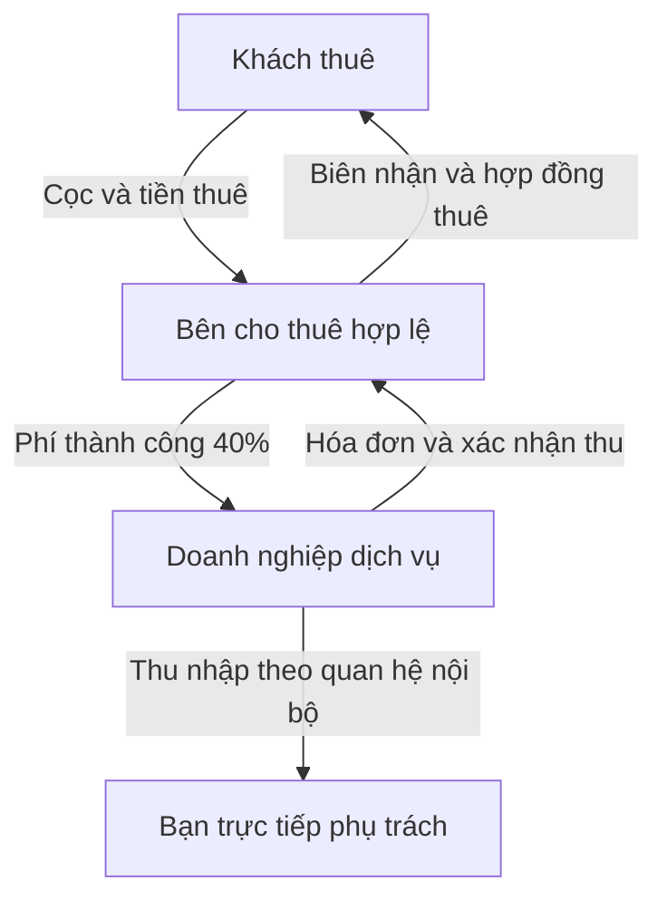
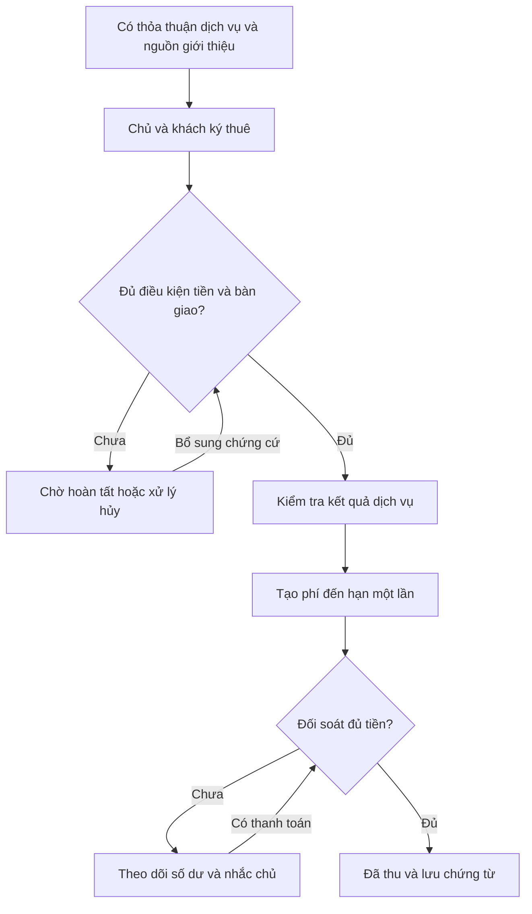

# KẾ HOẠCH THỰC THI MÔ HÌNH MÔI GIỚI CHO THUÊ

**Một người tiếp nhận và dẫn khách · Chủ ký hợp đồng thuê · Thu phí thành công 40%**

- Ngày lập: **24/09/2026**. Phiên bản: **1.0**.
- Repository: <https://github.com/QuanNguyenS403/batdongsan>.
- Mã nguồn đã đọc: commit `eb99862d8a6887dae0241d8e7302005d699ea40b`, thời điểm commit `17/09/2026 23:40:25 +07:00`.
- Đầu vào: yêu cầu của bạn, sơ đồ “Lead & Commission — Website cho thuê phòng”, mã nguồn tại commit trên và các nguồn pháp lý ở cuối tài liệu.
- Phạm vi: **phân tích và lập kế hoạch**, chưa sửa, triển khai hoặc kiểm thử website đang vận hành; chưa kiểm tra dữ liệu sản xuất, hồ sơ doanh nghiệp hay chứng chỉ của bạn.
- Giả định triển khai: hoạt động tại Việt Nam, ưu tiên phòng trọ, studio và nhà ở cho thuê dài hạn. Mặt bằng kinh doanh dùng mẫu và kiểm tra pháp lý riêng trước khi mở bán dịch vụ.

> **Kết luận chính:** Chọn **hai hợp đồng riêng**: hợp đồng dịch vụ môi giới giữa chủ và doanh nghiệp cung cấp dịch vụ của bạn; hợp đồng thuê giữa chủ/người có quyền cho thuê và khách. Liên kết bằng mã giao dịch, chứng cứ giới thiệu khách và biên bản xác nhận kết quả ba bên. Bạn là đầu mối tư vấn và dẫn xem; tên, số điện thoại của bạn xuất hiện trên tất cả tin, với nhãn rõ vai trò môi giới. Chủ trả phí thành công; khách thuê không trả phí tư vấn hoặc dẫn xem cho bạn.

**Quy ước:** “BẮT BUỘC” là yêu cầu nghiệm thu của kế hoạch; “KHÔNG ĐƯỢC” là hành vi hệ thống/quy trình phải ngăn; “ĐỀ XUẤT” là lựa chọn vận hành cần chốt trước khi áp dụng. Các tỷ lệ, thời hạn và chính sách thương mại trong tài liệu là thiết kế đề xuất, không phải mức pháp luật ấn định. Phần điều khoản là đầu bài cho luật sư hoàn thiện, không phải hợp đồng đã đủ điều kiện ký trong mọi trường hợp.

## 1. Chốt mô hình kinh doanh và điều kiện thành công

### 1.1. Sản phẩm bạn thực sự cung cấp

Đây là **dịch vụ môi giới cho thuê do bạn trực tiếp điều phối, có website hỗ trợ**. Giá trị nằm ở việc xác minh nguồn phòng, lọc nhu cầu, tư vấn, dẫn khách, phối hợp chốt hợp đồng và lưu bằng chứng giao dịch. Website chịu trách nhiệm thu hút khách và quản lý công việc; việc có nhiều tin chưa tự tạo ra doanh thu.

| Bên | Giá trị nhận được | Nghĩa vụ chính | Khoản phải trả |
|---|---|---|---|
| Người thuê | Một đầu mối tìm phòng, thông tin rõ, được dẫn xem và gặp đúng người có quyền cho thuê | Cung cấp nhu cầu trung thực, đọc/ký thỏa thuận, trả tiền thuê/cọc đúng người nhận | Tiền thuê, cọc và chi phí sử dụng đã thỏa thuận với chủ; **0 đồng phí môi giới cho bạn** |
| Chủ/người có quyền cho thuê | Khách phù hợp, giảm công tư vấn và dẫn xem | Cung cấp thông tin thật, ký hợp đồng dịch vụ, giữ lịch/phòng, ký thuê, bàn giao, trả phí | **40% cơ sở tiền thuê tháng đầu, một lần**, khi đủ điều kiện thành công |
| Doanh nghiệp dịch vụ của bạn | Phí môi giới phát sinh từ giao dịch thành công | Thực hiện dịch vụ, quản lý dữ liệu, xuất chứng từ phù hợp và chịu trách nhiệm với công việc của mình | Chi phí vận hành, nhân sự, marketing, thuế và các khoản hoàn hợp lệ |
| Bạn, người trực tiếp phụ trách | Thu nhập từ hoạt động của doanh nghiệp theo quan hệ thực tế | Nhận khách, tư vấn, dẫn xem, cập nhật hồ sơ, phối hợp ký kết | Không đồng nhất tiền doanh nghiệp thu với thu nhập cá nhân |

Nếu bạn làm trong một doanh nghiệp đối tác, phải làm rõ doanh nghiệp nào ký với chủ, nhận phí và trả thu nhập cho bạn. Không ghi “website” như một chủ thể độc lập ký hợp đồng.

### 1.2. Chính sách doanh thu phiên bản đầu

1. Người thuê được tìm kiếm, gọi, tư vấn và dẫn xem miễn phí.
2. Chủ gửi tin và tiếp nhận dịch vụ trong phạm vi đã ký; không thu gói đăng tin bắt buộc trong mô hình này.
3. Phí thành công mặc định **40%**, thu một lần cho một giao dịch thuê đủ điều kiện.
4. Không thu lại theo tháng, khi gia hạn hoặc khi tạo lại tin cho cùng hợp đồng.
5. Không tự áp dụng phí cho khách cũ của chủ, khách chưa chứng minh do bạn giới thiệu hoặc giao dịch phát sinh trước thỏa thuận dịch vụ.
6. Chưa mở các nguồn thu quảng cáo, gói VIP hay phí khách thuê trong bản đầu. Muốn bổ sung phải sửa chính sách, hợp đồng và giao diện công khai trước.
7. Hợp đồng/gói trả tiền đã tồn tại cần kiểm kê và xử lý chuyển tiếp; không xóa lịch sử hoặc tự chuyển tiền gói thành phí môi giới.

### 1.3. Những điểm phải sửa trong sơ đồ bạn cung cấp

| Sơ đồ hiện tại | Quy trình phù hợp yêu cầu của bạn |
|---|---|
| Hệ thống gửi lead cho chủ | Lead vào hàng đợi của bạn; tự gán bạn là người phụ trách |
| Chủ liên hệ khách | Bạn chủ động liên hệ, sàng lọc và tư vấn |
| Chủ nhập mã xem phòng | Bạn xác nhận có mặt; khách xác nhận đã xem; chủ phối hợp mở cửa và xác nhận khi cần |
| Khách/chủ tự thống nhất lịch | Khách đề xuất lịch; bạn xác nhận sau khi kiểm tra cả lịch cá nhân và phòng |
| Ký hợp đồng **hoặc** đặt cọc có thể phát sinh phí | Dùng một điều kiện thành công duy nhất tại mục 6; đặt cọc riêng chưa làm phát sinh phí |
| `RENTED → COMMISSION_DUE → PAID` nằm cùng vòng đời lead | Tách vòng đời khách, hợp đồng và công nợ để không nhầm thuê thành công với thu tiền thành công |
| Tự động thu commission | Tự tính, tạo công nợ và nhắc trả; chỉ xác nhận đã thu sau đối soát tiền thật |

## 2. Đánh giá mã nguồn hiện tại và khoảng cách cần khắc phục

Những nhận định sau dựa trên **đọc mã nguồn tĩnh**, không phải xác nhận hoạt động của bản production. Tài liệu cũ ghi “đã hoàn tất” không thay thế bằng chứng từ luồng chạy thực tế.

### 2.1. Những phần có thể sử dụng tiếp

- Monorepo `apps/web`, `apps/api`, `packages/database`; frontend Next.js, backend NestJS, dữ liệu PostgreSQL qua Prisma.
- Tin đã chuyên biệt cho thuê; có giá tháng, tiền cọc, kỳ thuê tối thiểu, điện/nước, tiện ích, ảnh và trạng thái duyệt.
- Có quản lý tin, lead, tài khoản, xác minh, báo cáo tin, dashboard quản trị.
- Có `FinanceLedger`, `AuditEvent`, `OutboxEvent`; có thể mở rộng sau khi kiểm tra cách sử dụng và phân quyền.
- Có nền tảng gửi OTP/SMS và chống trùng lead. Cần nối đúng vào yêu cầu thuê và củng cố trước khi dùng làm chứng cứ.

### 2.2. Bảng phát hiện gắn với file thực tế

| Mã | Phát hiện | Bằng chứng trong repo | Việc cần làm |
|---|---|---|---|
| GAP-01 | Tin gắn người liên hệ với người đăng/chủ | `apps/web/src/app/tin/[slug]/page.tsx`, `OwnerContactBox.tsx` | Tách dữ liệu chủ khỏi hồ sơ người phụ trách công khai; hiển thị bạn đúng vai trò |
| GAP-02 | API vẫn trả số chủ sau đăng nhập | `apps/api/src/modules/listings/listings.service.ts`, hàm `revealPhone()` trả `listing.owner.phone`; frontend `RevealPhoneButton.tsx` gọi API này | Vô hiệu khả năng lấy số chủ qua endpoint cũ; dùng đầu mối của bạn |
| GAP-03 | Chủ có thể xem số khách và đổi trạng thái lead | `leads.service.ts`: `findMyLeads()`, `updateStatus()`; `apps/web/src/app/tai-khoan/leads/page.tsx` có nút gọi khách | Thiết kế quyền xem theo giai đoạn; việc điều phối và đóng giao dịch do bạn thực hiện |
| GAP-04 | Lead mới chưa tự gán cho bạn, chưa có hồ sơ nhu cầu đầy đủ | `Lead` trong `schema.prisma`; `createLead()` không ghi `assignedToUserId` | Gán người phụ trách ở server; thêm ngân sách, ngày vào, kỳ thuê, số người, kênh và nguồn |
| GAP-05 | Trạng thái hiện chỉ là `new/contacted/qualified/completed/spam/cancelled` | `update-lead-status.dto.ts`, `Lead.status` | Thêm lịch xem, kết quả xem, giao dịch thuê và công nợ riêng |
| GAP-06 | Chưa thấy model lịch xem, hợp đồng dịch vụ, hợp đồng thuê, phí thành công | Danh sách model trong `packages/database/prisma/schema.prisma` | Xây các thực thể tại mục 10; `Listing.rented` không thay thế hồ sơ hợp đồng |
| GAP-07 | Phí gói thành viên và mùa cao điểm đang là luồng doanh thu | `MembershipPlan`, `PricingSeason`, `UserMembership`; `MembershipPricingClient.tsx` | Ngừng bán mới trong mô hình 40%; có kế hoạch xử lý khách/gói cũ |
| GAP-08 | Hạn mức đăng tin còn yêu cầu nâng cấp gói | `listings.service.ts`, hàm `create()`: mặc định 3 tin, kiểm tra membership | Đổi thành hạn mức kiểm duyệt/năng lực phục vụ; không buộc trả gói để hưởng dịch vụ mới |
| GAP-09 | Sổ tiền hiện liên kết với membership, chưa có khoản phải thu commission | `FinanceLedger.userMembershipId` và các trường tài chính hiện tại | Thêm tham chiếu nghiệp vụ, công nợ, phân bổ thanh toán và hoàn tiền; không trộn số cũ |
| GAP-10 | Đồng ý chia sẻ dữ liệu được chọn sẵn | `ContactBrokerModal.tsx`: `useState(true)`; schema có `consent` mặc định true; DTO yêu cầu true | Không chọn sẵn; lưu phiên bản thông báo, mục đích, thời điểm và người nhận dữ liệu |
| GAP-11 | Yêu cầu lead public không tự chứng minh người gửi sở hữu số điện thoại | `LeadsController.createLead()` là `@Public`; `JwtAuthGuard` bỏ xử lý auth cho public; `req.user` không được bảo đảm bởi luồng này | Xác thực tùy chọn hợp lệ hoặc challenge riêng; OTP ràng buộc đúng số khách trước xác nhận lịch |
| GAP-12 | Có outbox nhưng tạo lead chưa ghi sự kiện thông báo giao dịch cùng lúc | `createLead()` ghi trực tiếp DB; `outbox.service.ts` chưa có handler lead/lịch/commission | Ghi lead + sự kiện trong một transaction; retry, chống gửi trùng và cảnh báo hàng lỗi |
| GAP-13 | Nội dung pháp lý còn hứa liên hệ trực tiếp chủ | `apps/web/src/app/dieu-khoan/page.tsx`, `README.md`, `CLAUDE.md` | Đồng bộ lại mô hình, vai trò, chính sách tiền và giới hạn dịch vụ trên mọi trang |
| GAP-14 | Một tin chưa tương đương một phòng vật lý có tồn kho riêng | `Listing` và quan hệ `Project` hiện tại | Thêm `RentalUnit`; tránh cùng phòng được giữ/cho thuê hai lần qua nhiều tin |
| GAP-15 | OTP dùng bộ nhớ của tiến trình và `Math.random()` | `apps/api/src/modules/auth/otp.service.ts` | Dùng lưu trữ chia sẻ có TTL, bộ sinh ngẫu nhiên bảo mật, giới hạn thử/gửi; không ghi OTP thật vào log |
| GAP-16 | Tạo lead kiểm tra `status=active` nhưng chưa kiểm tra hết hạn/chủ bị khóa như luồng xem số | `leads.service.ts`: `createLead()` so với `listings.service.ts`: `revealPhone()` | Dùng chung điều kiện nhận khách: còn hiệu lực, chủ hợp lệ, phòng còn khả dụng và hợp đồng dịch vụ hiệu lực |

**Mức ưu tiên:** GAP-01 đến GAP-14 và GAP-16 đều ảnh hưởng trực tiếp mô hình hoặc khả năng thu phí rõ ràng. GAP-15 là điều kiện trước khi dựa vào OTP để xác nhận lịch/chứng cứ. Đây chưa phải kiểm toán an ninh toàn bộ repository.

## 3. Các nguyên tắc bắt buộc xuyên suốt

| Mã | Quy tắc | Bằng chứng nghiệm thu |
|---|---|---|
| BR-01 | Mỗi tin công khai dùng đúng tên và số của bạn trong khối liên hệ, cả desktop và mobile | Kiểm tra 100 tin thuộc 100 chủ; tất cả có cùng đầu mối |
| BR-02 | Hiển thị “Người tư vấn và dẫn xem”, không biến bạn thành chủ của 100 bất động sản | Nội dung và dữ liệu công khai thể hiện đúng vai trò |
| BR-03 | Giữ `ownerId` thật và hồ sơ người có quyền ký thuê trong dữ liệu riêng | Đổi người liên hệ không làm đổi chủ, quyền sở hữu tin hoặc người phải trả phí |
| BR-04 | Tất cả lead mới và yêu cầu lịch vào hàng đợi của bạn | Không gửi số khách đầy đủ cho chủ ngay khi khách gửi form |
| BR-05 | Chủ phải được kiểm tra và ký thỏa thuận dịch vụ trước khi tin được nhận khách thật | Thiếu hồ sơ/thỏa thuận thì tin ở trạng thái chờ |
| BR-06 | Khách phải biết và kiểm tra bên cho thuê trước khi cọc/ký | Có bước giới thiệu, hồ sơ đối chiếu và xác nhận đã nhận thông tin |
| BR-07 | Cọc và tiền thuê thuộc giao dịch khách–chủ | Không nhận vào tài khoản thu phí môi giới trong bản đầu |
| BR-08 | Không tự nhận quyền ký thay chủ, bảo lãnh hay quyết định hoàn cọc | Mọi ủy quyền bổ sung được lập riêng và rà soát trước |
| BR-09 | Phí thành công tính từ điều khoản đã ký, không từ giá tin có thể thay đổi | Có bản chụp điều khoản và cơ sở giá tại thời điểm chốt |
| BR-10 | Có đặt cọc chưa đồng nghĩa đã thuê thành công | Không sinh khoản đến hạn chỉ từ sự kiện cọc |
| BR-11 | Không đánh dấu đã thu từ lời nói, ảnh chuyển khoản hay việc khách đã ký thuê | Có giao dịch ngân hàng/đối soát đáng tin cậy |
| BR-12 | Một giao dịch chỉ phát sinh một phí thành công | Ràng buộc duy nhất, xử lý yêu cầu lặp và thanh toán trùng |
| BR-13 | Tranh chấp phí của chủ không làm khách mất quyền nhận phòng/hợp đồng | Không giữ chìa khóa, cọc hoặc hồ sơ của khách để gây sức ép |
| BR-14 | Không xóa chứng từ để sửa số tiền | Điều chỉnh bằng phiên bản hoặc bút toán đảo có lý do |
| BR-15 | Không chuyển dữ liệu/tiền gói cũ thành giao dịch mới tự động | Có đối soát và phương án chuyển tiếp được ghi nhận |

## 4. Điều kiện pháp lý cần hoàn tất trước khi nhận giao dịch thật

### 4.1. Các điểm đã tra cứu

**Môi giới:** Điều 61 Luật Kinh doanh bất động sản quy định hoạt động dịch vụ qua doanh nghiệp, cùng điều kiện tổ chức và chứng chỉ; cá nhân hành nghề cần chứng chỉ và làm trong doanh nghiệp phù hợp. Điều 63 phân biệt thu nhập môi giới cá nhân từ doanh nghiệp. Điều 46(4) quy định nội dung hợp đồng dịch vụ; Điều 48(2) yêu cầu doanh nghiệp nhận thanh toán qua tài khoản theo luật. **40% là chính sách thương mại của bạn, không phải tỷ lệ luật định.** [S1]

**Thuê nhà ở:** Nội dung hợp đồng xem Điều 163; thuê nhà ở thuộc trường hợp không bắt buộc công chứng/chứng thực theo Điều 164(2), trừ khi các bên có nhu cầu. Quy tắc này không thay thế kiểm tra quyền cho thuê và không áp dụng máy móc cho mọi loại bất động sản. Đã đối chiếu bản hợp nhất Luật Nhà ở năm 2026. [S2]

**Đặt cọc:** Cần phân biệt cọc bảo đảm giao kết, cọc bảo đảm thực hiện và tiền thuê trả trước. Việc hoàn/phạt cọc phụ thuộc mục đích, thỏa thuận, tình tiết và quy định liên quan; không để hệ thống tự kết luận cứ hủy là mất toàn bộ cọc. [S3]

**Ký điện tử:** OTP đăng nhập không tự trở thành chữ ký số. Giá trị xác nhận phụ thuộc phương thức, khả năng nhận diện, nội dung được chấp thuận và quy định áp dụng. Hợp đồng phải giữ được bản đã ký và bằng chứng kiểm tra. [S4]

**Dữ liệu và website:** Tại thời điểm lập kế hoạch, Luật Bảo vệ dữ liệu cá nhân 91/2025/QH15 và Nghị định 356/2025/NĐ-CP đã có hiệu lực; Luật Thương mại điện tử 122/2025/QH15 và Nghị định 248/2026/NĐ-CP có hiệu lực từ 01/07/2026. Phải rà soát theo khung hiện hành, không dùng riêng thủ tục cũ của năm 2023–2025. [S5][S6][S7][S8]

### 4.2. Danh mục đầu ra pháp lý — không bỏ qua để chạy nhanh

| Mã | Công việc | Người chịu trách nhiệm | Đầu ra để qua cổng triển khai |
|---|---|---|---|
| LEG-01 | Chốt doanh nghiệp cung cấp dịch vụ, người đại diện, tài khoản thu tiền và tư cách hành nghề của bạn | Bạn + luật sư | Hồ sơ và xác nhận điều kiện hoạt động phù hợp; hoàn thành công việc thông tin/đăng ký cần thiết |
| LEG-02 | Hoàn thiện hợp đồng dịch vụ môi giới và phụ lục từng tài sản | Luật sư; bạn duyệt thương mại | Mẫu có phiên bản, cơ sở 40%, điều kiện thành công, hủy/hoàn và xử lý nguồn khách |
| LEG-03 | Hoàn thiện mẫu thuê, cọc, bàn giao và xác nhận ba bên | Luật sư | Bộ mẫu cho từng loại hình; phân định rõ ai nhận/hoàn tiền |
| LEG-04 | Phân loại website theo hoạt động thực tế khi nhiều chủ gửi tin | Luật sư + người phụ trách website | Kết luận và thủ tục TMĐT phù hợp; không tự suy luận một số điện thoại là được miễn thủ tục |
| LEG-05 | Kiểm tra có thuộc hoạt động sàn giao dịch BĐS theo pháp luật chuyên ngành hay không | Luật sư | Kết luận riêng; không dùng chữ “sàn” như bằng chứng đã có đủ điều kiện |
| LEG-06 | Chốt cơ chế thuế, hóa đơn, thời điểm lập hóa đơn, hạch toán doanh thu và hoàn phí | Kế toán | Quy trình; cấu hình thuế được kiểm chứng, không gán cứng một thuế suất chưa xác định |
| LEG-07 | Hoàn thiện bảo vệ dữ liệu, thời hạn giữ, quyền truy cập/xóa và nhà cung cấp xử lý | Người phụ trách dữ liệu + luật sư | Chính sách, biểu mẫu đồng ý, lịch lưu/xóa; đánh giá/hồ sơ bắt buộc nếu áp dụng |
| LEG-08 | Chốt điều kiện phòng hợp lệ, an toàn và phòng cháy theo loại tài sản/địa phương | Bạn + chuyên gia khi cần | Danh mục kiểm tra và hồ sơ; không quảng cáo “đã kiểm định PCCC” nếu chỉ tự quan sát |

**Cổng pháp lý:** Có thể phát triển phần mềm bằng dữ liệu thử trong khi hoàn thiện hồ sơ. Chưa đủ LEG-01/02/03/04/06/07 và yêu cầu áp dụng của LEG-05/08 thì chưa mở quy trình nhận phí/giao dịch thật. Đây là điều kiện thực thi của kế hoạch, không phải kết luận rằng hiện tại bạn đang thiếu các giấy tờ đó.

## 5. Kiến trúc hợp đồng: hai hợp đồng chính và hồ sơ liên kết

### 5.1. Trả lời câu hỏi “tách hay gộp?”

**Nên tách hai hợp đồng chính.** Các bên, đối tượng, tiền và thời hạn khác nhau. Một văn bản ba bên gộp nội dung có thể được xem xét nếu soạn đúng, nhưng không mặc nhiên làm giao dịch minh bạch hơn; dễ làm bạn bị hiểu là bên cho thuê, người giữ cọc hoặc người bảo lãnh.

Đề xuất tách là thiết kế cho mô hình của bạn, **không phải khẳng định pháp luật bắt buộc mọi trường hợp phải đúng hai văn bản**. Bộ hồ sơ có thể có thêm thỏa thuận đặt cọc, phụ lục và biên bản.

| Văn bản | Bên ký | Ký lúc nào | Ràng buộc chính |
|---|---|---|---|
| **HĐ-01: Dịch vụ môi giới cho thuê** | Doanh nghiệp dịch vụ và chủ/người có quyền giao việc | Trước đăng công khai/nhận khách thật | Phạm vi công việc, đầu mối, phí 40%, bằng chứng khách, nghĩa vụ thanh toán |
| **PL-01: Danh mục tài sản/phòng** | Hai bên HĐ-01 | Khi thêm hoặc thay đổi phòng | Mã phòng, quyền cho thuê, giá, điều kiện, trạng thái, phiên bản |
| **BB-01: Xác nhận giới thiệu và xem phòng** | Khách và bạn; chủ xác nhận nguồn giới thiệu khi có thể | Trước/tại buổi xem, bổ sung kết quả sau buổi xem | Ai giới thiệu ai, xem phòng nào, thời gian, kết quả; không tạo phí khách thuê |
| **HĐ-02: Hợp đồng thuê** | Người có quyền cho thuê và khách | Trước hoặc tại bước chốt thuê, theo thỏa thuận | Giá thuê, cọc, thời hạn, bàn giao, sử dụng, chấm dứt và hoàn cọc |
| **BB-02: Xác nhận giao dịch ba bên** | Chủ + khách + đại diện dịch vụ | Khi chốt và cập nhật khi bàn giao | Nguồn giới thiệu, hợp đồng thuê liên quan, khoản tiền và nghĩa vụ phí của chủ |
| **BB-03: Bàn giao** | Chủ + khách; bạn ghi nhận/chứng kiến khi tham gia | Khi giao chìa khóa/quyền sử dụng | Hiện trạng, đồ đạc, công tơ, ngày bắt đầu, lỗi còn tồn tại |
| **HĐ-CỌC, nếu có** | Người nhận cọc có quyền và khách | Trước chuyển cọc | Mục đích, hạn giữ, điều kiện ký, hoàn/phạt, người nhận và tài khoản |

Bạn có thể có ô ký “người môi giới/người chứng kiến” trong HĐ-02 nếu được thống nhất, nhưng không ký vào ô bên cho thuê hoặc đại diện chủ khi chưa có ủy quyền hợp lệ. Việc khách ký BB-02 không làm khách liên đới trả khoản phí của chủ.

### 5.2. Các điều khoản HĐ-01 phải giải quyết

1. **Đúng chủ thể:** tên pháp lý, địa chỉ, thông tin nhận diện, người đại diện, thẩm quyền ký, thông tin doanh nghiệp và tài khoản nhận phí.
2. **Đúng tài sản:** mã tài sản/phòng trong phụ lục; chủ sở hữu, người cho thuê thực tế, căn cứ cho thuê hoặc cho thuê lại; không đồng nhất người đăng với chủ sở hữu khi chưa xác minh.
3. **Đúng công việc:** đăng/biên tập tin, sử dụng ảnh được cho phép, nhận nhu cầu, tư vấn, dẫn xem, hỗ trợ đàm phán, phối hợp giấy tờ và ghi nhận kết quả.
4. **Đúng giới hạn:** không mặc định quản lý tài sản, nhận giữ cọc, ký thay chủ hoặc bảo đảm mọi nghĩa vụ thuê; vẫn chịu trách nhiệm đối với lỗi trong dịch vụ của mình.
5. **Đúng đầu mối:** chủ đồng ý tin sử dụng tên/số liên hệ của bạn; hồ sơ của chủ được lưu và cung cấp đúng thời điểm, đúng mục đích.
6. **Đúng giá:** giá quảng cáo do chủ xác nhận; thay đổi giá/điện nước/cọc phải có lịch sử và gửi lại khách đang trao đổi.
7. **Đúng phí:** mức 40%, cơ sở tính, tổng tiền có/không gồm thuế, một lần hay nhiều lần, thời điểm phát sinh, hạn trả, chứng từ.
8. **Đúng nguồn khách:** có tiêu chí khách do bạn giới thiệu, cơ chế khách trùng và bằng chứng; không coi mọi người nhìn thấy website đều là khách phải trả phí.
9. **Đúng thông báo:** chủ báo phòng hết, thay điều kiện hoặc đã giao dịch với khách được giới thiệu; bạn báo tiến độ và các thông tin ảnh hưởng quyết định.
10. **Đúng hủy/hoàn:** áp dụng bảng mục 6.5; phí tranh chấp không được tự trừ vào cọc khách.
11. **Đúng thời hạn:** hiệu lực hợp đồng dịch vụ, phạm vi tiếp tục bảo vệ nguồn khách sau kết thúc, cách gia hạn hoặc chấm dứt.
12. **Đúng giải quyết tranh chấp:** tiếp nhận bằng văn bản, trao đổi bằng chứng, thương lượng; cơ quan/phương thức giải quyết phù hợp. Phạt, lãi chậm trả và bồi thường do luật sư kiểm tra, không tự đặt hệ số 3–5 lần.

### 5.3. Chính sách nguồn khách và chống bỏ qua môi giới

**ĐỀ XUẤT:** Hợp tác không độc quyền toàn bộ tài sản trong giai đoạn đầu; bảo vệ **từng khách được giới thiệu có bằng chứng** trong 90 ngày từ lần giới thiệu đủ bằng chứng. Một lần liên hệ trùng hoặc chỉnh sửa lead không tự kéo dài thời hạn. Mốc 90 ngày phải được ký và rà soát pháp lý trước áp dụng.

- Tạo `introduction_id`, gắn khách, chủ, phòng và thời điểm; gửi chủ mã/tóm tắt phù hợp mà không phát tán dữ liệu khách không cần thiết.
- Chủ phản hồi khách đã có sẵn trong 2 ngày làm việc **theo SLA đề xuất**, kèm bằng chứng có trước. Không biến việc im lặng thành bằng chứng duy nhất để thu phí.
- Nếu chủ và khách tự ký sau khi bạn đã thực hiện việc giới thiệu thuộc phạm vi thỏa thuận, xem xét phí theo HĐ-01 và hồ sơ; không yêu cầu bạn phải có mặt đúng buổi ký mới công nhận nguồn.
- Khách đã được bạn dẫn xem rồi thuê **phòng khác của cùng chủ** chỉ thuộc phạm vi phí khi điều khoản đã bao gồm trường hợp này, có quan hệ giới thiệu chứng minh được và phòng thay thế được cập nhật.
- Không tự cộng phí với người thân/bạn bè của khách; phải có giao dịch và căn cứ giới thiệu cụ thể.
- Hai môi giới cùng tham gia: xác nhận cách phân chia từ trước; không để khách/chủ bất ngờ trả hai lần cho cùng dịch vụ.
- Chấm dứt hợp tác phải có danh sách giới thiệu còn thời hạn, bằng chứng và cách xử lý tranh chấp; không bảo vệ vô thời hạn.

**Minh bạch không phụ thuộc việc giấu chủ đến cuối.** Khách cần được gặp và xác minh bên cho thuê trước khi cam kết tài chính; quyền hưởng phí được bảo vệ bằng thỏa thuận và bằng chứng, không bằng việc ngăn hai bên biết nhau.

### 5.4. Các câu điều khoản để luật sư phát triển

> **Vai trò:** “[DOANH NGHIỆP] cung cấp dịch vụ giới thiệu, tư vấn và tổ chức xem tài sản. [TÊN BẠN] là người trực tiếp phụ trách. Bên cho thuê và bên thuê tự xác lập hợp đồng thuê; quyền đại diện ký thay hoặc nhận tiền chỉ phát sinh theo văn bản riêng hợp lệ.”

> **Phí:** “Chủ thanh toán một lần khoản phí dịch vụ bằng 40% cơ sở tính phí ghi tại phụ lục giao dịch. Người thuê không có nghĩa vụ thanh toán khoản phí này. Điều kiện hoàn thành và hạn thanh toán được xác định tại các điều khoản tương ứng.”

> **Dòng tiền:** “Tiền cọc và tiền thuê thanh toán cho đúng bên cho thuê/người nhận được ủy quyền hợp lệ. Phí dịch vụ thanh toán riêng cho [DOANH NGHIỆP]. Không tự khấu trừ phí dịch vụ vào tài sản đặt cọc của người thuê.”

> **Xác nhận ba bên:** “Các bên xác nhận khách được giới thiệu theo mã […], thuê phòng […] theo hợp đồng […]. Khoản phí môi giới do chủ thanh toán theo HĐ-01 số […]; xác nhận này không chuyển nghĩa vụ trả phí sang người thuê và không tạo nghĩa vụ bảo lãnh ngoài phạm vi đã thỏa thuận.”

## 6. Hoa hồng, dòng tiền và quy tắc đối soát

### 6.1. Định nghĩa chính xác cơ sở 40%

```text
commission_rate_bps = 4000                    # 40%, đơn vị 1/10.000
commission_gross_vnd = round_half_up(commission_base_vnd * 4000 / 10000)
```

**Chính sách đề xuất để ký:** `commission_base_vnd` là tiền thuê thuần của **kỳ thuê một tháng đầu tiên tính từ ngày bắt đầu thuê**, sau ưu đãi thực sự áp dụng cho kỳ đó. Không gồm cọc hoàn lại, điện, nước, internet, giữ xe, vệ sinh, phí quản lý hoặc các khoản thu hộ. Phải ghi con số và kỳ tính cụ thể trong phụ lục, không chỉ ghi “40% tháng đầu”.

| Tình huống | Cơ sở tính đề xuất | Phí tổng theo tỷ lệ 40% |
|---|---:|---:|
| Tiền thuê tháng đầu 5.000.000đ | 5.000.000đ | 2.000.000đ |
| Thỏa thuận thuê thực tế giảm còn 4.500.000đ | 4.500.000đ | 1.800.000đ |
| Tháng đầu được giảm 50% từ 5.000.000đ | 2.500.000đ | 1.000.000đ |
| Tháng đầu miễn tiền thuê thật | 0đ | 0đ theo chính sách này; không tự lấy giá tháng thứ hai |
| Thanh toán trước ba tháng, mỗi tháng 5.000.000đ | 5.000.000đ | 2.000.000đ, không tính 40% của 15.000.000đ |
| Vào giữa tháng, chủ thu 2.500.000đ cho nửa tháng lịch rồi thu tiếp | Xác định đủ kỳ một tháng từ ngày bắt đầu; ví dụ 5.000.000đ nếu giá không giảm | 2.000.000đ **chỉ khi quy tắc kỳ tính này đã được chủ chấp thuận** |
| Thuê ngắn hơn một tháng | Phải có phụ lục riêng, xác định số thuê thực tế; không tự suy rộng mẫu dài hạn | Tính sau khi chốt phụ lục |
| Gói giá đã bao điện/nước, không tách được | Chủ phải xác nhận cơ sở tính phí cụ thể trước giới thiệu/chốt | Không tự lấy toàn bộ gói làm cơ sở |

**Thuế:** Đề xuất niêm yết **40% là tổng phí chủ phải trả, đã gồm thuế gián thu nếu áp dụng**, để ví dụ 5 triệu → 2 triệu không bị cộng thêm ngoài dự kiến. Kế toán xác định phần doanh thu trước thuế/thuế trong tổng này theo tình trạng thực tế. Nếu muốn dùng mức chưa thuế, phải sửa giá công khai, hợp đồng và ví dụ trước khi nhận khách; không cộng thêm sau khi chủ đã ký.

Giá trên tin, tiền thuê trong hợp đồng và cơ sở tính phí là ba trường riêng, phải đối chiếu chênh lệch. Không tự sửa cơ sở phí khi chủ chỉnh giá tin sau giao dịch.

### 6.2. Khi nào được ghi nhận “thuê thành công” để tính phí?

**ĐỀ XUẤT dùng đồng thời các điều kiện sau trong HĐ-01:**

1. Có thỏa thuận dịch vụ hiệu lực, đúng tài sản/phạm vi và nguồn giới thiệu hợp lệ.
2. Chủ/người có quyền cho thuê và khách đã ký hợp đồng thuê được kiểm tra đủ hồ sơ.
3. Chủ đã nhận khoản tiền thuê đầu tiên đến hạn theo hợp đồng; trường hợp được miễn/hoãn phải có phụ lục rõ ràng và được xử lý riêng, không đánh dấu “đã trả”.
4. Đã bàn giao chìa khóa/quyền sử dụng theo biên bản hoặc chứng cứ tương đương được kiểm tra.
5. Không còn tranh chấp chưa xử lý về quyền cho thuê, nguồn giới thiệu hoặc cơ sở phí làm giao dịch chưa đủ căn cứ xác nhận.

`success_at` là thời điểm cuối cùng các điều kiện cần thiết được đáp ứng. Nếu ký trước ngày nhận phòng hai tuần thì thời điểm ký chưa phải thời điểm đến hạn phí theo chính sách này. Khách có thể ký thẳng và nhận phòng mà không cọc trước; cọc là nhánh tùy chọn.

BB-02 có đủ xác nhận ba bên là bộ chứng cứ thuận tiện, không trao cho chủ quyền trì hoãn nghĩa vụ vô hạn bằng cách từ chối bấm nút. Khi có đủ chứng cứ khách quan về các điều kiện đã thỏa thuận, người xử lý được lập kết luận có căn cứ. Một lời phản đối không tự xóa khoản nợ; tranh chấp và việc tạm dừng nhắc thu cần quyết định riêng được ghi lại.

Nếu cơ sở phí bằng 0 do ưu đãi đã được xác nhận, lưu kết quả dịch vụ và lý do không thu phí; không tạo yêu cầu thanh toán 0đ để giả lập một khoản đã thu. Giá chưa biết/thiếu dữ liệu phải là trạng thái chờ, khác với giá 0đ hợp lệ.

**Mục tiêu:** Chủ chỉ trả khi dịch vụ có kết quả thật, bạn có tiêu chí khách quan để thu. Đổi sang thu ngay khi ký/cọc là thay đổi chính sách lớn, chỉ áp dụng cho hợp đồng mới đã chấp thuận; không sửa âm thầm trong phần mềm.

### 6.3. Luồng chuyển tiền



Ví dụ tiền thuê 5.000.000đ/tháng, cọc 5.000.000đ:

- Khách chuyển **10.000.000đ cho chủ** theo hợp đồng, trong đó cọc 5.000.000đ và tiền thuê 5.000.000đ được ghi riêng.
- Khi đủ điều kiện thành công, chủ chuyển **2.000.000đ phí dịch vụ** cho doanh nghiệp.
- Doanh nghiệp không ghi 10.000.000đ khách chuyển chủ vào doanh thu/dòng tiền của mình.
- Khoản cọc 5.000.000đ vẫn được chủ quản lý theo nghĩa vụ với khách; không được xem là phần tiền đã trả hoa hồng.

Trong bản đầu, bạn hỗ trợ kiểm tra/ghi nhận chứng từ nhưng **không vận hành ví, giữ cọc, chia tiền thuê hoặc tài khoản ký quỹ**. Nếu sau này muốn thu hộ phải thiết kế pháp lý, kế toán và thanh toán riêng; không thêm bằng một nút “nhận hộ”.

### 6.4. Đến hạn, đã thu và kế toán

1. Khi đủ điều kiện, tạo phí ở trạng thái `DUE`, có số tiền, cơ sở, phiên bản điều khoản và `due_at`.
2. Hạn đề xuất: **2 ngày làm việc từ `success_at`**. Định nghĩa ngày làm việc theo lịch Việt Nam và lịch nghỉ được cấu hình; không cộng cố định 48 giờ rồi gọi là hai ngày làm việc.
3. Tạo mã thanh toán riêng cho từng công nợ, ví dụ `MG-[deal_code]`; QR chỉ chứa tài khoản doanh nghiệp đã kiểm chứng.
4. Chủ gửi thông báo đã chuyển → trạng thái chứng từ `SUBMITTED`; **chưa** chuyển phí sang `PAID`.
5. Kế toán/bạn đối chiếu biến động ngân hàng, số tiền, mã giao dịch, bên trả và công nợ; bản đầu có thể làm thủ công có nhật ký.
6. Thiếu tiền → `PARTIALLY_PAID`; dư tiền → khoản chưa phân bổ/xử lý hoàn, không âm thầm tăng phí.
7. Khớp đủ → `PAID`; sinh biên nhận và thực hiện hóa đơn theo quy trình kế toán.
8. Thời điểm xuất hóa đơn/ghi nhận doanh thu theo luật kế toán–thuế và tính chất dịch vụ; không mặc định đợi đến khi tiền về mới lập hóa đơn. Dashboard phải tách **phí phát sinh**, **công nợ**, **tiền thực thu**, **tiền hoàn**, **thuế**.
9. Đến hạn +1 ngày làm việc nhắc chủ; quá hạn 7 ngày làm việc đưa vào xử lý công nợ và xem xét dừng nhận tin mới của chủ theo HĐ-01. Vẫn giữ quyền tiếp cận hợp đồng và giải quyết việc thuê đang tồn tại.

### 6.5. Chính sách hủy, hoàn và tranh chấp phí

| Tình huống | Phí môi giới theo chính sách đề xuất | Công việc bắt buộc |
|---|---|---|
| Chỉ xem phòng, khách không thuê | 0đ | Ghi lý do, giới thiệu lựa chọn khác nếu khách muốn |
| Có cọc nhưng chưa đủ điều kiện thành công | Chưa phát sinh phí | Chủ–khách xử lý cọc theo văn bản; bạn hỗ trợ chứng cứ |
| Ký hợp đồng rồi hủy trước bàn giao | Chưa thu theo chính sách tại 6.2 | Ghi hủy, lý do và nghĩa vụ giữa chủ–khách |
| Chủ thay giá/giấu thông tin làm giao dịch không thể hoàn thành | Không thu phí thành công | Dừng tin, xử lý trách nhiệm và cọc theo thỏa thuận/pháp luật |
| Giao dịch bị ghi nhận nhầm, không thực sự đủ điều kiện | Hủy công nợ; đã thu thì hoàn khoản thu sai | Phê duyệt điều chỉnh, bút toán đảo/hoàn, không xóa lịch sử |
| Sau bàn giao khách tự thay đổi nhu cầu | Không tự hoàn phí môi giới | Giải quyết hợp đồng thuê riêng; có thể hỗ trợ thêm nếu tự nguyện, không mặc định thu lại |
| Sau bàn giao phát hiện sai phạm của chủ hoặc lỗi dịch vụ làm giao dịch không đứng vững | Đưa vào `DISPUTED`, đánh giá hoàn/giảm phí và trách nhiệm liên quan | Luật sư xem tình tiết; bảo lưu quyền theo luật, không dùng điều khoản miễn trách nhiệm tuyệt đối |
| Chủ nói không phải khách bạn giới thiệu | Không tự đánh dấu công nợ đã được thừa nhận | Đối chiếu lịch sử và thỏa thuận; lập hồ sơ tranh chấp |
| Chủ/khách im lặng khi cần xác nhận | Không suy ra thành công chỉ từ im lặng | Dùng chứng cứ hợp lệ khác; nếu chưa đủ thì để chờ kiểm tra |
| Thanh toán hai lần cho cùng phí | Chỉ thu đúng một lần | Hoàn/phân bổ khoản dư có xác nhận; giữ hai giao dịch ngân hàng gốc |

Phí và cọc là hai tranh chấp khác nhau. Hoàn phí của doanh nghiệp không tự thay thế nghĩa vụ hoàn cọc của chủ. Đề xuất hoàn khoản thu sai trong 5 ngày làm việc sau khi có kết luận và thông tin nhận tiền hợp lệ; các thời hạn bắt buộc áp dụng nếu pháp luật quy định khác.

## 7. Quy trình vận hành từ nhận tin đến thu tiền

### 7.1. Các bước và điều kiện chuyển bước

| Bước | Bạn thực hiện | Chủ/khách thực hiện | Hồ sơ phải có trước khi đi tiếp |
|---|---|---|---|
| OP-01 Nhận chủ | Tạo hồ sơ, xác nhận số liên hệ, hẹn kiểm tra | Chủ cung cấp danh tính và căn cứ có quyền cho thuê | Hồ sơ người cho thuê; xác định người ký và người nhận tiền |
| OP-02 Kiểm tra phòng | Khảo sát/đối chiếu ảnh, địa chỉ, hiện trạng, phí và điều kiện an toàn | Chủ cung cấp thông tin, giải thích phần chưa rõ | Phiếu kiểm tra có ngày, người kiểm tra, phạm vi và tài liệu còn thiếu |
| OP-03 Ký dịch vụ | Giải thích vai trò, 40%, nguồn khách, cách trả tiền | Chủ ký HĐ-01 và phụ lục | Hợp đồng hiệu lực, cơ sở giá và quyền dùng nội dung |
| OP-04 Duyệt đăng | Biên tập tin, bỏ thông tin sai/không được phép công khai | Chủ xác nhận giá, ảnh và điều kiện | Tin đúng phòng, có người phụ trách là bạn, trạng thái còn phòng |
| OP-05 Tiếp nhận khách | Nhận form/gọi/Zalo; ghi nguồn và gán bản thân | Khách nêu nhu cầu, đồng ý xử lý cần thiết | Lead, mục đích liên hệ, thông tin tối thiểu |
| OP-06 Sàng lọc | Hỏi ngân sách tổng, ngày vào, kỳ thuê, số người, nhu cầu thực | Khách xác nhận tiêu chí; xác minh số khi xác nhận lịch | Lead đủ điều kiện; không cần thu CCCD ngay từ lần hỏi phòng |
| OP-07 Xác nhận lịch | Đối chiếu lịch bạn, thời gian đi lại, còn phòng, người mở cửa | Khách chọn giờ, chủ xác nhận sẵn sàng | Lịch có phòng, người dẫn, thời gian, điểm hẹn; gửi thông tin nhận diện bạn |
| OP-08 Dẫn xem | Bạn trực tiếp dẫn, đối chiếu phòng và giá, ghi kết quả | Khách xác nhận đã xem; chủ cung cấp điều kiện thực tế | Phiếu xem, sai lệch nếu có; chưa đủ thì không nhận yêu cầu cọc |
| OP-09 Giới thiệu bên ký | Cho khách kiểm tra danh tính, quyền cho thuê, người nhận tiền | Chủ và khách làm rõ điều khoản | Đúng chủ thể, đúng phòng; mở kênh liên hệ chủ–khách khi cần chốt |
| OP-10 Cọc tùy chọn | Hỗ trợ đọc thỏa thuận và kiểm tra người nhận | Khách–chủ ký/ghi nhận cọc và chuyển trực tiếp | Văn bản cọc, hạn giữ, biên nhận; không ghi doanh thu cho bạn |
| OP-11 Ký thuê | So sánh giá đã chốt, HĐ-02, phí, mốc nhận phòng | Chủ–khách ký; các bên xác nhận nguồn giới thiệu | Bản ký và mã giao dịch; công nợ chưa đến hạn nếu chưa đủ 6.2 |
| OP-12 Bàn giao | Bạn phối hợp ghi nhận; đối chiếu tiền đến hạn | Chủ giao phòng, khách kiểm tra/ký nhận | BB-03, chứng cứ thanh toán, kết quả kiểm tra |
| OP-13 Thu phí | Xác nhận kết quả, tạo công nợ, gửi chủ, đối soát | Chủ thanh toán phí dịch vụ | Giao dịch ngân hàng khớp, chứng từ, trạng thái tài chính đúng |
| OP-14 Theo dõi | Hỏi tình trạng nhận phòng, xử lý sai lệch, đóng hồ sơ | Chủ cập nhật hết phòng; khách báo vấn đề | Nhật ký xử lý và trạng thái phòng chính xác |

**Không có quy tắc “cứ thiếu giấy chứng nhận là mọi hợp đồng thuê vô hiệu”.** Phải kiểm tra loại tài sản, trường hợp pháp luật áp dụng và căn cứ hợp lệ cho quyền cho thuê. Nếu người đăng là người thuê lại/quản lý, kiểm tra thêm quyền cho thuê lại/ủy quyền và giới hạn thẩm quyền.

### 7.2. Hồ sơ tối thiểu để tạo niềm tin

**Đối với chủ và phòng:** danh tính/thẩm quyền; căn cứ quyền cho thuê; đồng ý cần thiết của đồng sở hữu hoặc bên có quyền; địa chỉ/phòng; ảnh đúng thực tế; giá và các khoản phí; ngày có thể vào; tình trạng sửa chữa/an toàn; phương thức nhận tiền; HĐ-01 có hiệu lực.

**Đối với bạn:** tên thật dùng để tiếp khách, ảnh nhận diện nếu bạn chọn, doanh nghiệp cung cấp dịch vụ, phạm vi phụ trách, số điện thoại/Zalo chính thức, lịch làm việc, cơ chế phản ánh. Chỉ công bố chứng chỉ/xác minh có căn cứ, không dùng badge chung “uy tín 100%”.

**Đối với khách trước chuyển tiền:** tên bên cho thuê, căn cứ quyền ký, phòng chính xác, giá thuê/phụ phí, số cọc, người thụ hưởng, thời hạn, điều kiện hoàn/hủy, ngày bàn giao và bản hợp đồng được đọc trước. Tài liệu nhạy cảm chỉ cung cấp đủ để kiểm tra, không đưa toàn bộ CCCD/giấy tờ lên trang công khai.

### 7.3. Lịch và SLA cho mô hình chỉ có bạn dẫn khách

Các chỉ tiêu sau là mục tiêu vận hành đề xuất, phải điều chỉnh theo địa bàn và năng lực:

- Giờ phục vụ: cấu hình và hiển thị công khai; khởi điểm có thể 08:30–18:00, ngoài giờ trả lời tự động và hẹn lại.
- Lead trong giờ: mục tiêu phản hồi trong 30 phút; cảnh báo nội bộ sau 2 giờ chưa được xử lý. Không hứa 24/7 khi chưa có người trực.
- Mỗi lịch dự trù 45–60 phút xem và khoảng đệm đi lại; thời gian di chuyển phụ thuộc khu vực.
- Khởi điểm tối đa **3 lịch xác nhận/ngày**, gom phòng cùng khu vực; các yêu cầu thêm ở hàng chờ.
- Khách chọn giờ chỉ tạo **yêu cầu lịch**, chưa là lịch xác nhận. Xác nhận phải có bạn và phòng sẵn sàng.
- Nhắc lịch trước 24 giờ và 2 giờ nếu còn phù hợp; không gửi tin nhắc sau hủy.
- Khách/chủ không đến: ghi `NO_SHOW`, chủ động liên hệ lại; không tự tính phí xem hoặc phạt khách.
- Bạn bận/ốm: dừng slot mới, báo lại lịch đã hẹn; chỉ thay người dẫn khi khách biết và đồng ý, không quảng cáo vẫn do bạn dẫn nếu đã thay.
- Chủ phải xác nhận lại phòng còn trống định kỳ, đề xuất 72 giờ/lần; quá hạn chuyển sang cần kiểm tra và ngừng xác nhận lịch mới.
- Kiểm tra lại tình trạng phòng sát giờ hẹn; chủ báo có cọc/đã thuê ngoài hệ thống thì cập nhật ngay.

### 7.4. Quản lý sức chứa thay vì đếm tin

100 chủ có 100 tin không đồng nghĩa bạn có thể xử lý 100 buổi xem cùng lúc. Dùng công thức:

```text
Lịch xem tối đa/tháng = ngày làm việc × lịch/ngày
Giao dịch dự kiến = lịch đã thực hiện × tỷ lệ chuyển từ xem sang thuê
```

Ví dụ giả định: 22 ngày × 3 lịch = 66 slot; sử dụng được 80% ≈ 53 lượt xem; tỷ lệ chốt 25% ≈ 13 giao dịch. Với phí 2 triệu/giao dịch, mức thu gộp khoảng 26 triệu trước chi phí, hoàn phí và thuế. Đây là mô hình tính để thử, không phải dự báo nhu cầu thị trường.

Mở thử 10–20 phòng đã kiểm tra trong phạm vi di chuyển hẹp. Khi tải lịch vượt 80% trong hai tuần hoặc phản hồi liên tục trễ, ưu tiên giảm nhận lịch/mở hàng chờ; tuyển thêm người là quyết định mới vì yêu cầu hiện tại là bạn trực tiếp dẫn.

## 8. Trải nghiệm website và ma trận quyền truy cập

### 8.1. Khối liên hệ trên tất cả tin

Nội dung chuẩn đề xuất:

> **[TÊN BẠN] — Người tư vấn và trực tiếp dẫn xem**  
> Đại diện dịch vụ của [TÊN DOANH NGHIỆP].  
> Tư vấn và xem phòng miễn phí. Hợp đồng thuê ký trực tiếp với bên có quyền cho thuê. Chủ thanh toán phí dịch vụ khi thuê thành công theo thỏa thuận.  
> **Gọi [SỐ CỦA BẠN] · Nhắn Zalo · Đề xuất lịch xem**

- Các biến tên/số lấy từ cấu hình đã xác minh; chưa coi hotline trong mã nguồn hiện tại là số đúng của bạn.
- Điện thoại công khai của bạn không cần bị khóa sau OTP. Ghi nhận lượt bấm là sự kiện quan tâm, **không tự coi là lead có số khách hoặc chứng cứ đã giới thiệu**.
- Cuộc gọi/Zalo: hỏi mã tin, nhập lead và nguồn vào CRM khi có thông tin khách. Không tự tuyên bố website đọc được lịch sử gọi/tin nhắn bên ngoài.
- Form bỏ lời hứa “người đăng tin sẽ gọi”; đổi thành “Người phụ trách sẽ liên hệ để tư vấn và xác nhận lịch”.
- Nhu cầu: họ tên, số điện thoại, ngân sách, ngày dự kiến vào, thời hạn thuê, số người, tin/phòng quan tâm; email tùy chọn.
- Đồng ý xử lý dữ liệu cần thiết không chọn sẵn; marketing là lựa chọn riêng, không bắt buộc để đi xem.
- Trang giá thay bằng giải thích phí thành công, ví dụ số tiền và điều kiện; trang điều khoản/quyền riêng tư phải thống nhất.

### 8.2. Hiển thị thông tin chủ mà không làm sai vai trò

Không công khai số liên hệ riêng của chủ trong khối tư vấn. Tuy nhiên, phải công khai thông tin bên cung cấp dịch vụ/người cho thuê mà pháp luật áp dụng yêu cầu; không dùng mục tiêu giữ lead để che giấu thông tin bắt buộc.

Thiết kế `publicContact` là bạn; `lessorDisclosure` là thông tin người cho thuê được công bố theo chính sách đã rà soát; `ownerPrivateProfile` giữ hồ sơ riêng. Trước cọc/ký, khách được nhận đầy đủ thông tin cần thiết để quyết định và liên hệ bên ký thuê. Sau khi thuê, chủ là đầu mối thực hiện nghĩa vụ cho thuê; bạn có kênh hỗ trợ về phần dịch vụ của mình.

### 8.3. Quyền theo vai trò và giai đoạn

| Dữ liệu/hành động | Khách công khai | Khách có giao dịch | Chủ liên quan | Bạn/người vận hành được phân công | Kế toán |
|---|---|---|---|---|---|
| Giá, ảnh, phí, liên hệ bạn | Xem | Xem | Xem | Quản lý theo kiểm duyệt | Xem khi cần |
| Hồ sơ gốc của chủ | Không | Phần cần kiểm tra đúng thời điểm | Hồ sơ của mình | Theo nhiệm vụ xác minh | Chỉ dữ liệu phục vụ hóa đơn/thu tiền |
| Số khách mới gửi form | Không | Chỉ thông tin của mình | Che/giới hạn trước bước giới thiệu chốt | Xem lead được phân công | Không mặc định |
| Thông tin chủ–khách phục vụ ký | Không | Của giao dịch mình | Của giao dịch mình | Điều phối và kiểm tra | Phạm vi cần thiết |
| Đề xuất/xác nhận lịch | Không cần tài khoản để gửi yêu cầu; xác minh trước xác nhận | Yêu cầu, hủy lịch của mình | Xác nhận phòng/người mở cửa | Xác nhận lịch dẫn | Không |
| Hợp đồng thuê | Không | Xem/tải bản của mình | Xem/tải bản của mình | Theo phạm vi hỗ trợ đã thông báo | Chỉ thông tin cần đối soát phí |
| HĐ dịch vụ và công nợ chủ | Không | Biết phí không thuộc nghĩa vụ mình | Của mình | Theo phân công | Theo quyền tài chính |
| Đánh dấu đủ điều kiện thu phí | Không | Cung cấp xác nhận | Cung cấp xác nhận/tranh chấp | Đề xuất và kiểm tra chứng cứ | Đối chiếu khoản phải thu |
| Đánh dấu đã thu/hoàn | Không | Không | Nộp thông báo/chứng từ | Chỉ nếu có quyền tài chính và bằng chứng | Thực hiện theo quy trình |

Một người có thể vừa là người thuê vừa là chủ; không khóa mô hình quyền chỉ bằng một enum vai trò cứng. Cần kiểm tra quyền với **từng bản ghi**. Khi bạn kiêm vận hành và tài chính, dùng lý do, bằng chứng và rà soát độc lập định kỳ bởi kế toán; chưa có người thứ hai thì không ghi đã thực hiện kiểm soát hai người.

### 8.4. Yêu cầu riêng tư ở mức hệ thống

- API công khai dùng danh sách trường cho phép; không trả toàn bộ object chủ rồi ẩn bằng CSS.
- Kiểm tra cả endpoint `reveal-phone` cũ, API danh sách, detail, HTML SSR, JSON-LD, cache, dữ liệu tìm kiếm, file export và đường dẫn tải hồ sơ.
- Soát số chủ trong tiêu đề, mô tả, ảnh, watermark và QR trước khi duyệt; bộ lọc tự động hỗ trợ, cần người kiểm duyệt vì nhận diện không hoàn hảo.
- Hồ sơ nhạy cảm lưu riêng với ảnh tin công khai, liên kết tải có hạn và kiểm tra quyền; lưu nhật ký truy cập phù hợp.
- Địa chỉ/định vị phải đáp ứng nghĩa vụ công bố và nhu cầu xem phòng; chỉ làm mờ phần được phép, không quảng cáo sai vị trí để giữ khách.
- Gửi email/Sheets chỉ dữ liệu cần thiết; Sheets là báo cáo hỗ trợ, không phải nguồn quyết định số nợ. Kiểm tra quyền truy cập và việc chuyển dữ liệu qua nhà cung cấp.
- Có lịch lưu và xóa theo loại dữ liệu; hồ sơ kế toán/tranh chấp cần giữ theo căn cứ tương ứng. Không giữ vô hạn mọi CCCD, không xóa chứng từ bắt buộc chỉ vì xóa tài khoản.

## 9. Trạng thái nghiệp vụ và điều kiện hệ thống phải kiểm tra

### 9.1. Tách bốn vòng đời

| Thực thể | Trạng thái chính đề xuất | Điều kiện cần kiểm tra |
|---|---|---|
| Lead/cơ hội thuê | `NEW`, `CONTACTED`, `QUALIFIED`, `IN_PROGRESS`, `WON`, `LOST`, `DUPLICATE`, `SPAM` | `WON` khi xác nhận khách đã thuê thực tế; không đồng nghĩa phí đã thu; không dùng `completed` cũ làm bằng chứng |
| Lịch xem | `REQUESTED`, `CONFIRMED`, `COMPLETED`, `CANCELLED`, `NO_SHOW`, `RESCHEDULED` | Xác nhận phải có người dẫn, phòng còn nhận lịch và không trùng giờ; hoàn thành cần chứng cứ đi xem |
| Giao dịch thuê | `NEGOTIATING`, `CONTRACT_READY`, `SIGNED`, `HANDOVER_PENDING`, `ACTIVE`, `CANCELLED`, `TERMINATED` | `SIGNED` cần bản ký; `ACTIVE` phản ánh thuê/bàn giao thực tế đã kiểm chứng; điều kiện hưởng phí được kiểm tra riêng |
| Phí thành công | `ESTIMATED`, `DUE`, `PARTIALLY_PAID`, `PAID`, `VOID`, `PARTIALLY_REFUNDED`, `REFUNDED` | Ước tính chưa là nợ; đến hạn có căn cứ; đã thu có tiền; hoàn có bút toán tham chiếu |

`OVERDUE` nên tính từ số dư và ngày đến hạn; `DISPUTED` quản lý bằng hồ sơ tranh chấp/flag riêng để một khoản có thể vừa trả một phần vừa tranh chấp. Đặt cọc có trạng thái/bằng chứng riêng, không bắt mọi hợp đồng phải qua bước cọc.

Trạng thái CRM không quyết định hiệu lực pháp lý của hợp đồng. Tranh chấp hoa hồng hoặc việc chủ chưa trả phí không được đổi hợp đồng thuê đang thực hiện thành “chưa thuê”. Lưu `rental_active_at` riêng với `commission_eligible_at`; `success_at` tại mục 6.2 phục vụ điều kiện phí đã ký.

### 9.2. Luồng đủ điều kiện thu



### 9.3. Những quy tắc không được chỉ kiểm tra trên giao diện

1. Chủ không được tự đặt trạng thái phí thành công hoặc tự sửa người phụ trách thành mình.
2. Chỉ gửi `status: 'PAID'` qua API không thể tạo tiền đã thu.
3. Khi xác nhận đủ điều kiện hưởng phí, việc ghi kết quả kiểm tra, khoản phí và sự kiện thông báo phải nguyên tử. Ghi nhận việc thuê thực tế có luồng riêng, không bị chặn bởi lỗi tính hoa hồng.
4. Hai yêu cầu đồng thời xác nhận cùng kết quả dịch vụ chỉ tạo một khoản phí; dùng khóa/ràng buộc DB, không chỉ kiểm tra trước bằng code.
5. Thay đổi hợp đồng, kỳ thuê hoặc cơ sở phí sau ký tạo phụ lục/phiên bản và luồng duyệt; không ghi đè bản cũ.
6. Mọi chuyển trạng thái quan trọng có `actor`, thời gian, lý do, phiên bản trước/sau và tham chiếu chứng cứ.
7. Giao dịch chưa rõ chứng cứ đi vào hàng chờ kiểm tra; chủ/khách thiếu thao tác online có thể xác nhận bằng tài liệu trực tiếp được kiểm tra. Không bắt buộc khách lập tài khoản chỉ để nhận bản hợp đồng giấy của mình.
8. Giao dịch thuê ngoài hệ thống của chủ phải cập nhật tồn phòng. Chỉ phát sinh phí nếu có căn cứ giới thiệu phù hợp HĐ-01.

## 10. Thiết kế dữ liệu tối thiểu để triển khai

Giữ cấu trúc monorepo hiện có. Tên dưới đây là **thiết kế mục tiêu**, không phải mô tả các bảng đã tồn tại. Chưa cần tách hệ thống thành nhiều dịch vụ độc lập.

| Thực thể | Trường/quan hệ cốt lõi | Quy tắc |
|---|---|---|
| `AgencyProfile` | Tên pháp lý, mã doanh nghiệp/thuế, địa chỉ, tài khoản thu phí, cấu hình công khai | Thay tài khoản cần xác minh và audit; không lấy từ form chủ |
| `AgentProfile` | `userId`, tên hiển thị, số công việc, ảnh, `agencyId`, năng lực/lịch | Một hồ sơ mặc định của bạn; không gán cả 100 tài sản thành sở hữu của bạn |
| `OwnerProfile` / `LessorAuthority` | Chủ sở hữu/người cho thuê/đại diện, căn cứ quyền, người ký, người nhận tiền, kiểm tra hồ sơ | Phân biệt người sở hữu tài khoản đăng tin với bên có quyền ký |
| `RentalUnit` | Mã phòng vật lý, địa chỉ, chủ liên quan, đặc điểm, tình trạng, ngày khả dụng | Một phòng có thể có nhiều phiên bản tin nhưng tồn phòng thống nhất |
| `Listing` mở rộng | `unitId`, `ownerId`, `contactAgentId`, phiên bản nội dung, trạng thái duyệt | Công khai qua DTO riêng; giữ chủ thật |
| `OwnerServiceAgreement` | Chủ thể, số hợp đồng, hiệu lực, bản ký, `termsVersion`, phạm vi, chính sách phí | Không có hợp đồng hiệu lực thì không xuất bản tin để nhận khách thật |
| `AgreementUnit` | Hợp đồng–phòng, giá/cơ sở phí, điều kiện, ngày áp dụng | Thêm phòng bằng phụ lục có xác nhận |
| `RentalRequest` | Người tìm, nhu cầu, thời gian, consent, kiểm chứng liên hệ | Nhóm nhu cầu của một người, tránh coi mỗi ngày gửi lại là một khách mới |
| `Lead` mở rộng | `requestId`, `listingId/unitId`, người phụ trách, trạng thái, nguồn, mốc liên hệ | Một nhu cầu có thể quan tâm nhiều phòng; không thu nhiều phí vì nhiều lead |
| `Introduction` | Khách–chủ–phòng, thời điểm, bằng chứng, phản hồi khách trùng, thời hạn bảo vệ | Là chứng cứ giới thiệu; không suy ra chỉ từ click điện thoại |
| `Viewing` | Lead, phòng, người dẫn, giờ bắt đầu/kết thúc, lịch thay thế, mã xác nhận, kết quả | Mã xác nhận có hạn, dùng một lần; không đủ một mình để chứng minh mọi điều kiện thuê |
| `UnitReservation` | Phòng, deal, khoảng thời gian, hạn giữ, căn cứ giữ/cọc, trạng thái | Ngăn giữ/cho thuê trùng trong khoảng thuê chồng nhau; hết hạn phải kiểm tra nghĩa vụ cọc |
| `RentalDeal` | Bên thuê, bên cho thuê, `unitId`, hợp đồng dịch vụ, bản thuê, kỳ thuê, giá, `successAt` | Chốt đúng bên ký và phòng; snapshot dữ liệu thương mại |
| `DepositRecord` | Deal, mục đích cọc, người nhận, số tiền, thỏa thuận, chứng từ, hạn, kết quả xử lý | Hồ sơ khoản khách trả chủ, **không** là tiền doanh nghiệp thu |
| `HandoverRecord` | Deal, ngày, hiện trạng, chìa khóa, công tơ, xác nhận các bên | Chứng cứ hoàn tất; không tự tạo từ việc tải bản hợp đồng |
| `Commission` | `dealId`, cơ sở, tỷ lệ bps, số tổng/trước thuế/thuế nếu áp dụng, đến hạn, chính sách | Duy nhất một phí thành công gốc mỗi deal; thay đổi bằng điều chỉnh |
| `Payment` / `PaymentAllocation` | Giao dịch ngân hàng, tài khoản nhận, số tiền, chứng cứ đối soát, phân bổ vào phí | Một giao dịch có thể trả nhiều phí; không phân bổ vượt tiền có thật |
| `FinanceLedger` mở rộng | Loại nghiệp vụ, `commissionId/paymentId`, thu/hoàn/điều chỉnh, tham chiếu bút toán gốc | Giữ nguyên lịch sử membership; phân loại nguồn tiền rõ ràng |
| `Document` / `DocumentAcceptance` | Loại, bản, hash, đường dẫn riêng, chủ thể ký/chấp thuận, cách xác thực | Gắn chấp thuận với đúng nội dung; giữ bản người dùng có thể tải |
| `ConsentRecord` | Chủ thể, mục đích, loại dữ liệu, người nhận, phiên bản, thời điểm, rút lại | Tách chăm sóc giao dịch khỏi marketing |
| `Dispute` | Chủ thể phản ánh, nội dung, chứng cứ, người xử lý, kết quả, thời hạn | Không xóa dữ liệu gốc khi tranh chấp |
| `AuditEvent`, `OutboxEvent` | Tái sử dụng và bổ sung sự kiện nghiệp vụ | Kiểm chứng quyền DB và độ tin cậy; tên “audit” chưa tự bảo đảm bất biến |

### 10.1. Ràng buộc dữ liệu bắt buộc

- Tiền VNĐ dùng số nguyên/`BigInt`; tỷ lệ dùng basis points; phép nhân/chia/làm tròn thực hiện phía server bằng phép tính chính xác, không dùng số thực JS cho số tiền lớn.
- Dùng `commission.deal_id` duy nhất cho khoản phí gốc. Một hợp đồng có nhiều đồng thuê không tạo phí riêng cho từng người.
- Có khóa nghiệp vụ cho một giao dịch thuê thực tế, kiểm tra cùng phòng/bên thuê/kỳ thuê và hợp đồng liên quan để không tạo hai deal cho cùng hợp đồng.
- Mã giao dịch ngân hàng phải duy nhất theo nhà cung cấp/tài khoản phù hợp; chống trùng `idempotency_key` và `provider_event_id`.
- Một khoản thanh toán có nhiều phân bổ, tổng phân bổ không vượt số tiền; hoàn không vượt số thu ròng hợp lệ.
- Kiểm soát lịch trùng của bạn và thời gian thuê chồng nhau bằng transaction/khóa hoặc ràng buộc phù hợp; không chỉ đếm phòng trống ở UI.
- Hết hạn giữ chỗ kỹ thuật không tự hủy thỏa thuận cọc hoặc quyền thuê đã ký. Khi có cọc, việc giải phóng phòng phải theo hồ sơ và điều kiện pháp lý đã thống nhất, có người kiểm tra khi chưa rõ.
- Không dùng `onDelete: Cascade` để xóa hợp đồng, chứng cứ, công nợ khi xóa tin. Rà soát quan hệ `Lead`–`Listing` hiện đang cascade trước migration.
- Trạng thái và version được kiểm tra để chống ghi đè đồng thời; người dùng nhận thông báo tải lại khi xung đột.
- Lưu thời gian hệ thống theo UTC, hiển thị `Asia/Ho_Chi_Minh`; kỳ thuê/ngày đến hạn theo múi giờ hợp đồng. Không dùng ngày UTC của dedupe hiện tại làm chính sách nguồn khách.
- Hạn lưu hồ sơ, hạn bảo vệ nguồn khách và hạn giữ phòng là **ba khái niệm khác nhau**.

## 11. Backlog kỹ thuật gắn với repository

### 11.1. Thứ tự triển khai và tiêu chí hoàn thành

| ID | Ưu tiên | Công việc và vị trí | Phụ thuộc | Điều kiện hoàn thành |
|---|---|---|---|---|
| DEV-01 | P0 | Chốt đặc tả, đồng bộ `README.md`, `CLAUDE.md`, `TRANG-THAI-TRIEN-KHAI.md` và runbook | Quyết định thương mại/LEG | Không còn hai mô hình mâu thuẫn được ghi là đang áp dụng |
| DEV-02 | P0 | Migration Prisma cho hồ sơ dịch vụ, chủ thể, phòng và liên hệ riêng | DEV-01 | Dữ liệu cũ giữ nguyên chủ; tin chưa đủ hồ sơ không được công khai theo luồng mới |
| DEV-03 | P0 | Thay luồng `revealPhone`, DTO public và các component liên hệ | DEV-02 | 100 tin đều dẫn tới bạn; endpoint cũ không lộ số chủ |
| DEV-04 | P0 | Sửa `leads.service.ts`, controller/DTO, `ContactBrokerModal.tsx`, trang lead chủ/admin | DEV-02/03 | Tự gán bạn; dữ liệu chủ xem đúng giai đoạn; lưu nhu cầu và sự đồng ý |
| DEV-05 | P0 | Nối xác minh số vào yêu cầu lịch; củng cố `otp.service.ts` và auth tùy chọn | DEV-04 | Không mượn OTP của số khác hoặc auth giả để xác minh lead |
| DEV-06 | P0 | Bổ sung quản lý hợp đồng dịch vụ, hồ sơ quyền cho thuê và cổng duyệt | DEV-02 + LEG-02/03 | Thiếu một điều kiện xuất bản bắt buộc thì server từ chối |
| DEV-07 | P0 | Lịch xem, lịch người dẫn, xác nhận xem, giữ phòng và tồn phòng | DEV-04/05/06 | Không xác nhận hai lịch xung đột hoặc cho thuê trùng một phòng |
| DEV-08 | P0 | Hồ sơ giao dịch, tài liệu riêng, cọc, bản thuê, bàn giao | DEV-06/07 | Truy vết đủ bằng chứng thuê; trạng thái thuê độc lập với thu phí |
| DEV-09 | P0 | Phí 40%, snapshot điều khoản, đến hạn, điều chỉnh, tranh chấp | DEV-08 | Công thức và mốc thu đúng; retry/đồng thời không tạo phí trùng |
| DEV-10 | P0 | Mở rộng ledger, công nợ, nhập/đối soát ngân hàng thủ công, hóa đơn/chứng từ | DEV-09 + LEG-06 | Có tiền thật mới đã thu; thu một phần/dư/hoàn xử lý được |
| DEV-11 | P0 | Đóng bán membership mới, bỏ gate nâng cấp trả tiền và cập nhật trang giá | DEV-01 + kế hoạch chuyển tiếp | Quyền/gói cũ được xử lý có hồ sơ; luồng mới không thu thêm ngoài công bố |
| DEV-12 | P0 | Outbox cho lead/lịch/giao dịch/phí; nhắc hạn, nhật ký và hàng lỗi | DEV-04/07/09 | Gửi thất bại không mất nghiệp vụ; retry không nhân đôi tác vụ quan trọng |
| DEV-13 | P0 | Đồng bộ trang điều khoản, riêng tư, liên hệ, giới thiệu; chính sách truy cập | DEV-03/06/10/11 + LEG | Người dùng đọc đúng dịch vụ thật và nghĩa vụ tiền |
| DEV-14 | P0 | Migration thử, kiểm thử các ca tại mục 13, phục hồi, hướng dẫn vận hành | DEV-02…13 | Có biên bản nghiệm thu và dữ liệu chứng minh, không chỉ ảnh UI |
| DEV-15 | P1 | Dashboard tỷ lệ chuyển đổi, thời gian phản hồi, chi phí và tuổi nợ | Luồng P0 chạy ổn | Định nghĩa chỉ số rõ, số tổng khớp hồ sơ và ledger |
| DEV-16 | P1 | Tự động đối soát/cổng thanh toán hợp pháp nếu phù hợp | DEV-10, đánh giá tích hợp | Webhook xác thực, chống replay, đối soát thử đúng rồi mới bật |
| DEV-17 | P1 | Tích hợp ký điện tử phù hợp thay thao tác tải bản giấy | DEV-08 + rà soát pháp lý | Nội dung, người ký, phiên bản, bằng chứng và tải bản được kiểm chứng |

P0 là điều kiện trước pilot giao dịch thật. P1 có thể làm sau; bản đầu dùng chuyển khoản và đối soát có người kiểm tra, không cần tự động hóa tất cả mới hoạt động được.

### 11.2. API và trang mục tiêu

Các tên dưới đây là đề xuất để dev thiết kế chi tiết; **chưa tồn tại** trừ các route cũ đã nêu.

| Nhóm | API/trang mục tiêu | Quyền chính |
|---|---|---|
| Liên hệ công khai | `GET /listings/:id/contact` | Chỉ trả đầu mối dịch vụ được phép công khai |
| Yêu cầu thuê | Mở rộng `POST /leads`; challenge/xác minh số cho booking | Giới hạn tần suất, xác minh theo bước; không tin `assignedTo` do client gửi |
| Quản lý chủ/phòng | `/admin/owners`, `/admin/units`, `/admin/agreements` | Người vận hành được phân quyền |
| Cổng chủ | `/tai-khoan/ho-so-cho-thue`, `/tai-khoan/giao-dich`, `/tai-khoan/phi-dich-vu` | Chỉ hồ sơ của chủ đó; có quyền phản ánh/đối soát |
| Lịch | `POST /viewings`, thao tác xác nhận/hủy/hoàn thành; `/admin/lich-xem` | Đúng khách, chủ liên quan và người dẫn |
| Giao dịch | `POST /rental-deals`, thao tác nộp bản ký/bàn giao/xác nhận; `/admin/giao-dich` | Chuyển trạng thái qua command kiểm tra điều kiện |
| Tài liệu | Upload riêng, quyền tải từng tài liệu, endpoint xác nhận phiên bản | Không dùng URL ảnh public để lưu hợp đồng |
| Phí và thu tiền | `/admin/commissions`, `/admin/payments`, `/admin/reconciliation` | Tách quyền nhập chứng từ, xác nhận thu và duyệt hoàn |
| Tranh chấp | Tạo phản ánh theo deal/commission; trang xử lý | Không cho chủ đọc phản ánh của chủ khác |

**Không tạo API cập nhật tự do mọi trạng thái.** Dùng thao tác có ý nghĩa như `confirm-viewing`, `record-handover`, `confirm-success`, `allocate-payment`, `approve-refund`; mỗi thao tác kiểm tra hồ sơ và quyền ở backend.

## 12. Chuyển đổi dữ liệu và triển khai có kiểm soát

### 12.1. Chuẩn bị và chuyển tiếp

1. Kiểm kê môi trường, phiên bản production thực tế và sao lưu được khôi phục thử. Commit đã đọc có thể khác bản đang chạy.
2. Kiểm kê số chủ, tin, phòng thực tế, lead, gói còn hiệu lực, tiền đã thu, tiền phải hoàn và vụ việc đang xử lý.
3. Tạo cấu hình doanh nghiệp và hồ sơ của bạn; kiểm tra tên/số thực tế. Không suy ra danh tính pháp lý từ username GitHub.
4. Thêm schema mới theo cách tương thích, backfill ở staging và lưu báo cáo đối chiếu số bản ghi.
5. Giữ `ownerId`; gán `contactAgentId` cho tin thuộc phạm vi chuyển đổi. Tin chưa xác minh quyền/thiếu thỏa thuận không tự active.
6. Xác minh ánh xạ một tin–một phòng; tin dạng “nhiều phòng còn trống” phải tách đơn vị hoặc quản lý số lượng rõ ràng.
7. Lead cũ `completed` chuyển vào danh sách rà soát, không tự thành `ACTIVE`, `WON` hoặc phát sinh phí.
8. Phân loại các hợp đồng/gói cũ: tiếp tục quyền lợi, hoàn phần chưa dùng hoặc chuyển đổi theo thỏa thuận. Không áp 40% hồi tố.
9. Tắt bán gói mới sau mốc chuyển đổi; giữ lịch sử tài chính và route cần thiết để khách cũ xem hồ sơ.
10. Đồng bộ API/UI/chính sách trong cùng đợt; xóa cache có dữ liệu liên hệ cũ thuộc phạm vi kiểm soát. Không hứa xóa được bản sao công khai người khác đã lưu.
11. Chạy pilot bằng tập phòng đã qua kiểm tra; chỉ mở rộng sau khi đạt cổng nghiệm thu.

### 12.2. Cơ chế dừng và khôi phục

- Có cờ dừng nhận yêu cầu lịch/giao dịch/thu phí mới độc lập với quyền đọc hợp đồng đã có.
- Khi lỗi tiền hoặc quyền truy cập: dừng thao tác ghi liên quan, bảo toàn hồ sơ và điều tra; không xóa ledger để làm số khớp.
- Rollback ứng dụng phải tương thích với schema đã mở rộng. Không khôi phục bản cũ nếu bản đó mở lại số chủ hoặc quyền truy cập sai.
- Không phục hồi toàn bộ DB về trước giờ giao dịch nếu chưa có kế hoạch giữ và đối soát những giao dịch vừa phát sinh.
- Đề xuất mục tiêu phục hồi: mất dữ liệu tối đa 15 phút, phục hồi dịch vụ trong 4 giờ, **chỉ được công bố sau khi đo và chứng minh**. Chọn mục tiêu khác nếu ngân sách/hạ tầng không đáp ứng.
- Có export hồ sơ đang xử lý và sổ liên hệ dự phòng được bảo vệ để hẹn lại khách trong thời gian hệ thống gián đoạn.

### 12.3. Lộ trình theo cổng đầu ra

Ước lượng tham khảo **4–6 tuần phát triển và kiểm thử**, với người phát triển có thể làm cả frontend/backend, bạn cung cấp nghiệp vụ và có hỗ trợ luật sư/kế toán. Thời gian thành lập/đăng ký/chứng chỉ không nằm trong ước lượng này và có thể quyết định ngày mở thực tế.

| Giai đoạn | Đầu ra | Cổng được đi tiếp |
|---|---|---|
| G0 — Chốt mô hình và hồ sơ | LEG, chính sách 40%, vai trò, biểu mẫu, danh sách dữ liệu cũ | Không còn câu hỏi chưa chốt về bên ký, người nhận tiền và mốc phí |
| G1 — Liên hệ và nguồn cung | DEV-02/03/06/11/13 phần liên quan | Tin đủ hồ sơ; không lộ số chủ qua luồng công khai; không bán phí sai chính sách |
| G2 — Lead và lịch bạn dẫn | DEV-04/05/07/12 phần lead | Nhận, lọc, hẹn, dẫn và ghi kết quả đầy đủ |
| G3 — Hợp đồng và tiền | DEV-08/09/10/12 phần tài chính | Thực hiện thử từ đầu đến thu/hoàn, đúng chứng cứ và số tiền |
| G4 — Diễn tập và nghiệm thu | DEV-14, quy trình vận hành, phân quyền | Toàn bộ ca P0 đạt; hồ sơ pháp lý áp dụng đã hoàn tất |
| G5 — Pilot 14 ngày vận hành | 10–20 phòng; giới hạn lịch của bạn | Đủ số ca thành công thật để đánh giá; không tự mở rộng chỉ vì hết 14 ngày |

Nếu pilot chưa có đủ giao dịch đã bàn giao, tiếp tục thu thập bằng chứng vận hành; không coi không có lỗi trên dữ liệu trống là hệ thống sẵn sàng mở rộng.

## 13. Bộ tiêu chí nghiệm thu bắt buộc

Đây là các ca phải triển khai kiểm tra ở bước DEV-14. **Chưa có ca nào được tuyên bố đã chạy trên website trong lần lập kế hoạch này.** Với mỗi ca, lưu môi trường, phiên bản, dữ liệu thử, người kiểm tra, kết quả và bằng chứng.

| Mã | Ca kiểm tra | Kết quả bắt buộc |
|---|---|---|
| AT-01 | 100 chủ, 100 tin, xem desktop/mobile | 100 tin dùng liên hệ của bạn; vẫn lưu đúng 100 chủ |
| AT-02 | Gọi endpoint `reveal-phone` cũ bằng tài khoản khách | Không trả số riêng của chủ ngoài luồng công bố/chia sẻ đã cho phép |
| AT-03 | Kiểm tra HTML, JSON, JSON-LD, mô tả, ảnh, cache và export | Không có dữ liệu riêng bị lọt trái chính sách; thông tin pháp luật yêu cầu vẫn hiện đúng |
| AT-04 | Tin chưa ký HĐ-01 hoặc người ký không đủ thẩm quyền | Không được duyệt nhận khách thật |
| AT-05 | Chủ A gọi API xem lead/hợp đồng/công nợ chủ B | Bị từ chối, không rò dữ liệu qua thông báo lỗi |
| AT-06 | Lead mới, chủ mở dashboard | Bạn nhận và được gán; chủ không lấy được số khách đầy đủ trước đúng giai đoạn |
| AT-07 | Khách chưa chọn đồng ý; đồng ý marketing bị bỏ trống | Chưa có đồng ý/căn cứ cần thiết thì không dùng dữ liệu cho mục đích đó; từ chối marketing không chặn tư vấn |
| AT-08 | OTP của số A dùng để xác minh lead số B, OTP quá hạn hoặc gửi lại | Bị từ chối; không tăng quyền nhờ dùng lại OTP |
| AT-09 | Gửi lại lead trong ngày/khác ngày và qua nhiều tin | Chống spam đúng; vẫn nối được nhu cầu, không đếm nhiều nguồn khách để thu nhiều phí |
| AT-10 | Hai khách xác nhận cùng giờ bạn dẫn | Không tạo hai lịch xung đột; có lựa chọn giờ khác/hàng chờ |
| AT-11 | Hai giao dịch cùng giữ/thuê một phòng có thời gian chồng nhau | Chỉ một giao dịch được giữ/xác nhận hợp lệ theo quy tắc; không chốt trùng |
| AT-12 | Khách hủy lịch, chủ hết phòng, hoặc bạn đổi giờ | Lịch cũ có lịch sử; không còn nhắc sai; khách nhận cập nhật |
| AT-13 | Có cọc nhưng chưa ký/bàn giao | Không có khoản phí `DUE` hoặc tiền doanh nghiệp thu giả |
| AT-14 | Ký thẳng không cọc, trả tiền thuê và nhận phòng | Có thể đủ điều kiện thành công; không bị mắc ở bước cọc |
| AT-15 | Giá 5 triệu; đặt cọc 5 triệu; trả trước ba tháng | Cơ sở đúng một tháng; phí 2 triệu theo chính sách; không tính trên 20 triệu |
| AT-16 | Tháng đầu giảm 50%, miễn phí, hoặc vào giữa tháng | Đúng cơ sở đã ký; không tự chuyển sang giá tháng khác hoặc tự mặc định giá 0 là miễn |
| AT-17 | Ký rồi hủy trước bàn giao | Không phát sinh phí thành công theo chính sách đã chọn |
| AT-18 | Gửi xác nhận thành công hai lần/đồng thời | Một giao dịch, một khoản phí gốc, không nhân bản sự kiện thu |
| AT-19 | Chủ đổi giá tin sau khi đã ký thuê | Phí cũ không đổi; phụ lục thay đổi phải có lịch sử và phê duyệt |
| AT-20 | Upload ảnh chuyển khoản giả hoặc gọi API đặt `PAID` | Không được coi là đã thu nếu thiếu đối soát hợp lệ |
| AT-21 | Trả thiếu, trả dư, một giao dịch ngân hàng trả hai phí | Số dư/phân bổ đúng; không tính tiền hai lần |
| AT-22 | Webhook trùng/replay khi bật tự động hóa | Chỉ ghi một lần; xác minh chữ ký và số tiền phía server |
| AT-23 | Hoàn một phần/toàn bộ | Bút toán liên kết đúng, số hoàn không vượt số thu hợp lệ; trạng thái và dashboard khớp |
| AT-24 | Chủ nói khách cũ, khách đổi sang phòng khác, hoặc hai nguồn môi giới | Chuyển kiểm tra bằng chứng/điều khoản, không tự thu bất lợi cho bên chưa xác định nghĩa vụ |
| AT-25 | Chủ nợ phí nhưng khách đã ký nhận phòng | Khách vẫn nhận được tài liệu/quyền hỗ trợ; không giữ cọc/chìa khóa vì nợ phí |
| AT-26 | Link tải hồ sơ hết hạn, người khác đoán ID, tài khoản bị thu hồi quyền | Không tải được; có nhật ký phù hợp |
| AT-27 | Email/SMS/Sheets lỗi sau khi ghi lead | Lead không mất; sự kiện còn để retry; người vận hành thấy hàng lỗi |
| AT-28 | Xóa/ẩn tin có hợp đồng và công nợ | Hồ sơ giao dịch và tài chính được giữ đúng chính sách; không cascade mất chứng cứ |
| AT-29 | Lead cũ `completed`, gói cũ còn hạn và ledger cũ | Không tự sinh hoa hồng; số tiền/quyền lợi chuyển tiếp đối chiếu được |
| AT-30 | Diễn tập mất dịch vụ và khôi phục | Không mất/ghi trùng giao dịch tiền; không bật lại luồng lộ số chủ |

**Định nghĩa hoàn thành P0:** tất cả ca áp dụng đạt; không còn lỗi về chủ thể ký, quyền truy cập, tính phí, tiền thực thu hoặc tồn phòng; hồ sơ pháp lý đã được người phụ trách kiểm tra. Ca tích hợp P1 như webhook chưa làm thì ghi “chưa áp dụng, tính năng đang tắt”, không đánh dấu đã đạt.

## 14. Chỉ số kinh doanh và điều kiện mở rộng

### 14.1. Dashboard phải trả lời được

| Chỉ số | Cách tính/ý nghĩa |
|---|---|
| Lead hợp lệ | Nhu cầu thật, liên hệ được, không phải trùng/spam; không lấy số click làm số khách |
| Tốc độ phản hồi | Trung vị và phân vị 90 từ khi nhận lead tới phản hồi đầu tiên, có phân biệt ngoài giờ |
| Tỷ lệ xác nhận lịch | Số nhu cầu có lịch xác nhận / số nhu cầu hợp lệ cùng nhóm thời gian |
| Tỷ lệ đến xem | Lượt xem hoàn thành / lịch đã xác nhận; tách chủ hủy và khách không đến |
| Tỷ lệ thuê sau xem | Số giao dịch thành công / nhóm khách đã xem; nêu rõ cửa sổ quan sát |
| Phí phát sinh | Tổng phí đã đủ điều kiện, tách thuế nếu áp dụng |
| Công nợ phải thu | Tổng nghĩa vụ hợp lệ sau điều chỉnh − thanh toán đã phân bổ |
| Tiền thực thu ròng | Tiền dịch vụ thực vào − tiền hoàn thực ra; không gồm cọc/tiền thuê trả chủ |
| Nợ quá hạn | Số dư quá ngày đến hạn, nhóm 1–7, 8–30, trên 30 ngày |
| Chi phí một giao dịch | Marketing + di chuyển + thời gian lao động + chi phí xử lý phân bổ |
| Sai lệch phòng/giá | Số lịch có khác biệt quan trọng với tin; dùng để đánh giá chất lượng nguồn cung |
| Tranh chấp nguồn/tiền | Số vụ và số tiền; tách nguyên nhân thay vì chỉ đếm tổng |

### 14.2. Kiểm tra mô hình có lời bằng số thật

Ví dụ **giả định để lập ngân sách**, chưa phản ánh chi phí của bạn:

| Khoản trên một giao dịch | Số tiền |
|---|---:|
| Phí tổng thu từ chủ | 2.000.000đ |
| Marketing phân bổ | 400.000đ |
| Di chuyển phân bổ: 4 lượt × 80.000đ | 320.000đ |
| Xử lý hồ sơ/liên lạc phân bổ | 180.000đ |
| Phần còn lại trước thuế trong phí, dự phòng hoàn và chi phí cố định/thu nhập của bạn | 1.100.000đ |

Nếu chi phí cố định và mức thu nhập tối thiểu bạn cần tổng cộng 12.000.000đ/tháng thì phép tính giản lược là `12.000.000 / 1.100.000 ≈ 10,91`, tức tối thiểu **11 giao dịch**; sau thuế và dự phòng hoàn, số cần thực tế sẽ cao hơn. Nếu năng lực chỉ khoảng 13 giao dịch/tháng như ví dụ mục 7, khoảng an toàn khá hẹp. Cần đo chi phí và tỷ lệ chốt thật trước khi tăng quảng cáo hoặc số tin.

### 14.3. Điều kiện mở rộng từ pilot

- 100% giao dịch thu phí có HĐ-01, bằng chứng thuê thành công và đối soát.
- Không có sai lệch tiền chưa giải thích; không dùng ngưỡng “sai dưới 5% vẫn chấp nhận”.
- Không có lỗi phân quyền/rò dữ liệu riêng còn mở.
- Không chốt trùng phòng hoặc trùng lịch người dẫn.
- Tối thiểu 5 hồ sơ hoàn tất từ tiếp nhận đến bàn giao và đối soát; các ca ít gặp như hoàn phí dùng diễn tập bổ sung, không tạo giao dịch thật giả để đủ chỉ tiêu.
- Theo dõi phản hồi sau nhận phòng; mọi khiếu nại trọng yếu có người xử lý và kết luận.
- Lịch và thời gian phản hồi nằm trong sức chứa của bạn; có đủ lợi nhuận đóng góp theo số thực tế để tiếp tục.

## 15. Cẩm nang làm việc hằng ngày và xử lý sự cố

### 15.1. Đầu ngày

- [ ] Kiểm tra lịch hôm nay, khoảng di chuyển, khách/chủ đã xác nhận và người mở cửa.
- [ ] Kiểm tra phòng còn trống, giá/phí có thay đổi, các hồ sơ thiếu cần chặn.
- [ ] Xử lý lead mới và cảnh báo quá SLA; ghi nhận khách từ gọi/Zalo vào đúng nhu cầu.
- [ ] Kiểm tra thông báo lỗi chưa gửi, lịch sắp đến và hợp đồng sắp bàn giao.
- [ ] Kiểm tra công nợ đến hạn; đối soát tiền ngày trước và các khoản chưa phân bổ.

### 15.2. Trước và sau mỗi buổi xem

- [ ] Trước buổi: gửi tên người dẫn, điểm hẹn, mã phòng, giá/phí, nội dung miễn phí và cách đổi lịch.
- [ ] Tại phòng: đối chiếu hiện trạng; ghi nhận khác biệt; không cam kết thay chủ ngoài phạm vi.
- [ ] Sau buổi: xác nhận đã xem, điều khách thích/chưa phù hợp, bước tiếp theo và thời hạn liên hệ lại.
- [ ] Nếu chuẩn bị cọc: giới thiệu đúng bên nhận và hoàn thiện thỏa thuận trước chuyển tiền.
- [ ] Cập nhật hồ sơ trong ngày; không đợi đến lúc cần thu phí mới nhập lịch sử.

### 15.3. Khi ký và bàn giao

- [ ] Đối chiếu người ký, quyền cho thuê, phòng, kỳ thuê, giá, phí, cọc và tài khoản nhận tiền.
- [ ] Khách được đọc hợp đồng trước, biết bạn là môi giới và chủ trả phí.
- [ ] Mỗi bên có bản hợp đồng/tài liệu thuộc quyền mình; không giữ bản của khách để chờ chủ trả phí.
- [ ] Chứng cứ tiền và bàn giao được lưu đúng hồ sơ; chụp/ghi thông tin cần thiết có thông báo phù hợp.
- [ ] Chỉ tạo khoản phí đến hạn khi các điều kiện mục 6.2 đáp ứng.

### 15.4. Cuối ngày và mỗi tuần

- [ ] Khớp tiền thu/hoàn/phân bổ với nguồn ngân hàng; có khoản lệch thì đưa vào hàng xử lý.
- [ ] Xem lead/lịch/hồ sơ treo; tắt tin đã hết phòng và nhắc chủ cập nhật.
- [ ] Theo dõi khách vừa nhận phòng, ưu tiên vấn đề làm khách không sử dụng được phòng.
- [ ] Mỗi tuần: rà soát mẫu hồ sơ, công nợ, nguồn khách tranh chấp, chi phí, quyền truy cập và sao lưu.
- [ ] Không dùng ngày đến hạn thanh toán phí như ngày tự động kết thúc trách nhiệm xử lý khiếu nại.

### 15.5. Ma trận xử lý sự cố

| Sự cố | Hành động ngay | Việc tiếp theo |
|---|---|---|
| Nghi giả chủ/không có quyền cho thuê | Dừng nhận lịch/cọc cho phòng liên quan, lưu bằng chứng | Xác minh, thông báo đúng khách bị ảnh hưởng, xử lý khiếu nại phù hợp |
| Khách báo nhận sai phòng/sai giá | Đối chiếu bản tin đã lưu và hợp đồng, phối hợp chủ | Chỉnh tin; đánh giá hoàn/đền bù theo thỏa thuận và lỗi thực tế |
| Lộ dữ liệu riêng | Chặn đường truy cập liên quan, giữ log, khoanh phạm vi | Thực hiện đánh giá/thông báo/khắc phục theo quy trình và thời hạn luật áp dụng |
| Tiền đã vào nhưng chưa ghi hoặc ghi hai lần | Dừng xác nhận thủ công trùng, kiểm tra mã giao dịch | Đối soát và điều chỉnh có chứng cứ, không xóa lịch sử |
| Chủ không trả phí | Gửi bảng đối soát và căn cứ nghĩa vụ, mở hồ sơ nợ | Thương lượng/biện pháp hợp đồng; không đòi khách thuê trả thay |
| Bạn không thể dẫn đúng hẹn | Báo ngay, đề xuất giờ thay | Chỉ thay người khi khách biết và đồng ý; sửa lịch và người phụ trách |

## 16. Những quyết định cần điền trước khi bắt đầu vận hành

Các ô dưới đây là công việc của giai đoạn G0, không cản việc tiếp tục chuẩn bị phần mềm bằng dữ liệu thử.

| Quyết định | Mặc định của bản kế hoạch | Cần điền/chốt |
|---|---|---|
| Chủ thể dịch vụ | Doanh nghiệp đủ điều kiện của bạn hoặc doanh nghiệp bạn hành nghề trong đó | `[TÊN PHÁP LÝ / NGƯỜI ĐẠI DIỆN / CĂN CỨ ĐIỀU KIỆN]` |
| Người trực tiếp dẫn | Bạn | `[TÊN HIỂN THỊ / SỐ CÔNG VIỆC / ZALO]` |
| Người nhận phí | Doanh nghiệp ký HĐ-01 | `[TÀI KHOẢN / NGƯỜI THỤ HƯỞNG]` |
| Địa bàn pilot | Một cụm nhỏ đi lại được; repo có runbook gợi ý địa bàn Hà Nội nhưng chưa coi là quyết định mới của bạn | `[ĐỊA BÀN / BÁN KÍNH]` |
| Loại hình pilot | Phòng trọ/studio/nhà ở dài hạn | `[LOẠI PHÒNG ĐƯỢC NHẬN]` |
| Phí | 40%, một lần; khách thuê miễn phí | `[XÁC NHẬN CHÍNH SÁCH]` |
| Cơ sở tính | Kỳ một tháng đầu từ ngày thuê, sau ưu đãi, loại khoản ngoài tiền thuê | `[ĐỊNH NGHĨA ĐƯỢC KÝ]` |
| Thuế trong giá | 40% là tổng phí gồm thuế gián thu nếu áp dụng | `[KẾ TOÁN XÁC NHẬN]` |
| Điều kiện thành công | Theo 6.2; không thu chỉ vì cọc/ký trước bàn giao | `[ĐIỀU KHOẢN HĐ-01]` |
| Hạn trả | 2 ngày làm việc từ đủ điều kiện | `[ĐIỀU KHOẢN ĐƯỢC CHỦ CHẤP THUẬN]` |
| Bảo vệ khách giới thiệu | 90 ngày có bằng chứng; không độc quyền toàn bộ mặc định | `[LUẬT SƯ RÀ SOÁT / CHỦ KÝ]` |
| Sức chứa | Tối đa 3 lịch/ngày lúc đầu | `[GIỜ LÀM / KHOẢNG ĐỆM / NGÀY NGHỈ]` |
| Gói cũ | Không bán mới; xử lý quyền lợi từng nhóm | `[DANH SÁCH / PHƯƠNG ÁN / MỐC CHUYỂN]` |
| Ký hợp đồng | Bản giấy có lưu hồ sơ hoặc giải pháp điện tử đã được thẩm định | `[PHƯƠNG THỨC / NGƯỜI KIỂM TRA]` |

### 16.1. Phiếu nghiệm thu một đầu việc

```text
Mã công việc:
Người chịu trách nhiệm:
Phiên bản/commit:
Môi trường và ngày kiểm tra:
Đầu vào và công việc phụ thuộc:
Kết quả cần đạt:
Bằng chứng thực hiện:
Các ca nghiệm thu đã chạy:
Vấn đề còn mở / ảnh hưởng:
Người xác nhận:
Kết luận: ĐẠT / CHƯA ĐẠT / CHƯA ÁP DỤNG (nêu lý do)
```

Không đánh dấu “hoàn thành” chỉ vì có file, có nút trên giao diện hoặc có câu “đã tích hợp” trong tài liệu. Đầu việc pháp lý cần mẫu/hồ sơ được rà soát; đầu việc phần mềm cần hành vi và dữ liệu đúng; đầu việc tiền cần chứng từ đối soát.

## 17. Nguồn đối chiếu và giới hạn kết luận

### 17.1. Mã nguồn đã trực tiếp đọc

Các liên kết sau cố định theo commit đã khảo sát để tránh nhầm với bản sửa sau này:

- [R1 — Prisma schema: chủ, tin, lead, membership, ledger, outbox](https://github.com/QuanNguyenS403/batdongsan/blob/eb99862d8a6887dae0241d8e7302005d699ea40b/packages/database/prisma/schema.prisma).
- [R2 — ListingsService: giới hạn gói, dữ liệu công khai và revealPhone](https://github.com/QuanNguyenS403/batdongsan/blob/eb99862d8a6887dae0241d8e7302005d699ea40b/apps/api/src/modules/listings/listings.service.ts).
- [R3 — LeadsService: tạo lead, chủ xem lead, cập nhật trạng thái](https://github.com/QuanNguyenS403/batdongsan/blob/eb99862d8a6887dae0241d8e7302005d699ea40b/apps/api/src/modules/leads/leads.service.ts).
- [R4 — LeadsController](https://github.com/QuanNguyenS403/batdongsan/blob/eb99862d8a6887dae0241d8e7302005d699ea40b/apps/api/src/modules/leads/leads.controller.ts).
- [R5 — Khối liên hệ chủ hiện tại](https://github.com/QuanNguyenS403/batdongsan/blob/eb99862d8a6887dae0241d8e7302005d699ea40b/apps/web/src/app/tin/%5Bslug%5D/OwnerContactBox.tsx).
- [R6 — Form liên hệ và sự đồng ý](https://github.com/QuanNguyenS403/batdongsan/blob/eb99862d8a6887dae0241d8e7302005d699ea40b/apps/web/src/components/ContactBrokerModal.tsx).
- [R7 — Outbox dispatcher](https://github.com/QuanNguyenS403/batdongsan/blob/eb99862d8a6887dae0241d8e7302005d699ea40b/apps/api/src/modules/outbox/outbox.service.ts).
- [R8 — Điều khoản hiện tại](https://github.com/QuanNguyenS403/batdongsan/blob/eb99862d8a6887dae0241d8e7302005d699ea40b/apps/web/src/app/dieu-khoan/page.tsx).
- [R9 — OTP service](https://github.com/QuanNguyenS403/batdongsan/blob/eb99862d8a6887dae0241d8e7302005d699ea40b/apps/api/src/modules/auth/otp.service.ts).
- [R10 — JWT guard cho route public](https://github.com/QuanNguyenS403/batdongsan/blob/eb99862d8a6887dae0241d8e7302005d699ea40b/apps/api/src/common/guards/jwt-auth.guard.ts).
- [R11 — Runbook pilot cũ](https://github.com/QuanNguyenS403/batdongsan/blob/eb99862d8a6887dae0241d8e7302005d699ea40b/docs/ops/PILOT-RUNBOOK-SOP.md).
- [R12 — README và định hướng cũ](https://github.com/QuanNguyenS403/batdongsan/blob/eb99862d8a6887dae0241d8e7302005d699ea40b/README.md).

### 17.2. Nguồn pháp lý đã tra cứu ngày 24/09/2026

- **[S1]** [Luật Kinh doanh bất động sản 29/2023/QH15 — bản trên Cổng Chính phủ](https://datafiles.chinhphu.vn/cpp/files/vbpq/2024/01/luat29.pdf), đặc biệt Điều 46, 48, 61–65. Mốc hiệu lực cần đọc cùng [Luật 43/2024/QH15](https://vanban.chinhphu.vn/?classid=1&docid=211201&pageid=27160), không lấy nguyên ngày cũ trên trang thông tin của luật gốc.
- **[S2]** [Văn bản hợp nhất 79/VBHN-VPQH — Luật Nhà ở, Công báo năm 2026](https://congbao.chinhphu.vn/van-ban/van-ban-hop-nhat-so-79-vbhn-vpqh-469209.htm); đã đọc [bản PDF, Điều 163–164](https://congbaocdn.chinhphu.vn/180507251028987904/2026/4/10/469209-1775794482_v1_1775811756_signed.pdf).
- **[S3]** [Bộ Tư pháp — phân tích Điều 328 BLDS 2015 và xử lý đặt cọc](https://htpldn.moj.gov.vn/SMPT_Publishing_UC/TinTuc/PrintTL.aspx?ItemID=1834&idb=2&l=%2Fnoidung%2Ftintuc%2FLists%2FNghiencuutraodoi). Đây là tài liệu giải thích; hợp đồng cụ thể cần đối chiếu văn bản luật và tình tiết thực tế.
- **[S4]** [Luật Giao dịch điện tử 20/2023/QH15 — bản PDF chính thức](https://datafiles.chinhphu.vn/cpp/files/vbpq/2023/8/luat20-2023-qh15..pdf), phần chữ ký điện tử, đặc biệt Điều 22–23.
- **[S5]** [Luật Bảo vệ dữ liệu cá nhân 91/2025/QH15](https://vanban.chinhphu.vn/?classid=1&docid=214590&orggroupid=1&pageid=27160), hiệu lực 01/01/2026.
- **[S6]** [Nghị định 356/2025/NĐ-CP hướng dẫn bảo vệ dữ liệu cá nhân](https://vanban.chinhphu.vn/?classid=1&docid=216387&pageid=27160), hiệu lực 01/01/2026.
- **[S7]** [Luật Thương mại điện tử 122/2025/QH15](https://vanban.chinhphu.vn/?classid=1&docid=216503&pageid=27160&typegroupid=3), hiệu lực 01/07/2026.
- **[S8]** [Nghị định 248/2026/NĐ-CP quy định chi tiết Luật Thương mại điện tử](https://chinhphu.vn/?classid=1&docid=218747&pageid=27160), hiệu lực 01/07/2026.
- **[S9]** [Cổng Chính phủ — minh bạch mục đích và sự đồng ý trong xử lý dữ liệu cá nhân](https://xaydungchinhsach.chinhphu.vn/phat-nang-hanh-vi-xu-ly-du-lieu-ca-nhan-thu-thap-khi-chua-co-su-dong-y-cua-chu-the-du-lieu-ca-nhan-119260822180409203.htm), thông tin công bố tháng 08/2026.

Các điều khoản và thủ tục áp dụng phải được luật sư/kế toán kiểm tra với loại tài sản, chủ thể và thời điểm triển khai cụ thể. Việc đã tra cứu các nguồn trên không xác nhận website đã đăng ký, doanh nghiệp đã đủ điều kiện, mọi quy định chuyển tiếp đều đã được kiểm tra hoặc mọi hợp đồng mẫu đều dùng chung được.

### 17.3. Kết quả thực tế của lần lập tài liệu

- **Đã làm:** đọc sơ đồ và yêu cầu; tải và đọc mã nguồn tại commit nêu đầu file; chỉ ra chênh lệch; tra cứu cơ sở pháp lý; thiết kế mô hình hợp đồng, tiền, vận hành, dữ liệu, backlog và nghiệm thu.
- **Chưa làm:** sửa repository, chạy website, kiểm tra dữ liệu production, ký/ban hành hợp đồng, nhận tiền, liên hệ chủ/khách hay triển khai các tính năng.
- **Bước triển khai đầu tiên:** hoàn thành G0, dùng tài liệu này làm đặc tả được chốt; thực hiện DEV-01 đến DEV-14 theo phụ thuộc, chỉ nhận giao dịch thật sau các cổng pháp lý và nghiệm thu.
